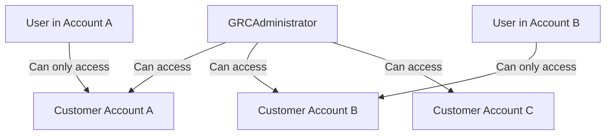
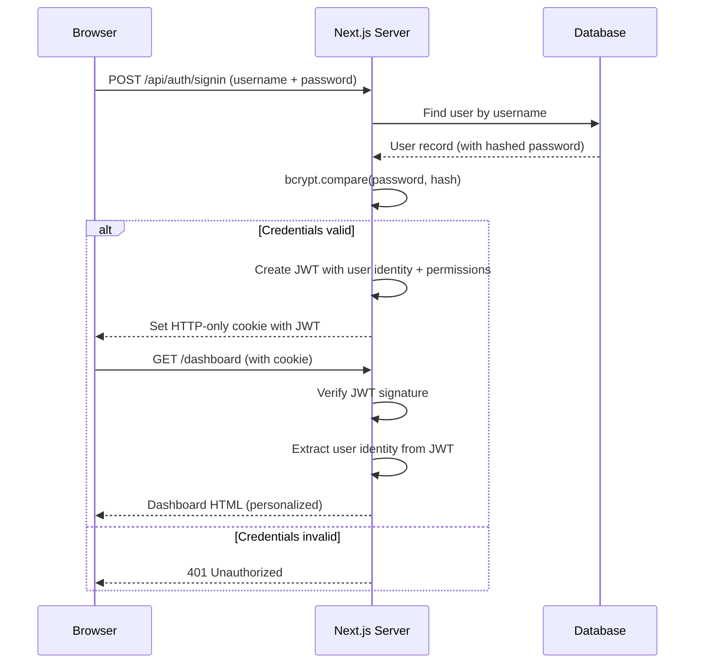
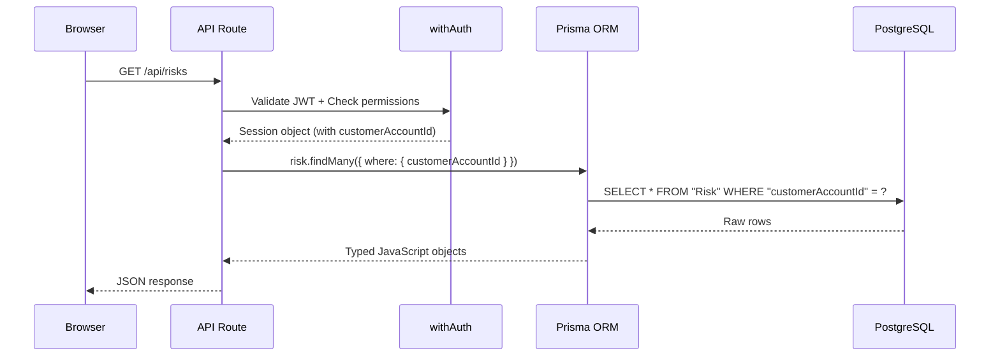
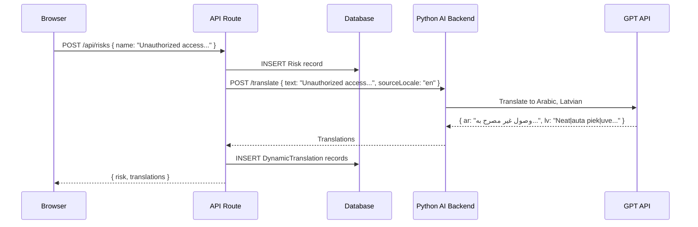
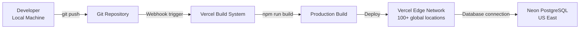
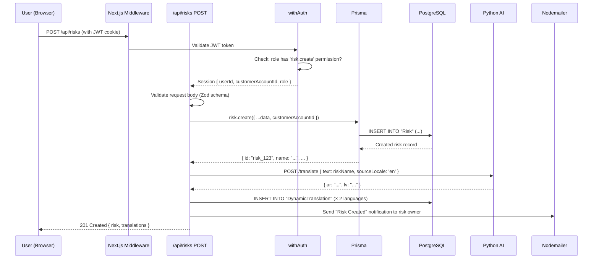

# Architecture Overview — testgrc 2025

> **Audience:** Developers, DevOps engineers, and technical architects. Some prior programming knowledge is assumed, but every technical concept is defined before use.
>
> **Goal:** By the end of this document, you should be able to explain how the entire system works — from a user clicking a button to data being saved and returned — and understand why every major technical decision was made.

---

## 1. What Is Software Architecture?

**Software architecture** is the high-level structure of a software system — how it is divided into parts, how those parts communicate, and where data lives. Good architecture makes a system easier to understand, change, scale, and secure.

This application uses a well-established architecture called **three-tier architecture**. Before diving into the specifics, let us understand this pattern.

### The Three-Tier Pattern

Imagine a restaurant:
- The **front of house** (dining room) is where customers sit and interact — they see the menu, order food, receive plates
- The **kitchen** is where the work happens — recipes are followed, food is prepared
- The **pantry / cold storage** is where ingredients are stored

Software three-tier architecture works the same way:
- **Tier 1: Presentation (Frontend)** — What the user sees and interacts with (the dining room)
- **Tier 2: Application Logic (Backend/API)** — Where business rules are enforced (the kitchen)
- **Tier 3: Data (Database)** — Where data is permanently stored (the pantry)

The key benefit: each tier can change independently. You can redesign the dining room without changing the kitchen recipes. You can switch from a gas stove to electric in the kitchen without rebuilding the dining room.

---

## 2. System Architecture Diagram

```mermaid
graph TB
    subgraph "Client Layer"
        BR[User's Web Browser\nChrome / Firefox / Safari]
    end

    subgraph "Application Layer — Vercel Edge Network"
        direction TB
        NX[Next.js 16\nApp Router]
        subgraph "Server Components"
            SC[React Server Components\nRender HTML on server]
        end
        subgraph "API Routes"
            AR[/api/* endpoints\nREST API]
        end
        subgraph "Middleware"
            MW[Auth Middleware\nSession validation]
            RBAC[Permission Check\nwithAuth wrapper]
        end
    end

    subgraph "Services Layer"
        PY[Python AI Backend\nGPT Translation API]
        SMTP[Email Service\nNodemailer + SMTP]
        CRON[Vercel Cron\n7 Scheduled Jobs]
    end

    subgraph "Data Layer"
        subgraph "Production"
            NEON[(Neon PostgreSQL\nCloud Database)]
        end
        subgraph "Development"
            SQ[(SQLite\nLocal File DB)]
        end
        PRISM[Prisma ORM\nDatabase Abstraction Layer]
    end

    BR -->|HTTPS Request| NX
    NX --> SC
    NX --> AR
    MW --> AR
    AR --> RBAC
    RBAC --> PRISM
    PRISM --> NEON
    PRISM --> SQ
    AR --> PY
    AR --> SMTP
    CRON --> AR
```

---

## 3. The Frontend: What Users See

### 3.1 What Is a Frontend?

The **frontend** is everything that runs in the user's web browser. It is what the user sees, clicks, and types into. In this application, the frontend is built with **React** — a JavaScript library for building user interfaces.

### 3.2 Next.js and the App Router

**Next.js** is a framework built on top of React. A "framework" provides structure and conventions — instead of making thousands of decisions about how to organize code, Next.js makes them for you.

**App Router** is the routing system used in this application. **Routing** means "when the user goes to `/compliance/controls`, show them the controls page." The App Router uses a folder-based system: the file `src/app/(protected)/compliance/controls/page.tsx` automatically becomes the page at `/compliance/controls`.

The `(protected)` folder name (with parentheses) is a **route group** — it tells Next.js to wrap all pages inside it with the `MainLayout` component (the sidebar, header, etc.) without adding "(protected)" to the URL.

### 3.3 Server Components vs. Client Components

This is a key concept in Next.js 16. There are two types of components:

**Server Components** — These run on the server (not the browser). They can directly query the database and render HTML. The browser receives finished HTML — it does not download the JavaScript needed to generate it. This is faster and more secure.

**Client Components** — These run in the browser. They have interactivity (click handlers, form state, etc.). They are marked with `"use client"` at the top of the file.

**The rule in this application:** Pages start as Server Components. Only the interactive parts (forms, modals, dropdowns) are Client Components.

### 3.4 Navigation and Layout

```
src/app/
├── (protected)/           ← All pages requiring login
│   ├── layout.tsx         ← MainLayout (sidebar + header) applied to all
│   ├── dashboard/
│   │   └── page.tsx       ← Dashboard page
│   ├── compliance/
│   │   ├── page.tsx       ← Compliance overview
│   │   └── controls/
│   │       └── page.tsx   ← Controls list page
│   └── ...
├── login/
│   └── page.tsx           ← Public login page
└── api/
    └── ...                ← All API routes
```

The sidebar navigation is defined in `src/lib/navigation.ts`. Every navigation item has a `permission` field. The sidebar only shows items the current user has permission to see.

---

## 4. The API Layer: Where Business Logic Lives

### 4.1 What Is an API?

**API** stands for Application Programming Interface. In web applications, an API is a set of URLs (called **endpoints**) that accept requests and return data. The frontend (browser) calls the API to create, read, update, or delete data.

Example:
- `GET /api/risks` — Return a list of all risks
- `POST /api/risks` — Create a new risk
- `PATCH /api/risks/123` — Update risk with ID 123
- `DELETE /api/risks/123` — Delete risk with ID 123

These four operations — Create, Read, Update, Delete — are called **CRUD** and represent the foundation of most data management systems.

### 4.2 REST Convention

The API follows **REST** (Representational State Transfer) conventions. REST is a widely-used pattern for structuring web APIs. The key ideas:
- URLs identify resources (things): `/api/risks`, `/api/users`, `/api/audits`
- HTTP methods describe actions: GET = read, POST = create, PATCH = update, DELETE = remove
- Responses are in JSON format (a text format that computers can easily parse)

### 4.3 The withAuth Protection Wrapper

Every API route in this application is wrapped with `withAuth` — a security layer defined in `src/lib/api-auth.ts`.

Here is what `withAuth` does every time an API call is made:

```
1. Extract the JWT token from the request's cookie
2. Verify the token is valid (not expired, not tampered with)
3. Load the user's identity (ID, role, customerAccountId)
4. Check if the user's role has the required permission
5. If any check fails → return 401 (Unauthorized) or 403 (Forbidden)
6. If all checks pass → run the actual handler function
```

This means there is no way to bypass authorization — it happens at the API layer, regardless of what the browser sends.

### 4.4 API Route File Structure

```typescript
// Standard pattern for every API route
// File: src/app/api/risks/route.ts

export const GET = withAuth(
  async (req, context, session) => {
    // 1. Query the database with the user's customerAccountId
    const risks = await prisma.risk.findMany({
      where: { customerAccountId: session.user.customerAccountId }
    });
    // 2. Return the data
    return NextResponse.json(risks);
  },
  { resource: 'risk', action: 'view' }  // ← Permission required
);

export const POST = withAuth(
  async (req, context, session) => { /* ... */ },
  { resource: 'risk', action: 'create' }
);
```

### 4.5 Dynamic Route Parameters

For routes that operate on a specific record (e.g., `/api/risks/123`), the route file is at `src/app/api/risks/[id]/route.ts`. In Next.js 16, the `[id]` parameter is accessed as a **Promise**:

```typescript
interface RouteContext {
  params: Promise<{ id: string }>;
}

export const GET = withAuth(async (req, context: RouteContext) => {
  const { id } = await context.params;  // Must await the params
  // ...
});
```

---

## 5. Multi-Tenancy Architecture

### 5.1 What Is Multi-Tenancy?

**Multi-tenancy** means one installation of a software application serves multiple separate customers (called **tenants**), where each customer's data is completely isolated from every other customer.

**Real-world analogy:** Think of an office building. Multiple companies (tenants) rent offices in the same building. They share the building's infrastructure (elevator, electricity, security desk), but each company has its own locked office — employees of Company A cannot walk into Company B's office.

In the same way, this GRC application is one installation serving many organizations. They share the same software code and the same database server — but each organization's data is locked away from all others.

### 5.2 How Multi-Tenancy Is Implemented

Every single table in the database has a `customerAccountId` column. This is the "padlock" on each record.

```sql
-- Example: The Risk table
CREATE TABLE "Risk" (
    "id"                TEXT NOT NULL,
    "customerAccountId" TEXT NOT NULL,  -- ← Every record has this
    "name"              TEXT NOT NULL,
    "description"       TEXT,
    -- ...
    PRIMARY KEY ("id")
);
```

When an API route queries the database, it **always** includes `customerAccountId` in the filter:

```typescript
// This query can ONLY return risks belonging to the logged-in user's organization
const risks = await prisma.risk.findMany({
  where: {
    customerAccountId: session.user.customerAccountId  // ← Always filtered
  }
});
```

Even if a user somehow called the API directly with someone else's risk ID, the query would return no results — because the ID would exist but not with their `customerAccountId`.

### 5.3 The CustomerAccount Model

```
CustomerAccount
├── id (unique identifier)
├── name ("Acme Corporation")
├── industry ("Financial Services")
├── createdAt
└── users (→ User table)
```

When a new organization signs up, a `CustomerAccount` record is created. All subsequent records created by that organization automatically get that account's ID.

### 5.4 The GRCAdministrator Exception

The `GRCAdministrator` role is the only role that can see data across multiple customer accounts. This is needed for:
- Platform support (helping a customer debug an issue)
- Billing and account management
- Platform-wide reporting



---

## 6. Authentication Architecture

### 6.1 What Is Authentication?

**Authentication** is the process of verifying that a user is who they claim to be. When you enter a username and password, you are being authenticated — the system checks that the password matches the stored hash for that username.

**Note:** Authentication is different from **Authorization** (which comes next). Authentication = "Are you who you say you are?" Authorization = "Are you allowed to do this?"

### 6.2 JWT Sessions

This application uses **JWT** (JSON Web Token) sessions, managed by **NextAuth v5**.

**How JWT works:**

1. User enters username and password → submits login form
2. Server verifies the credentials against the database
3. If correct, server creates a JWT — a digitally-signed token containing the user's identity (ID, role, `customerAccountId`)
4. The JWT is stored in an HTTP-only cookie in the browser (HTTP-only means JavaScript cannot read it — only the browser sends it automatically)
5. On every subsequent request, the browser sends the cookie automatically
6. The server verifies the JWT signature (to ensure it was not tampered with) and extracts the user's identity

**Why JWT?** JWTs are stateless — the server does not need to store session data in a database. The token itself contains all needed information, and the digital signature proves it has not been tampered with.

### 6.3 The Session Object

After authentication, every API route can access a `session` object containing:

```typescript
session = {
  user: {
    id: "usr_abc123",
    name: "Jane Smith",
    email: "jane@company.com",
    role: "AuditManager",
    customerAccountId: "cust_xyz789",
    permissions: [
      "internal-audit.view",
      "internal-audit.create",
      "internal-audit.edit",
      // ... (expanded from role at login)
    ]
  }
}
```

The permissions array is populated at login from the `permissions.ts` file, which defines the full permission matrix for every role.

### 6.4 Authentication Flow



---

## 7. Permission Architecture (RBAC)

### 7.1 What Is RBAC?

**RBAC** stands for **Role-Based Access Control**. Instead of assigning permissions to individual users, you assign permissions to **roles**, and then assign roles to users.

**Analogy:** Think of a hospital. Every Nurse has the same permissions (access patient records, administer prescribed medications, update charts). Every Doctor has a different set of permissions (prescribe medications, order tests, discharge patients). Instead of configuring 200 individual nurses, you configure the "Nurse" role once.

### 7.2 The Permission Model

Permissions in this application follow the pattern: **`resource.action`**

- **Resource** — What entity is being accessed (e.g., `risk`, `audit.finding`, `compliance.control`)
- **Action** — What operation is being performed (`view`, `create`, `edit`, `delete`, `approve`)

Examples:
- `risk.view` — Can read risk records
- `risk.create` — Can create new risk records
- `audit.finding.approve` — Can approve audit findings
- `compliance.control.delete` — Can delete controls (restricted to admins)

### 7.3 Role-Permission Matrix (Partial)

| Permission                   | GRCAdmin | CustAdmin | AuditHead | AuditManager | Auditor | Auditee | Contributor |
|------------------------------|----------|-----------|-----------|--------------|---------|---------|-------------|
| risk.view                    | ✓        | ✓         | ✓         | ✓            | ✓       | -       | ✓           |
| risk.create                  | ✓        | ✓         | -         | -            | -       | -       | ✓           |
| risk.edit                    | ✓        | ✓         | -         | -            | -       | -       | ✓           |
| audit.finding.view           | ✓        | ✓         | ✓         | ✓            | ✓       | ✓*      | -           |
| audit.finding.create         | ✓        | ✓         | ✓         | ✓            | ✓       | -       | -           |
| audit.finding.approve        | ✓        | ✓         | ✓         | ✓            | -       | -       | -           |
| audit.finding.respond        | ✓        | ✓         | -         | -            | -       | ✓       | -           |

*Auditee can only view findings assigned to them

### 7.4 Where Permissions Are Defined

The full permission matrix lives in `src/lib/permissions.ts`. This file defines:
- All available roles (25 total)
- All resources and their valid actions
- The mapping of which role has which permissions

### 7.5 How Permissions Are Checked

**On the server (API routes):**
```typescript
export const DELETE = withAuth(
  handler,
  { resource: 'compliance.control', action: 'delete' }
);
// withAuth checks: does session.user.permissions include 'compliance.control.delete'?
// If not → return 403 Forbidden, never run the handler
```

**On the frontend (UI visibility):**
```typescript
// In a React component
const { canDelete } = usePermissions('compliance.control');

// Only show the Delete button if the user has permission
{canDelete && <Button onClick={handleDelete}>Delete</Button>}
```

The UI check is for user experience only (hiding buttons the user cannot use). The server check is the real security gate.

---

## 8. Database Architecture

### 8.1 The Prisma ORM

**ORM** stands for **Object-Relational Mapper**. It is a library that lets you work with the database using your programming language instead of writing raw SQL queries.

**Analogy:** Imagine you want to get a customer from the database. Without an ORM, you write: `SELECT * FROM "Customer" WHERE id = '123'`. With Prisma (the ORM used here), you write: `prisma.customer.findUnique({ where: { id: '123' } })`. Prisma translates this to SQL for you.

Benefits:
- Type safety — TypeScript knows exactly what fields a Risk has, so typos are caught at compile time
- Database independence — the same Prisma code works with SQLite (local) and PostgreSQL (production)
- Automatic migrations — schema changes are tracked and applied consistently

### 8.2 Local vs. Production Database

| Environment  | Database   | Why                                                      |
|--------------|------------|----------------------------------------------------------|
| Development  | SQLite     | No installation required; file-based; fast for development |
| Production   | PostgreSQL (Neon) | Scalable, reliable, concurrent writes, full SQL features |

The same Prisma schema (`prisma/schema.prisma`) generates code for both. The `DATABASE_URL` environment variable switches between them.

### 8.3 Schema Size and Complexity

The database has **200+ models** (tables). Major model groups:

```
Authentication & Authorization: User, Role, CustomerAccount, Permission
Organization: OrgProfile, Department, BusinessProcess, BIA, Stakeholder
Compliance: Framework, Control, Requirement, Evidence, Exception, Governance
Risk: Risk, RiskCategory, RiskAssessment, RiskTreatment, RiskControlMatrix
Assets: Asset, AssetClassification, AssetRisk
Internal Audit: AuditUniverse, AuditEngagement, AuditFinding, CAPA, AuditReport
TPRM: Vendor, VendorAssessment, VendorContract
Translations: DynamicTranslation
Notifications: Notification, NotificationPreference
```

### 8.4 Database Request Flow



---

## 9. Encryption Architecture

### 9.1 Why Encrypt Database Fields?

The database stores sensitive information — uploaded compliance certificates, audit evidence, contracts. If the database were breached (hacked, backup stolen, insider threat), these files would be exposed.

**Field-level encryption** means the file data is encrypted before it is written to the database. Even someone with direct database access cannot read the files without the encryption key, which is stored separately.

### 9.2 The Algorithm: AES-256-GCM

**AES** (Advanced Encryption Standard) is the encryption algorithm. **256** refers to the key size (256 bits — extremely strong). **GCM** (Galois/Counter Mode) is a mode of operation that also provides **authentication** — it can detect if the encrypted data has been tampered with.

This is the same encryption standard used by major banks, the US government, and most HTTPS connections.

### 9.3 Transparent Encryption via Prisma Extension

The encryption is implemented as a **Prisma extension** in `src/lib/prisma.ts`. This means encryption and decryption happen automatically — application code does not need to handle it manually.

```
Write path: Application code → Prisma extension ENCRYPTS → Database stores ciphertext
Read path:  Database returns ciphertext → Prisma extension DECRYPTS → Application code gets plaintext
```

The extension knows which fields to encrypt based on the registry in `src/lib/encrypted-fields.ts`.

### 9.4 The Encryption Key

The encryption key (`FIELD_ENCRYPTION_KEY`) is:
- Stored as an environment variable (not in the codebase)
- Never logged
- Never stored alongside the encrypted data
- Rotated every 90 days using `npm run encrypt:rotate-key`

### 9.5 Raw SQL Exception

The Prisma extension only intercepts queries made through the Prisma client. If a developer uses raw SQL (`$queryRaw`), the encryption extension does NOT run. Any such usage must manually call `maybeEncryptBytes` / `maybeDecryptBytes`. All raw SQL touching encrypted fields is documented in `docs/encryption-raw-sql-audit.md`.

---

## 10. Translation Architecture

This application has two distinct translation systems. It is important not to confuse them.

### 10.1 Static UI Translation (i18n)

**What it translates:** Fixed interface text — button labels, menu items, column headers, error messages.

**How it works:**
- Translation strings are defined in `scripts/init-translations.ts` as English phrases
- Arabic and Latvian translations are stored alongside them
- The `LanguageContext` provides a `t()` function to every component
- `t("Save Changes")` returns the translation in the current language

**When translations load:** At page load, from local storage or the server.

**Example:**
```typescript
const { t } = useLanguage();
<Button>{t("Save Changes")}</Button>
// English: "Save Changes"
// Arabic: "حفظ التغييرات"
// Latvian: "Saglabāt izmaiņas"
```

### 10.2 Dynamic Content Translation (AI)

**What it translates:** User-entered content — risk names, control descriptions, audit findings, vendor names.

**How it works:**
1. User creates a Risk record with the name "Unauthorized access to customer PII"
2. The API handler calls `translateRecord()` from `src/lib/translation-service.ts`
3. `translateRecord()` sends a POST request to the Python AI backend
4. The Python backend calls GPT to translate the text into all other languages
5. Translations are stored in the `DynamicTranslation` table
6. When any user views that risk, the `useTranslatedData` hook fetches the translation for their language

**When translations are triggered:** Only when a record is created or edited — never automatically in the background.



---

## 11. Email Notification Architecture

### 11.1 Overview

The application sends emails using **Nodemailer** — a Node.js library for sending email. Emails are sent through an SMTP server (configured via environment variables).

The system has 65+ distinct email templates covering all significant events:
- User registration and password reset
- Evidence assigned, due soon, overdue
- Audit finding created, responded to, closed
- CAPA due soon, escalated
- Vendor assessment requests
- Policy review due

### 11.2 Email Template Structure

Each email template is an HTML file with dynamic variables. Templates are stored in the codebase and rendered server-side before sending.

### 11.3 Cron-Based Reminders

7 scheduled jobs run automatically using Vercel Cron:

| Job                     | Schedule        | What It Does                                               |
|-------------------------|-----------------|-------------------------------------------------------------|
| Due Reminders           | Daily 8:00 AM UTC | Sends reminders for evidence, CAPAs, and policies due soon |
| Evidence Expiry Check   | Daily           | Alerts for evidence expiring within N days                  |
| CAPA Escalation         | Daily           | Escalates overdue CAPAs to managers                        |
| Vendor Review Due       | Weekly          | Reminds about vendor assessments due for renewal           |
| Audit Plan Reminder     | Weekly          | Reminds audit team of upcoming scheduled audits            |
| Policy Review Due       | Monthly         | Reminds policy owners of annual review due                 |
| Risk Review Due         | Monthly         | Reminds risk owners to re-assess their risks               |

---

## 12. Deployment Architecture

### 12.1 Vercel

**Vercel** is the hosting platform. It is a cloud service that:
- Runs the Next.js application on a global network of servers
- Automatically deploys when code is pushed to Git
- Handles TLS certificates (HTTPS) automatically
- Runs cron jobs on a schedule
- Scales up automatically under high load

The application is deployed at: https://grc-app-ba-testing.vercel.app

### 12.2 Neon (Serverless PostgreSQL)

**Neon** is the cloud database provider. It provides **serverless PostgreSQL** — a PostgreSQL database that scales to zero when not in use (reducing costs) and scales up instantly when needed.

**"Serverless"** does not mean there is no server — it means you do not manage the server. Neon handles all database server maintenance, backups, and scaling.

### 12.3 Deployment Flow



### 12.4 Environment Separation

| Environment | Frontend     | Database     | Purpose                         |
|-------------|--------------|--------------|----------------------------------|
| Local Dev   | localhost:3000 | SQLite file | Development and testing          |
| Production  | Vercel CDN   | Neon PostgreSQL | Live user-facing application  |

These environments are completely isolated. A developer can make mistakes locally without affecting production.

---

## 13. Data Flow: End-to-End Example

To tie everything together, here is the complete journey of a user creating a new Risk record:



This entire journey — from button click to database record to translated content to email notification — happens in under 2 seconds.

---

*Related documents: `02-Architecture/Technology-Stack.md` for details on every technology used, `07-Authentication/Permissions.md` for the full RBAC matrix, `07-Authentication/Encryption.md` for encryption details.*
