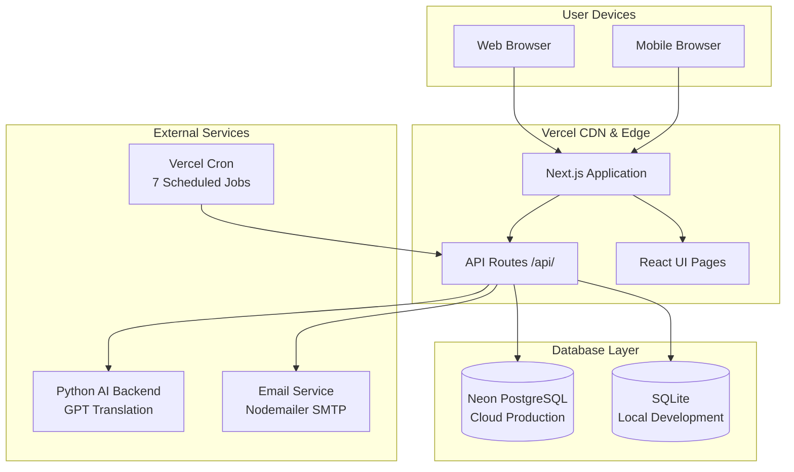

# Project Introduction — testgrc 2025

> **Who this document is for:** Anyone who is new to this project — developers, business analysts, executives, auditors, or operations staff. No prior knowledge of GRC software is assumed.

---

## Part 1: What Is GRC?

**GRC** stands for **Governance, Risk, and Compliance**. These three words describe a set of activities that every serious organization must perform. Let us explain each one:

### Governance

**Governance** is the system of rules, practices, and processes by which an organization is directed and controlled. Think of it like the constitution of a country — it defines who has authority, what decisions they can make, and how accountability is maintained.

In business terms, governance answers questions like:
- Who is responsible for cybersecurity?
- What is the company's policy on data sharing?
- How are major decisions documented and approved?
- Are employees following the rules they agreed to?

Good governance means that every person in the organization knows their responsibilities, every important decision has a documented owner, and the board of directors can trust that management is running the company correctly.

### Risk

**Risk** is the possibility that something bad will happen that prevents the organization from achieving its goals. Risk management is the process of identifying those possibilities, deciding how serious they are, and taking action to reduce them.

Examples of organizational risks:
- A cyberattack could expose customer data (cybersecurity risk)
- A key supplier could go out of business (supply chain risk)
- A new regulation could require expensive system changes (regulatory risk)
- An employee could make a fraudulent transaction (operational risk)
- A natural disaster could destroy a data center (continuity risk)

Risk management does NOT mean eliminating all risk — that is impossible. It means understanding which risks matter most, treating them in the most cost-effective way, and being prepared when things go wrong anyway.

### Compliance

**Compliance** means following the rules — laws, regulations, industry standards, and internal policies. Organizations that handle sensitive data, financial transactions, or healthcare information are typically required by law to meet specific standards.

Examples of compliance requirements:
- **GDPR** — European Union law requiring protection of personal data
- **ISO 27001** — International standard for information security management
- **SOC 2** — American auditing standard for service organizations
- **PCI-DSS** — Payment Card Industry standard for card data security
- **HIPAA** — US law protecting health information

Compliance is not optional. Organizations that fail to comply face fines, lawsuits, reputational damage, and even criminal liability for executives.

### Why GRC Together?

Governance, Risk, and Compliance are deeply interconnected:
- Good governance makes compliance easier (clear ownership means someone is responsible)
- Risk management informs compliance priorities (fix the biggest threats first)
- Compliance requirements drive risk identification (what laws require us to protect)

Managing GRC manually — with spreadsheets and email — is error-prone, time-consuming, and nearly impossible to audit. Organizations with more than about 50 employees need purpose-built software to do this effectively.

---

## Part 2: Why Do Organizations Need GRC Software?

### The Manual GRC Problem

Before dedicated GRC tools existed, organizations managed compliance through spreadsheets, Word documents, email threads, and shared drives. Here is what that looks like in practice:

- The compliance officer maintains a 500-row Excel spreadsheet tracking 200 controls across 3 frameworks
- Evidence documents are scattered across SharePoint, email attachments, and local drives
- Risk assessments are done in PowerPoint presentations that nobody updates after they are presented
- When an auditor asks for proof of a control, it takes days to gather the documents
- When a regulation changes, nobody knows which of the 500 controls are affected
- When the compliance officer leaves the company, the institutional knowledge leaves with them

This approach fails at scale. It is also unacceptable to external auditors, who require traceable, timestamped records of compliance activities.

### The Real Business Problems GRC Software Solves

**Problem 1: Audit Readiness**

Organizations that face regulatory audits need to produce evidence on demand. With manual systems, gathering audit evidence for even a single control can take hours. With a GRC platform, the auditor can see everything in one place — timestamped, linked, and searchable.

**Problem 2: Control Duplication**

Most organizations must comply with multiple frameworks simultaneously (ISO 27001 AND SOC 2 AND GDPR). Many requirements overlap — the same control satisfies all three. Without software, teams do the same work three times. GRC software maps controls to multiple frameworks automatically.

**Problem 3: Accountability**

When a security incident occurs, regulators ask: "Who was responsible for this control? Was it tested? When was it last reviewed?" Without a system of record, organizations cannot answer these questions. GRC software creates an immutable audit trail of every action taken.

**Problem 4: Risk Blind Spots**

Risks identified in one department are often unknown to another. The IT team knows about a critical vulnerability, but the executive team has no visibility into how serious it is. GRC software creates a single, organization-wide risk register with consistent scoring so leadership can prioritize.

**Problem 5: Deadline Management**

Compliance activities have deadlines — quarterly evidence reviews, annual policy updates, bi-annual penetration tests. Missing these deadlines can mean regulatory non-compliance. GRC software sends automated reminders and tracks completion status.

**Problem 6: Multi-Framework Complexity**

A mid-size financial services company might simultaneously comply with ISO 27001, SOC 2, PCI-DSS, GDPR, local banking regulations, and its own internal security policies. Managing all of these without software is practically impossible.

---

## Part 3: What Does This Application Do?

**testgrc 2025** is a comprehensive GRC platform built for organizations that need to manage compliance, risks, governance, and internal audit activities in a single, integrated system.

### The Core Value Proposition

Instead of 15 different spreadsheets and email chains, everything is in one place:
- All risks in one register, with assessments and treatment plans
- All compliance controls mapped to all relevant frameworks
- All evidence attached directly to the controls they support
- All audit activities tracked from planning to final report
- All third-party vendor risks assessed in a standardized way
- Everything tied to real people with documented responsibilities

### What Makes This Application Different

**Multi-tenant architecture** — This is a SaaS (Software as a Service) platform. One installation of the software serves many different customer organizations. Each customer's data is completely isolated from every other customer. The same way Gmail serves millions of users but each user only sees their own email.

**Multilingual support** — The application works in English, Arabic (with full right-to-left layout), and Latvian. Not just the interface — user-entered content like risk names and control descriptions is automatically translated by an AI system.

**AI-powered translation** — A Python backend powered by GPT translates all user-entered content into all supported languages automatically when records are created or edited.

**Field-level encryption** — Sensitive file data (uploaded documents) is encrypted at the database level using AES-256-GCM encryption, the same standard used by major banks. Even if someone gained unauthorized access to the database, they could not read file contents.

**Role-Based Access Control** — 25 different roles control exactly what each user can see and do. An Auditor can view findings but not delete them. An Auditee can respond to findings directed at them but cannot see the whole audit plan.

**Complete audit trail** — Every action in the system is logged with who did it and when. This log is append-only — records cannot be deleted.

---

## Part 4: Who Are the Users?

### Types of Organizations

The application is designed for any organization that must manage compliance and risk, including:

- **Financial services** — Banks, insurance companies, investment firms (regulated by central banks, SEC, FCA, etc.)
- **Healthcare** — Hospitals, clinics, health technology companies (regulated by HIPAA, HL7, etc.)
- **Technology companies** — SaaS providers, cloud services, software companies (often require SOC 2, ISO 27001)
- **Government and public sector** — Government agencies managing citizen data
- **Retail and e-commerce** — Any company processing payment cards (requires PCI-DSS)
- **Professional services** — Law firms, accounting firms, consulting companies

### The 25 User Roles

The application defines 25 distinct roles organized into three tiers:

**System-Level Roles** (manage the platform itself):
- `GRCAdministrator` — Can create and manage customer accounts, configure frameworks
- `SystemSupport` — Technical support access

**Organization-Level Roles** (manage one customer's data):
- `CustomerAdministrator` — Full access within their organization
- `Reviewer` — Can view and approve all items
- `Contributor` — Can create and edit items in their domain
- `DepartmentReviewer` / `DepartmentContributor` — Same but scoped to one department

**Specialized Module Roles:**
- `AuditHead` — Full internal audit authority
- `AuditManager` — Plans and manages audit engagements
- `Auditor` — Conducts audits and writes findings
- `Auditee` — Responds to audit findings
- `RiskManager` — Manages the risk register
- `ComplianceManager` — Oversees compliance activities
- `AssetManager` — Manages the asset inventory
- `TPRMManager` — Manages vendor risk assessments
- `QPostReviewer` — Conducts quality post-compliance reviews
- *(and more)*

### Real-World User Journeys

**A Chief Risk Officer** logs in and sees the dashboard — a summary of the organization's top 10 risks by severity, compliance percentage across all frameworks, and open audit findings. They can drill into any risk to see its assessment history and treatment plan.

**An IT Security Analyst** logs in as an Auditor to conduct a technical audit. They access the assigned audit engagement, record their fieldwork observations, upload evidence screenshots, and write findings for anything non-compliant.

**A Department Manager** logs in as an Auditee and sees only the findings addressed to their department. They document their response and corrective action plan, then attach evidence that the issue has been fixed.

**A Compliance Officer** works in the Compliance module to map the organization's controls to ISO 27001 requirements, track which evidence has been collected for each control, and generate a compliance report for the upcoming external audit.

---

## Part 5: Business Problems Solved (Module by Module)

| Module              | Problem It Solves                                                                          |
|---------------------|--------------------------------------------------------------------------------------------|
| Organization        | No central record of company structure, processes, and who owns what                       |
| Compliance          | Cannot track 200+ controls across 5 frameworks without spreadsheets                        |
| Risk Management     | Risks are in silos; no consistent scoring; no link between risks and controls              |
| Asset Management    | No inventory of what data/systems/equipment the organization has or who owns it            |
| Internal Audit      | Audit paperwork done in Word/Excel; no tracking; findings lost after the report            |
| TPRM                | No visibility into vendor security posture; no standard due-diligence process              |
| QPost Compliance    | Compliance activities completed but nobody checks they were done correctly                  |
| Technical Evidence  | Screenshots and log files scattered across email; not linked to controls                   |
| Dashboard           | Leadership has no real-time visibility into GRC status; relies on quarterly reports        |
| Support             | Users cannot get help within the application; must email a separate mailbox               |

---

## Part 6: Project History and Purpose

This application was built to address a gap in the market for an integrated, multilingual, AI-enhanced GRC platform that is affordable for mid-market organizations.

**Key design goals established at project start:**

1. **Single source of truth** — All GRC data in one system, not spread across tools
2. **Audit-ready at all times** — The system always produces auditable, timestamped records
3. **Global-first** — Support for multiple languages and RTL layouts from day one
4. **Role-appropriate views** — Each user sees exactly what they need, nothing more
5. **Automation** — Reminders, notifications, and AI translation reduce manual work
6. **Security by default** — Encryption, access control, and audit logging built in, not bolted on

---

## Part 7: High-Level Architecture Overview

The application follows a standard three-tier web application architecture:

**How a page load works (simplified):**
1. User opens browser and goes to the application URL
2. Vercel's servers receive the request and run the Next.js application
3. Next.js checks if the user is authenticated (has a valid login session)
4. If authenticated, Next.js fetches data from the PostgreSQL database via the Prisma ORM
5. Next.js renders the page and sends HTML to the browser
6. The browser displays the page; JavaScript handles interactions from there

---

## Part 8: Key Capabilities

### AI-Powered Multilingual Content

When a user creates a Risk record (for example, "Unauthorized access to customer PII"), the system automatically sends this text to a Python API. The Python API calls a GPT language model to translate the text into Arabic and Latvian. The translations are stored in the database. Next time any user views that risk — regardless of their language preference — they see the content in their chosen language.

### Multi-Tenant Data Isolation

Every single record in the database has a `customerAccountId` field. This is like a stamp on every piece of paper saying "this belongs to Company X." When Company X's users query data, the system automatically adds a filter: "only show records where `customerAccountId = Company X's ID`." This means Company X can never see Company Y's data, even if they use the same database.

### Field-Level Encryption

When a user uploads a document (say, a compliance certificate PDF), the file's binary data is encrypted before being stored in the database. The encryption key is stored separately from the data. Even if a database backup were stolen, the file contents would be unreadable without the encryption key.

### Role-Based Access Control

Every API call is checked before it proceeds. The system asks: "What role does this user have? Does that role have permission to perform this action on this resource?" If not, the API returns an error and the action is blocked — regardless of what the frontend shows.

### Automated Notifications

7 scheduled jobs run automatically. For example, every day at 8:00 AM UTC, the system checks for evidence reviews due within 24 hours and sends email reminders to the responsible persons. This means compliance officers no longer need to manually track deadlines in a calendar.

---

*Next: Read `Business-Requirements.md` for a formal statement of what the system must do, or `Architecture-Overview.md` for a deep dive into how it is built.*
