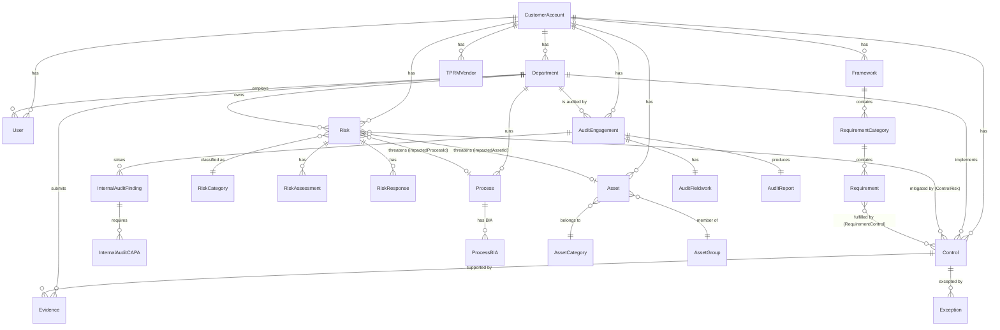
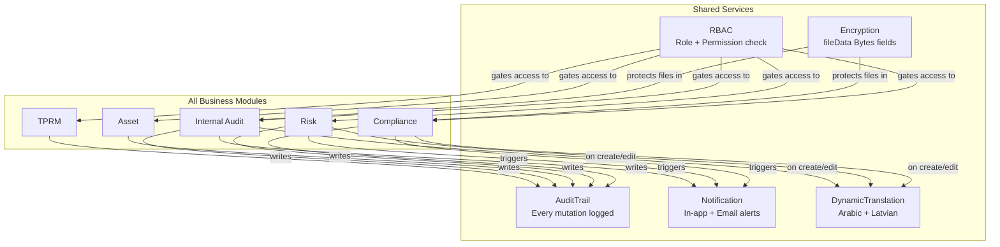
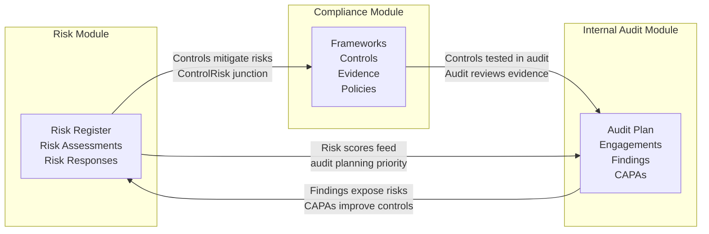

# Module Relationships

**Document:** Module Relationships and Data Flow  
**Application:** GRC (Governance, Risk, and Compliance) Platform  
**Last Updated:** 2026-06-29

---

## Table of Contents

1. [Overview: How Modules Connect](#1-overview-how-modules-connect)
2. [Organization Module: The Foundation](#2-organization-module-the-foundation)
3. [Compliance Module: Controls and Evidence](#3-compliance-module-controls-and-evidence)
4. [Risk Module: Assessment and Response](#4-risk-module-assessment-and-response)
5. [Asset Module: Inventory and Classification](#5-asset-module-inventory-and-classification)
6. [Internal Audit Module: Consuming All Modules](#6-internal-audit-module-consuming-all-modules)
7. [TPRM Module: Third-Party Risk](#7-tprm-module-third-party-risk)
8. [Shared System Models](#8-shared-system-models)
9. [Cross-Module Data Flow Examples](#9-cross-module-data-flow-examples)
10. [Architecture Diagrams](#10-architecture-diagrams)

---

## 1. Overview: How Modules Connect

The GRC platform is not a collection of isolated tools — it is an integrated system where data and workflows flow across modules. Understanding these relationships is critical for:

- Knowing which module to modify when changing a piece of data.
- Avoiding duplicate data entry (each piece of information has one authoritative source).
- Understanding cascading effects when a record is deleted or status-changed.

**The hierarchy of dependency:**

```
Organization Module (foundation — provides departments, users, stakeholders)
    ↓
Compliance Module ←→ Risk Module
    ↓              ↕
Asset Module → Risk Module
    ↓
Internal Audit Module (consumes all modules above)
    ↓
TPRM Module (semi-independent, uses Organisation as foundation)
```

**Shared services** (used by all modules without belonging to any):

- **AuditTrail** — logs every mutation across all modules.
- **Notification** — delivers in-app and email alerts triggered by all modules.
- **DynamicTranslation** — stores translated content for records in all modules.
- **RBAC** (Roles, Permissions) — controls access to every module.

---

## 2. Organization Module: The Foundation

The Organization module is the **bedrock** on which all other modules are built. Every other module references Organisation entities — primarily `Department` and `User`.

### What the Organization Module Provides

| Model | Used by |
|-------|---------|
| `Department` | All modules — risks, controls, processes, assets, evidence, and audit engagements are assigned to departments |
| `User` | All modules — owners, assignees, reviewers, and approvers across all modules are Users |
| `Organization` | Display (company logo, name) — does not drive business logic in other modules |
| `Branch` | Asset module (assets can be located at a branch) |
| `Process` | Internal Audit module (processes are the primary audit subjects), Risk module (risks can be linked to a process) |
| `Stakeholder` | Compliance module (governance documents reference stakeholders) |

### Why Departments Are Central

Departments appear in every other module because GRC compliance is inherently department-scoped:

- A **Risk** is owned by a department and assigned to a user within that department.
- A **Control** is implemented by a department.
- An **Evidence** item is gathered by a department's assignee.
- An **Audit Engagement** audits a department or process within a department.

The `DepartmentContributor` and `DepartmentReviewer` RBAC roles use the `department` scope — they can only see and modify records belonging to their own department. This scoping is enforced by filtering on `departmentId` in every relevant Prisma query.

### Department Model Connections

```
Department
├── users[]                  → Users in this department
├── risks[]                  → Risks assigned to this department
├── controls[]               → Controls owned by this department
├── processes[]              → Processes belonging to this department
├── policies[]               → Policies for this department
├── assets[]                 → Assets managed by this department
├── evidences[]              → Evidence items assigned to this department
├── exceptions[]             → Compliance exceptions for this department
├── kpis[]                   → KPIs tracked by this department
├── auditEngagements[]       → Audit engagements scoped to this department
└── internalAuditFindings[]  → Findings raised against this department
```

---

## 3. Compliance Module: Controls and Evidence

The Compliance module is the largest and most interconnected module. It sits at the intersection of Risk, Asset, and Internal Audit data.

### Compliance Module Components

| Model | Purpose |
|-------|---------|
| `Framework` | Compliance standard being followed (ISO 27001, SOC 2, NIST) |
| `RequirementCategory` | Top-level groupings within a framework (e.g., "Access Control") |
| `Requirement` | Individual clauses within a framework (e.g., "A.9.1.1 Access Control Policy") |
| `ControlDomain` | Thematic grouping of controls (e.g., "Identity Management") |
| `Control` | A specific security or compliance control the organisation implements |
| `Policy` | Written governance documents (policies, standards, procedures) |
| `Evidence` | Proof that a control has been implemented (screenshots, reports, logs) |
| `Exception` | Formal record of why a control cannot be fully implemented |
| `KPI` | Key Performance Indicators measuring compliance health |
| `Artifact` | Reusable documents referenced across multiple evidence items |

### Compliance ↔ Risk Relationships

Controls and Risks have a **many-to-many relationship** through the `ControlRisk` junction table:

- A single control can mitigate multiple risks.
- A single risk can be mitigated by multiple controls.

```
Risk ──< ControlRisk >── Control
```

This relationship appears in the **Risk Control Matrix** — a view that maps every risk to all controls that mitigate it. The Risk Control Matrix also has an independent model (`RiskControlMatrixEntry`) that stores snapshot copies of risk data, so the matrix view remains stable even if the source risk is edited.

### Compliance ↔ Internal Audit

When an audit engagement is conducted, the auditor reviews how well controls are implemented. The pathway is:

```
AuditEngagement → (audits a) Department or Process
                  → Process has Controls
                  → Controls have Evidence
                  → Auditor reviews Evidence
                  → If deficient: InternalAuditFinding raised
                  → Finding assigned to control owner
                  → Finding drives CAPA (Corrective Action)
```

### Policy AI Review

Policies have AI integration fields (`aiReviewStatus`, `aiReviewScore`, `aiReviewJustification`). When a policy is uploaded, the system can send it to the AI backend for automated quality review. The results are stored in `PolicyAIReview` records linked to the policy.

---

## 4. Risk Module: Assessment and Response

### Risk Module Components

| Model | Purpose |
|-------|---------|
| `Risk` | The core risk record — name, description, category, likelihood, impact |
| `RiskCategory` | Organisational categories for classifying risks (Operational, Strategic, Financial) |
| `RiskType` | Sub-types within categories (Asset-based, Process-based) |
| `RiskThreat` | Specific threats that could materialise the risk |
| `RiskVulnerability` | Weaknesses that threats exploit |
| `RiskAssessment` | A formal assessment record capturing scores at a point in time |
| `RiskResponse` | The organisation's chosen response strategy (Treat / Transfer / Avoid / Accept) |
| `RiskPlannedControl` | Controls planned but not yet implemented, intended to reduce the risk |
| `RiskActivityLog` | Historical log of changes to the risk |

### Risk ↔ Asset

Risks of type "Asset" are linked to specific `Asset` records via `impactedAssetId`. This allows the Asset module to show "which risks affect this asset?" and the Risk module to show "what is the asset at risk?".

### Risk ↔ Process

Risks of type "Process" are linked to `Process` records via `impactedProcessId`. This enables process-based risk analysis in the Business Impact Analysis (BIA) workflow.

### Risk Lifecycle

```
Risk Created (status: Open, assessmentStatus: Open)
    │
    ▼
Risk Assessment Submitted by owner
(assessmentStatus: Submitted)
    │
    ▼
Risk Assessment Approved by reviewer
(assessmentStatus: Approved)
    │
    ▼
Risk Response Strategy chosen (Treat / Transfer / Avoid / Accept)
(responseStatus: In-Progress)
    │
    ▼
Risk Response Approved
(status: Closed or In Progress with treatment plan)
```

### Risk ↔ Internal Audit

The Internal Audit module has its own risk model — `InternalAuditRisk` — which represents audit-universe-level risk ratings separate from the operational Risk register. However, the Internal Audit module can also consume the operational Risk register to populate the **Risk-Based Audit Planning** workflow.

---

## 5. Asset Module: Inventory and Classification

### Asset Module Components

| Model | Purpose |
|-------|---------|
| `Asset` | An IT or physical asset (server, application, database, endpoint) |
| `AssetCategory` | High-level category (Hardware, Software, Data, People) |
| `AssetSubCategory` | More specific type within a category (e.g., "Physical Server") |
| `AssetGroup` | Collection of related assets (e.g., "Production Infrastructure") |
| `CIARating` | Confidentiality, Integrity, Availability sensitivity rating |
| `AssetScoringConfig` | Configuration for how CIA scores are calculated |
| `AssetLifecycleStatus` | Current lifecycle stage (Active, Decommissioning, Retired) |

### Asset ↔ Process

The `Process` model has an `assetDependency` boolean. When true, `assetId` links the process to the asset it depends on. This is used in Business Impact Analysis — if the asset fails, which processes are affected?

### Asset ↔ Risk

`Risk.impactedAssetId` links a risk to the asset it threatens. `Risk.impactedAssetGroupId` links it to an asset group.

### CIA Rating Explained

**CIA** stands for **Confidentiality, Integrity, Availability** — the three pillars of information security:

- **Confidentiality:** Information is accessible only to authorised parties.
- **Integrity:** Information is accurate and unmodified.
- **Availability:** Information and systems are accessible when needed.

Each asset is rated on these three dimensions. The `AssetScoringConfig` model holds the weights and ranges used to calculate an overall risk score for the asset.

---

## 6. Internal Audit Module: Consuming All Modules

The Internal Audit module is the most complex module in the platform. It has 20+ sub-routes, 167+ API endpoints, and consumes data from all other modules.

### Internal Audit Hierarchy

```
AuditStrategicPlan (3/4/5 year horizon)
    │
    └── AuditOperationalPlan (annual plan)
            │
            └── AuditEngagement (individual audit assignment)
                    │
                    ├── AuditEngagementAPM (Planning Memorandum)
                    ├── AuditEngagementAnnouncement (Formal notification)
                    ├── AuditFieldwork (execution phase)
                    │     └── FieldworkEvidenceRequest (PBC list items)
                    ├── AuditProgram (test procedures)
                    │     └── AuditProgramStep (individual test steps)
                    ├── InternalAuditFinding (issues found)
                    │     ├── FindingComment (discussion)
                    │     └── InternalAuditCAPA (corrective action plan)
                    │           └── CAPAEvidence (supporting proof)
                    └── AuditReport (formal output document)
```

### How Internal Audit Consumes Other Modules

| Data Consumed | Source Module | How It Is Used |
|--------------|--------------|----------------|
| `Department` | Organization | Audit engagements are scoped to a department |
| `Process` | Organization | Processes are the primary auditable entities |
| `User` | Organization | Auditors, auditees, and team members are all Users |
| `Risk` (operational) | Risk | Risk scores feed into audit planning priority |
| `InternalAuditRisk` | Internal Audit | Audit universe risk ratings for planning |
| `Control` | Compliance | Auditors reference controls during fieldwork |
| `Evidence` | Compliance | Auditors request evidence as part of the PBC list |
| `Policy` | Compliance | Document Library stores policies for auditor reference |

### AuditableEntity

The `AuditableEntity` model represents entities that can be audited — they can be departments, processes, vendors, or any scoped unit the organisation chooses. `AuditEngagement.auditableEntityId` links an engagement to its auditable entity.

### AuditDeclaration (Independence and Objectivity)

Before an audit, team members must formally declare any conflicts of interest. The `AuditDeclaration` model stores these declarations, with a PDF export capability.

---

## 7. TPRM Module: Third-Party Risk

**TPRM** stands for **Third-Party Risk Management**. It manages the risks associated with vendors, suppliers, and service providers.

### TPRM Independence

The TPRM module is **semi-independent**. It has its own:

- User roles (`TPRMCustomerAdmin`, `FactoryAdmin`, `BusinessOwner`, `RelationshipManager`, `TPRMAssessor`, `TPRMApprover`, `TPRMAuditor`).
- Models prefixed with `TPRM` (e.g., `TPRMVendor`, `TPRMAssessment`).
- Feature flag on the tenant: `isTprmAdded`.

### TPRM ↔ Organization

TPRM shares the `Department` and `User` models with the core GRC modules. A TPRM vendor assessment is assigned to a user (`BusinessOwner`, `RelationshipManager`) and may be associated with a department.

### TPRM Data Models

| Model | Purpose |
|-------|---------|
| `TPRMVendor` | A third-party vendor or supplier |
| `TPRMAssessment` | A risk assessment of a specific vendor |
| `TPRMAssessmentResponse` | Vendor's answers to assessment questionnaire questions |
| `TPRMConfiguration` | Customer-specific TPRM configuration |
| `TPRMVendorIssue` | Issues/findings identified during vendor assessment |
| `TPRMIssueRemediation` | Remediation plans for vendor issues |
| `TPRMMonitoringVendor` | Ongoing monitoring configuration for a vendor |
| `TPRMDomain` | Domain classification for vendor risk (Security, Privacy, etc.) |
| `TPRMMasterQuestion` | Question bank for assessment questionnaires |
| `TPRMScorecardFactor` | Factors contributing to vendor risk score |

---

## 8. Shared System Models

These models are used by all modules and do not belong to any single module.

### AuditTrail

Every create, update, delete, approve, and reject operation in the application automatically writes a row to `AuditTrail`. This is done by the `withAuth` wrapper's `autoRecordMutation` function — API route handlers do not need to write audit trail entries manually.

```
AuditTrail {
  customerAccountId  String  // tenant
  userId             String  // who performed the action
  userName           String  // name snapshot at time of action
  action             String  // Create | Update | Delete | Submit | Approve | ...
  module             String  // "Risk Register" | "Audit Engagement" | ...
  recordId           String  // ID of the affected record
  description        String  // human-readable detail
  ipAddress          String  // client IP address
  createdAt          DateTime
}
```

### Notification

When significant events occur — a risk is assigned, evidence is due, a finding is raised — the system creates `Notification` rows for the relevant user. Notifications are displayed in the in-app notification bell and can optionally trigger emails.

```
Notification {
  customerAccountId  String  // tenant
  userId             String  // recipient
  type               String  // EVIDENCE_DUE, RISK_ASSIGNED, AUDIT_FINDING, ...
  module             String  // "GRC" | "TPRM" | "INTERNAL_AUDIT"
  title              String
  message            String
  relatedEntityType  String  // "risk", "evidence", "capa"
  relatedEntityId    String  // record ID to navigate to
  link               String  // URL to navigate when clicked
  priority           String  // low, normal, high, urgent
  isRead             Boolean
}
```

### DynamicTranslation

User-entered content (risk names, control descriptions, policy titles) can be translated into Arabic and Latvian. Translations are stored in `DynamicTranslation` keyed by `(modelName, recordId, fieldName, locale)`.

```
DynamicTranslation {
  customerAccountId  String  // tenant
  modelName          String  // "Risk", "Control", "Evidence"
  recordId           String  // ID of the source record
  fieldName          String  // "name", "description"
  locale             String  // "ar", "lv" (never "en")
  translatedText     String
  sourceHash         String  // hash of original text for staleness detection
  isStale            Boolean // true if source text changed after translation
}
```

Translations are **never auto-generated** for existing records. They are generated only when a record is created or edited, triggered by the API route handler calling `translateRecord()`.

### EmailSettings and EmailTemplate

Global email configuration (SMTP credentials) is stored in `EmailSettings`. There are 65+ `EmailTemplate` records covering every notification event in the system (risk assignment, evidence due reminder, audit finding notification, etc.).

---

## 9. Cross-Module Data Flow Examples

### Example 1: Risk Drives Audit Planning

```
1. Risk Manager creates a Risk (HIGH severity)
   → Risk.riskRating = "High"

2. Audit Head reviews the Risk register
   → Creates InternalAuditRisk linked to the operational Risk
   → Sets auditPriority = "High"

3. Audit Head creates AuditStrategicPlan
   → Adds the high-risk process/department to the plan

4. Audit Manager creates AuditOperationalPlan for the year
   → Schedules an AuditEngagement for Q2

5. AuditEngagement is conducted
   → Findings may reference the original Risk record
```

### Example 2: Evidence Lifecycle

```
1. Compliance Officer creates Evidence item
   → Evidence.status = "Not Uploaded"
   → Linked to Control and Department

2. Department user uploads evidence file
   → Evidence.status = "Draft"
   → File stored in uploads/ or fileData Bytes column (encrypted)

3. Reviewer reviews evidence
   → Evidence.status = "Validated"

4. Evidence linked to Framework Requirement via RequirementControl
   → Framework compliance score improves

5. Audit Engagement requests same evidence via FieldworkEvidenceRequest
   → Auditor reviews the evidence record
   → If deficient: InternalAuditFinding raised against the Control
```

### Example 3: Asset Risk Impact Analysis

```
1. Asset Manager creates Asset (Production Database Server)
   → Asset linked to AssetGroup (Database Infrastructure)

2. Risk Manager creates Risk
   → Risk.impactedAssetId = Production Database Server ID
   → Risk.riskRating = "High"

3. Process Owner defines Process
   → Process.assetDependency = true
   → Process.assetId = Production Database Server ID

4. BIA (Business Impact Analysis) is conducted
   → ProcessBIA records capture recovery time objectives
   → High-RTO processes flagged for priority treatment

5. Internal Audit programme includes
   → Audit of Production Database Server's security controls
   → Audit of dependent processes' resilience
```

---

## 10. Architecture Diagrams

### 10.1 Module Entity Relationships



### 10.2 Shared Services Fan-Out



### 10.3 Compliance-Risk-Audit Triangle



---

*For the complete request lifecycle, see [Request-Lifecycle.md](Request-Lifecycle.md). For folder structure, see [Folder-Structure.md](Folder-Structure.md).*
