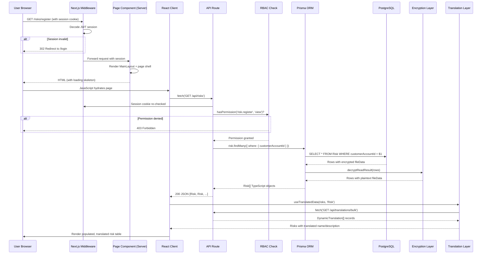
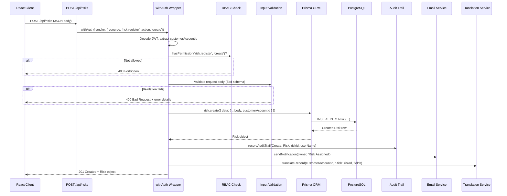
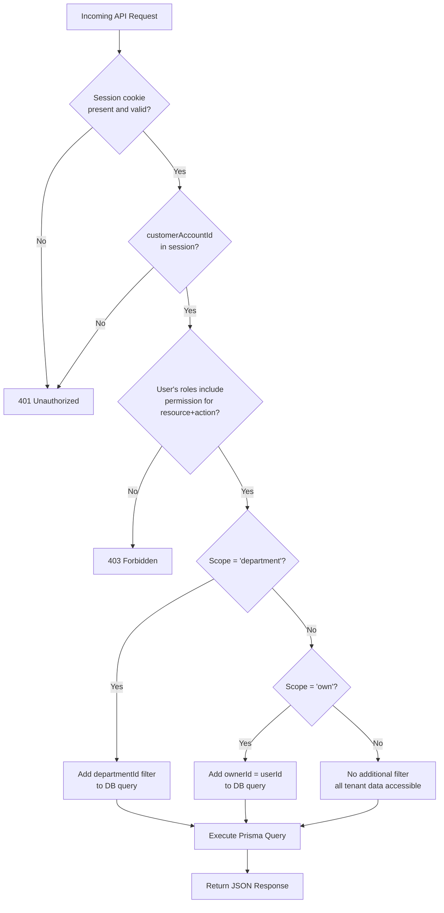

# Request Lifecycle

**Document:** Request Lifecycle Reference  
**Application:** GRC (Governance, Risk, and Compliance) Platform  
**Last Updated:** 2026-06-29

---

## Table of Contents

1. [Overview: What Happens When You Click?](#1-overview-what-happens-when-you-click)
2. [Full Page Navigation Lifecycle](#2-full-page-navigation-lifecycle)
3. [API Request Lifecycle](#3-api-request-lifecycle)
   - [Step 1: Browser Sends Request](#step-1-browser-sends-request)
   - [Step 2: Next.js Middleware (Authentication Gate)](#step-2-nextjs-middleware-authentication-gate)
   - [Step 3: Route Matching](#step-3-route-matching)
   - [Step 4: Server-Side Rendering or Client Fetch](#step-4-server-side-rendering-or-client-fetch)
   - [Step 5: API Route Handler (`withAuth` Wrapper)](#step-5-api-route-handler-withauth-wrapper)
   - [Step 6: Permission Check (RBAC)](#step-6-permission-check-rbac)
   - [Step 7: Database Query (Prisma)](#step-7-database-query-prisma)
   - [Step 8: Encryption and Decryption](#step-8-encryption-and-decryption)
   - [Step 9: Response Returned](#step-9-response-returned)
   - [Step 10: Client Renders with Translations](#step-10-client-renders-with-translations)
4. [Sequence Diagrams](#4-sequence-diagrams)
5. [Error Scenarios](#5-error-scenarios)
6. [Performance Considerations](#6-performance-considerations)

---

## 1. Overview: What Happens When You Click?

When a user clicks "Risk Register" in the sidebar, a chain of events unfolds in milliseconds. Understanding this chain is essential for debugging issues, adding new features, and reasoning about security boundaries.

Here is the high-level summary:

| Step | Location | What Happens |
|------|----------|--------------|
| 1 | Browser | HTTP GET sent to server for `/risks/register` |
| 2 | Next.js Middleware | Session cookie verified; unauthenticated users redirected |
| 3 | Next.js Router | URL matched to `src/app/(protected)/risks/register/page.tsx` |
| 4 | Page Component | React component rendered; client-side fetch initiated |
| 5 | API Route | `GET /api/risks` received; `withAuth` wrapper invoked |
| 6 | Permission Check | User's roles and permissions verified against RBAC matrix |
| 7 | Prisma Query | `prisma.risk.findMany({ where: { customerAccountId } })` executed |
| 8 | Encryption | `fileData` Bytes fields decrypted transparently |
| 9 | JSON Response | Array of Risk objects serialised and returned to browser |
| 10 | Client Render | React re-renders the table; `useTranslatedData` applies language |

---

## 2. Full Page Navigation Lifecycle

When a user navigates to a protected URL (e.g., `/internal-audit/engagements`), the following sequence occurs before the page is visible:

### 2.1 Browser Navigation

The user's browser sends an HTTP `GET` request. The request includes:

- The target URL path.
- All cookies attached to the domain — crucially, the `next-auth.session-token` cookie that carries the encrypted JWT session.

### 2.2 Next.js Middleware Intercepts

Before any page code runs, `src/app/middleware.ts` executes on every request. In the GRC platform, the middleware:

1. Calls NextAuth's `auth()` helper to decode the session cookie.
2. If the session is invalid or absent, redirects the user to `/login?callbackUrl=<original-url>`.
3. If the session is valid, attaches the session to the request and passes it downstream.

**What is a JWT?** A **JSON Web Token** (JWT) is a compact, digitally signed data structure. Think of it as a tamper-evident envelope. The server writes user information (user ID, roles, tenant ID) into the envelope, seals it with a secret key (`NEXTAUTH_SECRET`), and gives it to the browser as a cookie. On every subsequent request, the browser sends the envelope back. The server can verify the seal without consulting the database — this is what makes JWTs fast.

### 2.3 Layout and Page Render

The Next.js router matches the URL to:

```
src/app/(protected)/layout.tsx         ← applies MainLayout (sidebar + header)
src/app/(protected)/internal-audit/layout.tsx  ← module-level layout (if present)
src/app/(protected)/internal-audit/engagements/page.tsx  ← the actual page
```

Layouts wrap pages. The `MainLayout` renders the sidebar navigation and the top header. The page component renders inside the layout's content area.

---

## 3. API Request Lifecycle

Once the page component is mounted in the browser, it fetches data from the API. This is the critical path for understanding how data flows in the GRC platform.

### Step 1: Browser Sends Request

The React component calls the browser's `fetch()` API:

```typescript
const response = await fetch('/api/risks', {
  headers: { 'Content-Type': 'application/json' }
});
```

The browser automatically includes the session cookie. This cookie is the proof of identity sent to the server.

The request travels over HTTPS (TLS 1.2 / 1.3) from the user's browser to Vercel's edge network. All data in transit is encrypted at the network layer — nobody can intercept the risk data on the wire.

### Step 2: Next.js Middleware (Authentication Gate)

The middleware runs again for API routes. It verifies the JWT session cookie. If the session is missing or expired, the middleware returns `401 Unauthorized` immediately — the API route handler never executes.

This is the **first security gate**: no code in `src/app/api/` can be reached without a valid session.

### Step 3: Route Matching

Next.js routes the request based on the URL:

| URL | Matched File |
|-----|-------------|
| `GET /api/risks` | `src/app/api/risks/route.ts` — `export const GET` |
| `POST /api/risks` | `src/app/api/risks/route.ts` — `export const POST` |
| `GET /api/risks/clx9abc` | `src/app/api/risks/[id]/route.ts` — `export const GET` |
| `PATCH /api/risks/clx9abc` | `src/app/api/risks/[id]/route.ts` — `export const PATCH` |

### Step 4: Server-Side Rendering or Client Fetch

**Server-Side Rendering (SSR)** means the page HTML is generated on the server before being sent to the browser. The page component runs on the server and may query the database directly.

**Client-Side Fetching** means the browser receives a minimal HTML shell and then makes additional `fetch()` calls to retrieve data. The page becomes interactive progressively.

The GRC platform primarily uses **Client-Side Fetching** for interactive pages. The pattern is:

1. Page loads with a loading skeleton or spinner.
2. `useEffect` or `SWR` triggers a `fetch('/api/<resource>')` call.
3. The API returns JSON data.
4. React state is updated; the component re-renders with real data.

### Step 5: API Route Handler (`withAuth` Wrapper)

Every API route in the GRC platform is wrapped with the `withAuth` higher-order function from `src/lib/api-auth.ts`:

```typescript
// src/app/api/risks/route.ts
export const GET = withAuth(
  async (req, context, session) => {
    // handler code — only runs if auth + permissions pass
  },
  { resource: 'risk.register', action: 'view' }
);
```

**What is a higher-order function?** A function that takes another function as an argument and returns a new function. `withAuth` wraps your handler with authentication and authorization checks. Your actual business logic only runs if all checks pass.

`withAuth` performs these steps in order:

1. **Extract session** — calls `auth()` to read the JWT cookie.
2. **Verify tenant** — confirms `customerAccountId` is present in the session (no cross-tenant access).
3. **Check permission** — delegates to the RBAC system (Step 6 below).
4. **Call handler** — only if all checks pass, invokes the wrapped handler function.
5. **Auto-log mutation** — for `POST`, `PATCH`, `DELETE` methods, automatically writes an AuditTrail entry.

If any check fails, `withAuth` returns an error response immediately and the handler is never called.

### Step 6: Permission Check (RBAC)

**RBAC** stands for **Role-Based Access Control**. Instead of asking "can user Alice do X?", the system asks "does Alice's role grant permission to do X?". This makes permission management scalable — you change a role's permissions once, and all users with that role are updated automatically.

The permission matrix is defined in `src/lib/permissions.ts` (1,117 lines). It maps every combination of (role, resource, action) to an allow/deny decision.

**Key concepts:**

| Term | Definition | Example |
|------|-----------|---------|
| **Resource** | A named area of the application | `risk.register`, `compliance.evidence` |
| **Action** | What the user wants to do | `view`, `create`, `edit`, `delete`, `approve` |
| **Scope** | Data visibility boundary | `all` (all data), `department` (own dept only), `own` (created by self) |
| **Role** | A named set of permissions | `AuditHead`, `Auditor`, `Reviewer` |

**The check in code:**

```typescript
// From src/lib/permissions.ts
export function hasPermission(
  userPermissions: UserPermission[],
  resource: string,
  action: Action
): boolean {
  return userPermissions.some(
    p => p.resource === resource && p.action === action
  );
}
```

The user's permissions are pre-computed at login time and embedded in the JWT token. Every permission check is a simple array search — no database round-trip needed.

**Scope enforcement** adds a second layer. A `DepartmentContributor` with scope `department` can only see risks belonging to their own department. The API route reads the scope from the user's session and adds `departmentId: session.user.departmentId` to the Prisma query.

If the permission check fails, `withAuth` returns `403 Forbidden`. The database is never queried.

This is the **second security gate**: authenticated users can only access data their role permits.

### Step 7: Database Query (Prisma)

If authentication and authorization both pass, the handler executes its Prisma query.

**What is Prisma?** Prisma is an **ORM** (Object-Relational Mapper). It translates TypeScript method calls into SQL queries. Instead of writing raw SQL like `SELECT * FROM "Risk" WHERE "customerAccountId" = $1`, you write:

```typescript
const risks = await prisma.risk.findMany({
  where: {
    customerAccountId: session.user.customerAccountId,  // tenant isolation
    ...(scope === 'department' && {
      departmentId: session.user.departmentId           // scope isolation
    })
  },
  include: {
    category: true,   // JOIN with RiskCategory table
    owner: {
      select: { firstName: true, lastName: true }       // select specific columns
    }
  },
  orderBy: { createdAt: 'desc' }
});
```

Prisma generates the equivalent SQL, executes it against the database, and returns typed TypeScript objects.

**The Prisma Client Singleton** (`src/lib/prisma.ts`) ensures only one Prisma Client instance exists per server process. Creating multiple instances would waste database connection slots. In Next.js serverless functions, the singleton is stored on the `globalThis` object to survive hot-reload in development.

**Multi-tenant guarantee:** The `customerAccountId` filter is applied in every data-returning query. There is no query in the codebase that returns data from the database without scoping to a tenant. This is the **third security gate**: the query itself enforces data isolation.

### Step 8: Encryption and Decryption

The Prisma client in `src/lib/prisma.ts` is extended with a **transparent encryption/decryption extension**. This extension intercepts every read and write operation.

**Affected fields:** Only `Bytes` (binary data) columns that are registered in `src/lib/encrypted-fields.ts` are affected. These are primarily `fileData` columns that store uploaded file contents.

**On write (create/update):** Before the data reaches PostgreSQL, the extension calls `maybeEncryptBytes()` on the `fileData` value. The raw file bytes are encrypted using AES-256-GCM. What is stored in the database is unintelligible ciphertext.

**On read (findMany/findUnique):** After PostgreSQL returns the row, the extension calls `maybeDecryptBytes()` on the `fileData` value. The ciphertext is decrypted back to the original file bytes before the result reaches application code.

**Kill switch:** When the `ENCRYPTION_ENABLED` environment variable is not set to `"true"`, the extension is a no-op — it passes data through untouched. This allows the same codebase to be deployed to UAT (without encryption) and production (with encryption) by flipping a single environment variable.

**What is AES-256-GCM?** AES stands for Advanced Encryption Standard. 256 refers to the key length (256 bits = 32 bytes). GCM (Galois/Counter Mode) is a mode of operation that provides both encryption and authentication — meaning it detects if the encrypted data has been tampered with. It is the industry standard for symmetric encryption.

### Step 9: Response Returned

The handler serialises the Prisma result to JSON and returns it:

```typescript
return NextResponse.json(risks, { status: 200 });
```

Next.js serialises the JavaScript objects to a JSON string and sends it to the browser in the HTTP response body. The response includes `Content-Type: application/json` and appropriate cache headers.

For error cases:
- `400 Bad Request` — invalid input data.
- `401 Unauthorized` — no valid session.
- `403 Forbidden` — valid session but insufficient permissions.
- `404 Not Found` — the requested record does not exist (or belongs to another tenant).
- `500 Internal Server Error` — unexpected server-side failure.

### Step 10: Client Renders with Translations

The browser receives the JSON response. The React component's state is updated:

```typescript
const [risks, setRisks] = useState<Risk[]>([]);

useEffect(() => {
  fetch('/api/risks')
    .then(r => r.json())
    .then(data => setRisks(data));
}, []);
```

React re-renders the component tree with the new data. Simultaneously, the **i18n translation layer** applies:

1. **Static strings** (UI labels like "Risk Name", "Status", "Actions") are passed through the `t()` function from `useLanguage()`. The function looks up the current locale in `localStorage` and returns the translated string.

2. **Dynamic data** (user-entered risk names, control descriptions) is processed by `useTranslatedData()`. This hook fetches previously computed translations from the `/api/translations/bulk` endpoint and overlays them on the raw data.

The final result: the user sees a fully translated, data-populated risk register table.

---

## 4. Sequence Diagrams

### 4.1 Full Page Request Lifecycle



### 4.2 API Request Lifecycle (Write Operation)



### 4.3 Authentication and Authorization Decision Tree



---

## 5. Error Scenarios

### 5.1 Session Expired

**Symptom:** User is redirected to `/login` mid-session.

**Cause:** The NextAuth JWT session has a configurable expiry (default 24 hours for this application). After expiry, the middleware detects an invalid session and redirects.

**Resolution:** Log in again. The `callbackUrl` query parameter in the redirect URL preserves the original destination.

### 5.2 Permission Denied (403)

**Symptom:** API call returns `{ "error": "Permission denied" }` with status 403.

**Cause:** The user's roles do not include a permission entry for the requested resource + action combination.

**Debug steps:**
1. Check the user's assigned roles in `Organization > Users`.
2. Check the role's permissions in `src/lib/permissions.ts`.
3. Verify the API route's `withAuth` call specifies the correct `resource` and `action`.

### 5.3 Record Not Found (404)

**Symptom:** API call returns `{ "error": "Not found" }` with status 404.

**Cause:** Either the record genuinely does not exist, or it belongs to a different tenant. Prisma's `findUnique` with `customerAccountId` in the `where` clause returns `null` for records in other tenants, which is treated as not found.

This behaviour is intentional. The API must not reveal whether a record exists in another tenant — returning 404 (rather than 403) prevents tenant enumeration attacks.

### 5.4 Database Connection Error (500)

**Symptom:** API call returns 500 with a database error message.

**Cause:** The Neon PostgreSQL connection pool is exhausted, or the `DATABASE_URL` environment variable is misconfigured.

**Resolution:**
- Check the Neon dashboard for active connections.
- Verify `DATABASE_URL` in the Vercel environment variables.
- In development, ensure the local PostgreSQL server is running.

---

## 6. Performance Considerations

### 6.1 Permission Pre-computation

User permissions are expanded at login time by the NextAuth session callback in `src/lib/auth.ts`. The callback queries the database for the user's roles and resolves all permissions, storing them in the JWT. This means permission checks during API requests are pure in-memory lookups — zero database round-trips.

### 6.2 Prisma Query Optimisation

Common patterns used in the GRC API routes:

- **Select only needed fields** (`select: { id: true, name: true }`) to avoid transferring large columns like `content` or `fileData` unnecessarily.
- **Pagination** (`skip`, `take`) on list endpoints to prevent returning thousands of rows.
- **Indexed columns** — every `customerAccountId` column has a database index, as do `createdAt`, `userId`, and `module` on the `AuditTrail` table. Indexed columns are used in `where` clauses for fast lookups.

### 6.3 Serverless Cold Starts

The application runs on Vercel Serverless Functions. A **cold start** occurs when a function has been idle and a new instance must be initialised. The Prisma client singleton pattern (`globalThis.prisma`) minimises this overhead by reusing the database connection pool across invocations within the same process lifetime.

Neon PostgreSQL uses **connection pooling** (PgBouncer) that is specifically designed for serverless workloads where many short-lived connections are opened and closed rapidly.

---

*For architectural context, see [System-Architecture.md](System-Architecture.md). For module interactions, see [Module-Relationships.md](Module-Relationships.md).*
