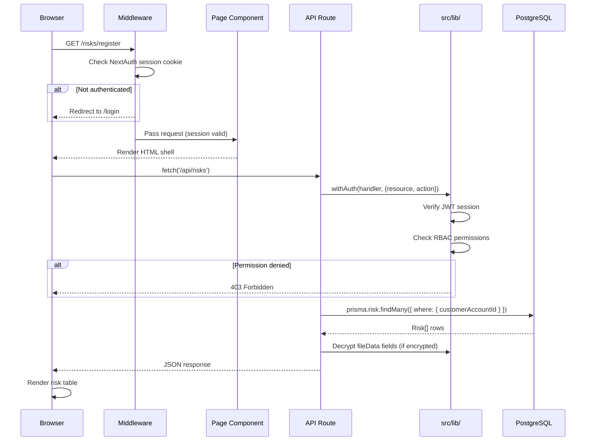
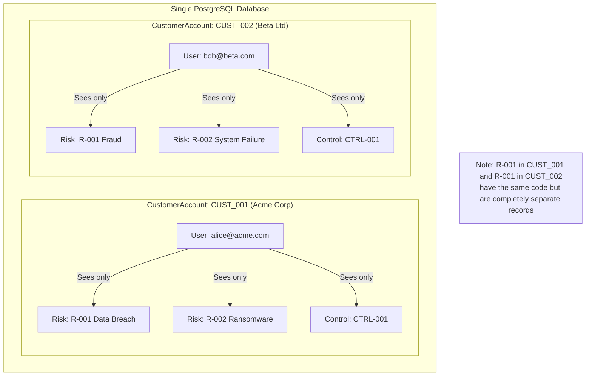
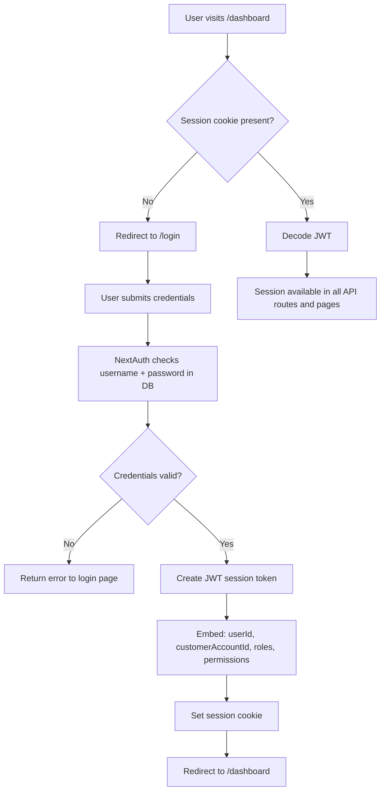

# System Architecture

**Document:** System Architecture Reference  
**Application:** GRC (Governance, Risk, and Compliance) Platform  
**Stack:** Next.js 16.1.1 · TypeScript · Prisma ORM · PostgreSQL / SQLite  
**Last Updated:** 2026-06-29

---

## Table of Contents

1. [What Is Software Architecture?](#1-what-is-software-architecture)
2. [Three-Tier Architecture](#2-three-tier-architecture)
3. [How Next.js Unifies Frontend and Backend](#3-how-nextjs-unifies-frontend-and-backend)
4. [Server Components vs Client Components](#4-server-components-vs-client-components)
5. [App Router Pattern](#5-app-router-pattern)
6. [Multi-Tenant Architecture](#6-multi-tenant-architecture)
7. [Module Architecture](#7-module-architecture)
8. [Service Layer Pattern](#8-service-layer-pattern)
9. [Architecture Diagrams](#9-architecture-diagrams)

---

## 1. What Is Software Architecture?

Imagine you are constructing a large office building. Before a single brick is laid, architects produce blueprints. These blueprints answer questions such as:

- How many floors will there be, and what is on each floor?
- Where do the staircases and elevators go?
- How does electricity reach every office?
- How does waste water leave the building?
- Which structural walls cannot be moved?

**Software architecture** is the same idea applied to code. Before writing a single line, the team decides:

- How the application is divided into major parts (called **tiers** or **layers**).
- How data flows from the user's screen to the database and back.
- Which parts of the code can be changed without breaking others.
- How the system grows when more users or features are added.

Good architecture makes the application:

- **Maintainable** — a bug in one area does not cascade into unrelated areas.
- **Scalable** — new features or more traffic can be handled without redesigning everything.
- **Secure** — authentication and authorization live in well-known, auditable places.
- **Testable** — individual parts can be tested in isolation.

This document describes the architectural decisions made for the GRC platform and explains the reasoning behind each choice.

---

## 2. Three-Tier Architecture

The GRC platform follows the **three-tier architecture** pattern — the most widely used pattern for web applications. Think of it as three separate floors in our office building, each with a distinct job.

### Tier 1: Presentation Layer (The Reception Floor)

This is everything the user sees and touches: buttons, forms, tables, charts, menus. Its only job is to display information and collect user input. It knows nothing about databases or business rules.

In the GRC platform, the Presentation Layer is built with:

- **React** — a JavaScript library that builds user interfaces as composable components.
- **Tailwind CSS** — a utility-first CSS framework that provides design tokens (colours, spacing, typography).
- **shadcn/ui** — a set of 37 pre-built React components (buttons, dialogs, tables, forms) built on Radix UI primitives.
- **Next.js App Router** — the routing engine that connects URLs to React components.

### Tier 2: Application Logic Layer (The Operations Floor)

This is where business rules live. Examples of business logic in the GRC platform:

- "A risk cannot be closed unless it has at least one response strategy."
- "Only a user with the `AuditHead` role may approve an audit engagement."
- "Evidence uploaded more than 90 days ago requires a re-review."

This layer receives requests from the Presentation Layer, applies these rules, and then asks the Data Layer for information.

In the GRC platform, the Application Logic Layer lives in:

- `src/app/api/` — REST API route handlers.
- `src/lib/` — utility libraries for authentication, permissions, email, translation, and encryption.
- `src/hooks/` — client-side logic hooks that coordinate data fetching and state.

### Tier 3: Data Layer (The Records Vault)

This layer stores and retrieves all persistent data. It knows nothing about user interfaces or business rules. Its only job is to read and write data reliably.

In the GRC platform, the Data Layer is:

- **Prisma ORM** — the software interface that translates TypeScript code into SQL queries.
- **SQLite** (development) — a file-based database stored in `prisma/dev.db`.
- **PostgreSQL on Neon** (production) — a fully managed, serverless PostgreSQL database.

### How the Tiers Communicate

```
User's Browser
     │
     │  HTTP Request (URL / form submit / button click)
     ▼
Presentation Layer  ──────────────────────────────────────────
     │  (React components in src/app/(protected)/)
     │
     │  fetch() call to API route
     ▼
Application Logic Layer  ─────────────────────────────────────
     │  (src/app/api/* route handlers)
     │  - Check authentication (NextAuth session)
     │  - Check authorization (RBAC permissions)
     │  - Apply business rules
     │
     │  Prisma query
     ▼
Data Layer  ──────────────────────────────────────────────────
     │  (Prisma ORM → PostgreSQL / SQLite)
     │
     │  SQL result
     ▼
Application Logic Layer
     │  - Format response JSON
     ▼
Presentation Layer
     │  - Render updated UI
     ▼
User's Browser
```

---

## 3. How Next.js Unifies Frontend and Backend

Traditionally, web development required two entirely separate projects:

1. A **frontend** project (e.g., React) that only draws the user interface.
2. A **backend** project (e.g., Node.js / Express) that only handles database queries and business logic.

These two projects needed to be deployed separately, maintained separately, and communicate via a network API.

**Next.js** is a React framework that merges both into a single project. In the same codebase, the same repository, and even sometimes the same file, you can write:

- React components that render in the browser (frontend).
- API route handlers that run on the server and talk to the database (backend).

For the GRC platform, this means:

| Without Next.js (traditional) | With Next.js |
|-------------------------------|--------------|
| `grc-frontend/` repository | `grc-app/` single repository |
| `grc-backend/` repository | (same) |
| Deploy frontend to CDN | Deploy once to Vercel |
| Deploy backend to server | (same) |
| CORS configuration needed | No CORS needed (same origin) |
| Two separate CI/CD pipelines | One pipeline |

The practical benefit is enormous: a developer can change the database query and the UI that displays the result in the same pull request, with the TypeScript compiler verifying type safety end-to-end.

---

## 4. Server Components vs Client Components

This is one of the most important concepts in Next.js 13 and later (the App Router era). Understanding it is essential for working on this codebase.

### What Is a Server Component?

A **Server Component** is a React component that runs **only on the server**. The browser never downloads its JavaScript code. The server executes the component, produces HTML output, and sends that HTML to the browser.

**Characteristics:**
- Can access the database directly (no API call needed).
- Can use secrets and environment variables safely.
- Cannot use browser APIs (`window`, `document`, `localStorage`).
- Cannot use React state (`useState`) or effects (`useEffect`).
- Cannot respond to user interactions (click, input change).
- Renders once at request time; not interactive.

**When to use:** Pages that display data without interactivity — dashboards, detail views, report pages.

**Marker:** No special marker. In the App Router, all components are Server Components by default.

### What Is a Client Component?

A **Client Component** is a React component that runs **in the browser**. Its JavaScript is downloaded and executed by the user's browser.

**Characteristics:**
- Can use React state, effects, and context.
- Can respond to user events (clicks, form inputs).
- Can access browser APIs.
- **Cannot** directly query the database (must call an API route).
- Must be explicitly marked.

**Marker:** The `"use client"` directive at the very top of the file.

```typescript
"use client";

import { useState } from "react";

export default function RiskForm() {
  const [name, setName] = useState("");
  // This component runs in the browser
}
```

### The GRC Platform's Approach

The GRC platform is highly interactive (forms, filters, real-time updates), so the overwhelming majority of page components are Client Components marked with `"use client"`. The pattern used throughout is:

1. The **page file** (`page.tsx`) is a Server Component that handles routing and layout.
2. The actual **content component** (e.g., `RiskRegisterClient.tsx`) is a Client Component that fetches data via API calls and renders interactive UI.

This is a deliberate trade-off: slightly more network calls in exchange for rich interactivity throughout the application.

---

## 5. App Router Pattern

### What Is Routing?

**Routing** is the process of mapping a URL (web address) to a specific piece of code (a page component). When a user navigates to `https://app.example.com/risks/register`, the router must determine which React component to render.

### File-System Based Routing

Next.js App Router uses the **file system as the routing configuration**. There is no separate `routes.js` file to maintain. Instead, the folder structure directly determines the URL structure.

**The rule:** A file named `page.tsx` inside a folder becomes a URL route matching that folder's path.

```
src/app/
├── page.tsx                           → /
├── login/
│   └── page.tsx                       → /login
└── (protected)/
    ├── dashboard/
    │   └── page.tsx                   → /dashboard
    ├── risks/
    │   ├── page.tsx                   → /risks
    │   ├── register/
    │   │   └── page.tsx               → /risks/register
    │   └── [id]/
    │       └── page.tsx               → /risks/abc123 (dynamic)
    └── internal-audit/
        ├── page.tsx                   → /internal-audit
        └── engagements/
            ├── page.tsx               → /internal-audit/engagements
            └── [id]/
                └── page.tsx           → /internal-audit/engagements/abc123
```

### Route Groups: The `(protected)` Folder

A folder name wrapped in parentheses `(like-this)` is a **Route Group**. It organises files into a group without affecting the URL. The folder name does not appear in the URL.

`src/app/(protected)/dashboard/page.tsx` renders at `/dashboard`, not at `/protected/dashboard`.

The `(protected)` group serves one purpose: it applies a shared `layout.tsx` file to all routes inside it. That layout wraps every protected page with the `MainLayout` component — the sidebar navigation, top header bar, and authentication check. Any route outside `(protected)` (such as `/login`) gets none of this wrapper.

### Dynamic Routes

A folder named `[id]` (with square brackets) creates a **dynamic segment**. The value in the URL position is captured as a parameter.

- URL `/risks/clx9abc123` → component receives `params.id = "clx9abc123"`.

In Next.js 16, route parameters are **Promises** and must be awaited:

```typescript
interface RouteContext {
  params: Promise<{ id: string }>;
}

export async function GET(req: Request, context: RouteContext) {
  const { id } = await context.params;
  // use id
}
```

### API Routes

Files named `route.ts` (instead of `page.tsx`) become HTTP API endpoints. They export named functions (`GET`, `POST`, `PATCH`, `DELETE`) corresponding to HTTP methods.

```
src/app/api/
├── risks/
│   ├── route.ts        → GET /api/risks, POST /api/risks
│   └── [id]/
│       └── route.ts    → GET /api/risks/:id, PATCH /api/risks/:id, DELETE /api/risks/:id
```

---

## 6. Multi-Tenant Architecture

### What Is Multi-Tenancy?

**Multi-tenancy** means one application instance serves multiple independent organisations (called **tenants**), with complete data isolation between them. Each organisation sees only its own data, even though they all share the same database server and application code.

**Analogy:** An apartment building is multi-tenant. Every resident (tenant) has their own locked apartment (data). They share the building's infrastructure (elevator, water supply, electricity) but cannot enter each other's apartments.

The GRC platform is designed to serve multiple customer organisations simultaneously. Company A cannot see Company B's risks, controls, or audit findings — even though all data lives in the same PostgreSQL database.

### The `customerAccountId` Pattern

Every business data model in the schema carries a `customerAccountId` field:

```prisma
model Risk {
  id                String          @id @default(cuid())
  customerAccountId String          // ← tenant identifier
  customerAccount   CustomerAccount @relation(...)
  name              String
  // ...
}
```

`CustomerAccount` is the root tenant record. Every customer organisation has one row in this table. The `id` of that row becomes the `customerAccountId` that appears on every piece of data belonging to that organisation.

**Data isolation in queries:** Every API route adds `customerAccountId` to its Prisma `where` clause:

```typescript
// Correct: scoped to the authenticated user's tenant
const risks = await prisma.risk.findMany({
  where: { customerAccountId: session.user.customerAccountId }
});

// Wrong: would return data from ALL tenants
const risks = await prisma.risk.findMany();
```

The `customerAccountId` is extracted from the authenticated user's JWT session token, which is set at login and cannot be forged by the client.

### The Tenant Hierarchy

```
CustomerAccount (one per organisation)
├── Users (employees of that organisation)
├── Organization (profile, branches, data centres)
├── Departments
├── Frameworks / Controls / Evidence
├── Risks / Assessments / Responses
├── Assets
├── Audit Engagements / Findings / CAPAs
└── Subscription (modules licensed to this tenant)
```

### The Superadmin Tenant

The system itself has a special tenant with code `SUPERADMIN_001`. Users in this tenant have the `GRCAdministrator` role, which grants access to all tenant accounts for platform administration (creating new customer accounts, configuring frameworks, managing subscriptions).

### Module-Level Feature Flags

Beyond data isolation, the `CustomerAccount` model carries boolean flags that control which modules a tenant can access:

| Flag | Module |
|------|--------|
| `isGrcAdded` | Core GRC (Compliance, Risk, Assets) |
| `isTprmAdded` | Third-Party Risk Management |
| `isInternalAuditEnabled` | Internal Audit |
| `isTechnicalEvidenceEnabled` | Technical Evidence Platform |
| `isQpostComplianceEnabled` | QPost Compliance |

These flags are checked server-side on every relevant API request, preventing tenants from accessing modules they have not licensed.

---

## 7. Module Architecture

The GRC platform is organised into **10 functional modules**. Each module is an independent vertical slice of the application — it has its own:

- Pages (`src/app/(protected)/<module>/`)
- API routes (`src/app/api/<module>/`)
- Database models (in `prisma/schema.prisma`)
- Navigation entry (in `src/lib/navigation.ts`)
- Permission resources (in `src/lib/permissions.ts`)

This separation ensures that changes to the Risk module cannot accidentally break the Compliance module.

### The 10 Modules

| Module | Folder | Primary Purpose |
|--------|--------|-----------------|
| Organization | `organization/` | Manage company profile, departments, stakeholders, infrastructure |
| Compliance | `compliance/` | Frameworks, controls, policies, evidence, exceptions, KPIs |
| Risk Management | `risks/` | Risk register, assessment, response, risk control matrix |
| Asset Management | `assets/` | Asset inventory, classification, CIA ratings |
| Internal Audit | `internal-audit/` | Strategic planning, engagements, fieldwork, findings, CAPA |
| TPRM | `tprm/` | Third-party vendor risk management and assessments |
| Dashboard | `dashboard/` | Cross-module summary views and analytics |
| GRC Administration | `grc/` | Platform-level admin (customer accounts, frameworks, subscriptions) |
| Settings | `settings/` | User profile, notifications, subscription portal |
| Support | `support/` | Helpdesk ticketing system |

### Module Isolation Principles

1. **No direct imports between modules.** The Compliance module does not import components from the Risk module. Shared UI lives in `src/components/shared/`.

2. **Cross-module data access via API only.** If the Internal Audit module needs to display a list of risks, it calls `/api/risks/` like any other client. It does not import Prisma queries from the Risk module's code.

3. **Shared utilities in `src/lib/`.** Authentication, permissions, email, encryption, and translation are genuinely cross-cutting concerns and live in `src/lib/`.

4. **Independent navigation entries.** Each module's navigation items are guarded by permission checks, so a user who has access to only Compliance sees only Compliance in the sidebar.

---

## 8. Service Layer Pattern

In traditional multi-layered applications, a **Service Layer** is a dedicated set of functions that contain business logic and sit between the API route handler and the database. For example:

```
API Route Handler → RiskService.createRisk() → Prisma Database
```

The GRC platform uses a **lightweight service layer** — most business logic is written directly in the API route handler for explicitness and simplicity, but cross-cutting concerns are extracted into `src/lib/` utilities:

| Service | File | Responsibility |
|---------|------|----------------|
| Authentication | `src/lib/auth.ts` | NextAuth configuration, session callbacks, JWT expansion |
| Authorization | `src/lib/permissions.ts` | RBAC permission matrix, permission checks |
| API Protection | `src/lib/api-auth.ts` | `withAuth` wrapper, tenant isolation helpers |
| Email | `src/lib/email-service.ts` | Email sending, template rendering (1,700 lines) |
| Encryption | `src/lib/encryption.ts` | AES-256-GCM field-level encryption |
| Translation | `src/lib/translation-service.ts` | Dynamic content translation via Python backend |
| Audit Trail | `src/lib/audit-trail.ts` | Activity logging for all mutations |
| Prisma Client | `src/lib/prisma.ts` | Singleton Prisma client with transparent encryption extension |

---

## 9. Architecture Diagrams

### 9.1 System Overview

```mermaid
graph TB
    subgraph "User's Browser"
        UI[React Components<br/>Tailwind CSS<br/>shadcn/ui]
    end

    subgraph "Vercel Edge Network"
        MW[Next.js Middleware<br/>Auth check<br/>Route protection]
    end

    subgraph "Next.js Server (Vercel Serverless)"
        PR[Protected Pages<br/>src/app/(protected)/]
        API[API Routes<br/>src/app/api/]
        LIB[Server Libraries<br/>src/lib/]
    end

    subgraph "External Services"
        NEON[(Neon PostgreSQL<br/>Production DB)]
        PYTHON[Python Backend API<br/>AI Translation]
        EMAIL[SMTP Server<br/>Email Notifications]
        RUNPOD[RunPod<br/>AI Document Processing]
    end

    UI -->|HTTP fetch| MW
    MW -->|Passes authenticated request| PR
    MW -->|Passes authenticated request| API
    PR -->|fetch| API
    API -->|withAuth wrapper| LIB
    LIB -->|Prisma queries| NEON
    LIB -->|Translation requests| PYTHON
    LIB -->|Send emails| EMAIL
    API -->|AI ingest jobs| RUNPOD
```

### 9.2 Module Relationships

```mermaid
graph LR
    subgraph Foundation
        ORG[Organization Module<br/>Departments · Users · Profile]
    end

    subgraph GRC Modules
        COMP[Compliance Module<br/>Frameworks · Controls · Evidence]
        RISK[Risk Module<br/>Register · Assessment · Response]
        ASSET[Asset Module<br/>Inventory · Classification]
        AUDIT[Internal Audit Module<br/>Engagements · Findings · CAPA]
    end

    subgraph Extended Modules
        TPRM[TPRM Module<br/>Vendors · Assessments]
        DASH[Dashboard<br/>Cross-module analytics]
    end

    subgraph Cross-Cutting
        RBAC[RBAC<br/>Roles · Permissions]
        TRAIL[Audit Trail<br/>Activity Log]
        NOTIF[Notifications<br/>In-app · Email]
        TRANS[Translations<br/>Dynamic i18n]
    end

    ORG --> COMP
    ORG --> RISK
    ORG --> ASSET
    ORG --> AUDIT
    ORG --> TPRM
    RISK --> COMP
    RISK --> AUDIT
    ASSET --> RISK
    COMP --> AUDIT
    RBAC --> ORG
    RBAC --> COMP
    RBAC --> RISK
    RBAC --> ASSET
    RBAC --> AUDIT
    RBAC --> TPRM
    TRAIL -.->|logs all mutations| GRC Modules
    NOTIF -.->|alerts users| GRC Modules
    DASH -->|reads from| GRC Modules
```

### 9.3 Request Data Flow



### 9.4 Multi-Tenant Data Isolation



### 9.5 Authentication Flow



---

*This document covers the high-level architecture. For request-level details, see [Request-Lifecycle.md](Request-Lifecycle.md). For module relationships, see [Module-Relationships.md](Module-Relationships.md). For the folder structure, see [Folder-Structure.md](Folder-Structure.md).*
