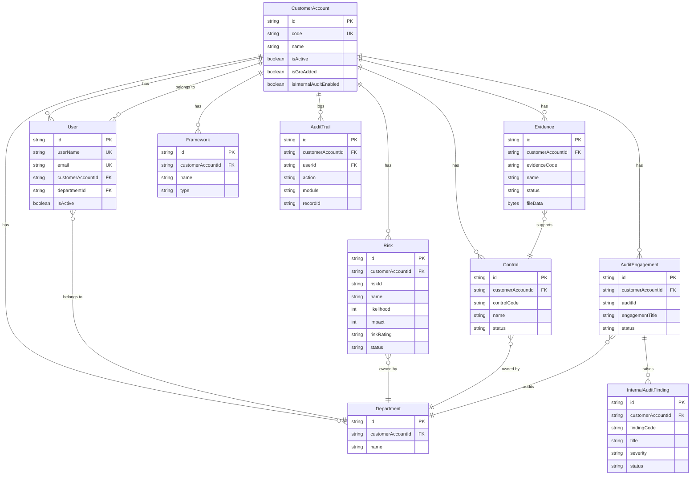

# Database Overview

**Document:** Database Architecture and Concepts  
**Application:** GRC (Governance, Risk, and Compliance) Platform  
**Stack:** Prisma ORM · PostgreSQL (Neon, production) · SQLite (development)  
**Last Updated:** 2026-06-29

---

## Table of Contents

1. [What Is a Database?](#1-what-is-a-database)
2. [PostgreSQL vs SQLite — Why Two Databases?](#2-postgresql-vs-sqlite--why-two-databases)
3. [What Is an ORM? What Is Prisma?](#3-what-is-an-orm-what-is-prisma)
4. [Multi-Tenant Data Isolation](#4-multi-tenant-data-isolation)
5. [Database Provider Configuration](#5-database-provider-configuration)
6. [Neon PostgreSQL — Serverless Database](#6-neon-postgresql--serverless-database)
7. [Connection Pooling](#7-connection-pooling)
8. [The Prisma Client Singleton](#8-the-prisma-client-singleton)
9. [Transaction Handling](#9-transaction-handling)
10. [The Encryption Extension](#10-the-encryption-extension)
11. [Key Model Relationships Diagram](#11-key-model-relationships-diagram)

---

## 1. What Is a Database?

Imagine a library. The library contains thousands of books, neatly organised on shelves, catalogued by subject, author, and title. When you want a book, you ask the librarian; they consult the catalogue and retrieve it. When you return a book, the librarian puts it back in the right place and updates the catalogue.

A **database** is the digital equivalent of that library system:

- **Data** is stored persistently — it survives the application being restarted.
- **Queries** are structured requests for specific data (like asking for "all books by Tolkien published after 1950").
- **Indexes** are like the library catalogue — they make queries fast.
- **Transactions** are like the librarian's checklist — they ensure that a sequence of operations either all succeed or all fail together.

### Relational Databases

The GRC platform uses a **relational database**. In a relational database:

- Data is stored in **tables** (like spreadsheet sheets).
- Each table has **columns** (like spreadsheet headers: id, name, status).
- Each table has **rows** (individual records: one risk per row).
- Tables are **linked** to each other using foreign keys (a risk row contains a `departmentId` that points to a row in the department table).

**SQL** (Structured Query Language) is the language used to query relational databases. Example:

```sql
SELECT r.name, r.riskRating, d.name AS departmentName
FROM "Risk" r
JOIN "Department" d ON r."departmentId" = d.id
WHERE r."customerAccountId" = 'cust-001'
ORDER BY r."createdAt" DESC;
```

---

## 2. PostgreSQL vs SQLite — Why Two Databases?

The GRC platform uses two different database systems at different stages of development:

### SQLite (Development)

**What is SQLite?** A database that is stored in a single file (`prisma/dev.db`) on your computer's hard drive. It requires no installation, no server process, and zero configuration. It simply works.

**Why use SQLite in development?**
- Instant setup — `npm run dev` works out of the box.
- Each developer has their own isolated copy of the database.
- No network latency — reads and writes are local disk operations.
- Easy to reset: `npm run db:reset` recreates the file from scratch.
- Works on any operating system without external services.

**Limitations of SQLite:** It cannot handle many simultaneous connections (not suitable for production web traffic), lacks some advanced PostgreSQL features, and does not support all Prisma capabilities.

### PostgreSQL (Production)

**What is PostgreSQL?** A powerful, open-source relational database management system (RDBMS). It is the industry standard for production web applications. Unlike SQLite, PostgreSQL runs as a separate server process and can serve thousands of simultaneous connections.

**Why PostgreSQL in production?**
- Handles concurrent writes from many users simultaneously.
- Advanced features: JSONB columns, full-text search, recursive queries.
- Robust ACID guarantees (explained in the Transactions section).
- Enterprise-grade reliability and performance.
- Supported by all major cloud providers.

### The Switch Is One Line

The `datasource` block in `prisma/schema.prisma` controls which database Prisma connects to:

```prisma
datasource db {
  provider = "postgresql"  // or "sqlite" for development
  url      = env("DATABASE_URL")
}
```

In development, `DATABASE_URL` points to the SQLite file. In production, it points to Neon PostgreSQL. The application code is identical — only this configuration changes.

> **Note:** The current schema uses `provider = "postgresql"` even in development for Neon cloud access. For fully local development with SQLite, this would be changed to `"sqlite"`.

---

## 3. What Is an ORM? What Is Prisma?

### The Problem Without an ORM

Writing raw SQL in application code has several problems:

1. **String concatenation is error-prone.** A typo in a column name causes a runtime crash, not a compile-time error.
2. **SQL injection risk.** Improperly constructed queries can allow attackers to execute arbitrary SQL.
3. **No type safety.** The compiler doesn't know that the query returns rows with a `name: string` field — you find out at runtime when it breaks.
4. **Database coupling.** SQL syntax varies between PostgreSQL, MySQL, and SQLite — code written for one often breaks on another.

### What an ORM Does

An **ORM** (Object-Relational Mapper) is a library that translates between the object-oriented world of your application code and the table-based world of the database.

Instead of writing:
```sql
INSERT INTO "Risk" (id, name, "customerAccountId", likelihood, impact)
VALUES ($1, $2, $3, $4, $5);
```

You write:
```typescript
const risk = await prisma.risk.create({
  data: {
    name: "Data Breach",
    customerAccountId: session.user.customerAccountId,
    likelihood: 3,
    impact: 4
  }
});
// risk is now a fully typed TypeScript object: { id: string, name: string, ... }
```

### Prisma Specifically

Prisma is a **next-generation TypeScript ORM** that goes beyond traditional ORMs by generating a fully-typed client from your database schema.

**The Prisma workflow:**

1. You define your data models in `prisma/schema.prisma` using Prisma's declarative schema language.
2. Running `npx prisma generate` reads the schema and generates TypeScript types and the Prisma Client library.
3. Your application imports the generated Prisma Client and uses it for all database operations.
4. Prisma translates your TypeScript method calls into optimised SQL and executes them.

**Type safety example:** If you try to query a column that doesn't exist on the Risk model, TypeScript refuses to compile:

```typescript
const risk = await prisma.risk.findUnique({
  where: { id: "abc" },
  select: { nonExistentField: true }  // TypeScript error: nonExistentField does not exist
});
```

This catches database errors at compile time, not in production.

### Key Prisma Operations

| Operation | Method | SQL Equivalent |
|-----------|--------|----------------|
| Find one | `findUnique({ where: { id } })` | `SELECT ... WHERE id = $1 LIMIT 1` |
| Find many | `findMany({ where: { ... } })` | `SELECT ... WHERE ...` |
| Find first | `findFirst({ where: { ... } })` | `SELECT ... WHERE ... LIMIT 1` |
| Create | `create({ data: { ... } })` | `INSERT INTO ...` |
| Update | `update({ where: { id }, data: { ... } })` | `UPDATE ... SET ... WHERE id = $1` |
| Delete | `delete({ where: { id } })` | `DELETE FROM ... WHERE id = $1` |
| Upsert | `upsert({ where, create, update })` | `INSERT ... ON CONFLICT DO UPDATE` |
| Count | `count({ where: { ... } })` | `SELECT COUNT(*) WHERE ...` |

---

## 4. Multi-Tenant Data Isolation

**Multi-tenancy** is the architecture where one application serves many independent customers (tenants) while keeping their data completely separate.

### The Apartment Building Analogy

Imagine a large apartment building:
- The building is the application server.
- Each apartment is a customer organisation (tenant).
- All apartments share the elevator, plumbing, and electricity (the application code and database server).
- Each apartment has its own locked door — tenants cannot enter each other's apartments (data isolation).
- The building manager (GRCAdministrator/superadmin) has a master key (can access all tenants for platform administration).

In the GRC database, every data table has a `customerAccountId` column. This column acts as the "locked door" — queries always filter by this column.

### CustomerAccount: The Root of All Data

`CustomerAccount` is the root tenant entity. Every customer organisation has exactly one row in this table:

```
CustomerAccount (id: "cust-acme-001", code: "ACME_001", name: "Acme Corporation")
```

Every other business data record has `customerAccountId = "cust-acme-001"`. This creates a strict parent-child ownership:

```
CustomerAccount "cust-acme-001"
├── Department "Legal" (customerAccountId: "cust-acme-001")
├── Department "IT" (customerAccountId: "cust-acme-001")
├── Risk "Data Breach" (customerAccountId: "cust-acme-001")
├── Control "Access Control" (customerAccountId: "cust-acme-001")
└── User "alice@acme.com" (customerAccountId: "cust-acme-001")
```

A completely different tenant:

```
CustomerAccount "cust-beta-001"
├── Department "Legal" (customerAccountId: "cust-beta-001")  ← same name, different data
├── Risk "Fraud" (customerAccountId: "cust-beta-001")
└── User "bob@beta.com" (customerAccountId: "cust-beta-001")
```

Both tenants have a "Legal" department, but they are separate rows with different `customerAccountId` values. A query for `customerAccountId = "cust-acme-001"` will never return Beta Ltd's Legal department.

### Isolation Is Enforced in Code, Not the Database

The database itself does not enforce cross-tenant isolation (there is no row-level security at the PostgreSQL level). Instead, the application code guarantees isolation:

1. `customerAccountId` is extracted from the **signed JWT session token** — it cannot be forged.
2. Every API route adds `customerAccountId` to its `where` clause using the `withAuth` wrapper.
3. The `getCustomerAccountId()` helper in `src/lib/api-auth.ts` extracts the tenant ID from the session.

**Why not database-level RLS?** Row-Level Security in PostgreSQL is very effective but adds complexity to migrations and Prisma compatibility. The application-layer approach is simpler to maintain while providing equivalent security given that all database access flows through the application.

### Database Indexes for Multi-Tenancy

Every model that carries `customerAccountId` has a database index on that column:

```prisma
model Risk {
  customerAccountId String
  // ...
  @@index([customerAccountId])
}
```

Without this index, querying `WHERE customerAccountId = $1` would require a full table scan (reading every row). With the index, PostgreSQL can jump directly to the relevant rows. As the database grows to millions of rows, these indexes are what keep queries fast.

---

## 5. Database Provider Configuration

The `prisma/schema.prisma` file begins with:

```prisma
generator client {
  provider = "prisma-client-js"
  output   = "../node_modules/.prisma/client"
}

datasource db {
  provider = "postgresql"
  url      = env("DATABASE_URL")
}
```

**`generator client`** — instructs Prisma to generate a JavaScript/TypeScript client library. The `output` path is where the generated files are written inside `node_modules`.

**`datasource db`** — configures the database connection. `env("DATABASE_URL")` reads the `DATABASE_URL` environment variable. This variable has different values in different environments:

| Environment | `DATABASE_URL` Value |
|-------------|---------------------|
| Local development | `postgresql://localhost:5432/grc_app` or SQLite file path |
| Vercel staging / production | Neon PostgreSQL connection string |

The Neon connection string format:
```
postgresql://neondb_owner:<password>@ep-small-sea-ahhjbm6p.c-3.us-east-1.aws.neon.tech/neondb?sslmode=require
```

Note `?sslmode=require` at the end — this enforces TLS encryption for the database connection.

---

## 6. Neon PostgreSQL — Serverless Database

**What is Neon?** Neon is a managed PostgreSQL service designed specifically for serverless applications. It is hosted on AWS (us-east-1 region) for the production GRC deployment.

### What Makes Neon Special for This Application

**The serverless problem:** Traditional PostgreSQL requires persistent database connections. Serverless functions (Vercel) create new process instances on demand and discard them when idle. Opening a new PostgreSQL connection takes ~100ms — unacceptable for a web request. A busy application can overwhelm the database's connection limit.

**Neon's solution:** Neon provides a **serverless connection pooler** that maintains a pool of persistent connections to PostgreSQL and multiplexes many short-lived application connections through them. The application's connection string points to the pooler (not directly to PostgreSQL), so connection overhead is minimal.

### Neon's Branching Feature

Neon supports database **branching** — creating a copy-on-write snapshot of the database for testing or staging, without duplicating all the data. This is used when testing schema migrations before applying them to production.

### Storage Limits

The free tier provides 0.5 GB of storage. The GRC production deployment uses this tier, which is sufficient for a moderate number of tenants.

---

## 7. Connection Pooling

**What is connection pooling?** A pool is a pre-established set of database connections that the application reuses instead of opening a new connection for every query.

**The problem:** Opening a new PostgreSQL connection requires a TCP handshake, SSL negotiation, and authentication — this takes 100–300ms. A web page that makes 10 API calls would spend 1–3 seconds just establishing connections.

**The solution:** A connection pool creates, say, 10 connections at startup and keeps them alive. When a query needs to run, it borrows an idle connection from the pool, runs the query, and returns the connection. Connection borrowing takes microseconds.

In the GRC platform:
- **Development:** Prisma manages connections directly.
- **Production:** Neon's built-in PgBouncer pooler manages connections between the Vercel serverless functions and PostgreSQL.

The connection string uses the pooled endpoint (port 6432 for PgBouncer, port 5432 for direct connections).

---

## 8. The Prisma Client Singleton

**What is a singleton?** A design pattern that ensures a class has only one instance throughout the application's lifetime.

**Why does Prisma need a singleton?**

In development, Next.js uses **hot module replacement** (HMR) — when you save a file, the server reloads your code without restarting the process. Each hot reload would create a new Prisma client and a new connection pool, quickly exhausting the database's connection limit.

**The solution** in `src/lib/prisma.ts`:

```typescript
const globalForPrisma = globalThis as unknown as {
  prisma: PrismaClientWithExtensions | undefined;
};

export const prisma = globalForPrisma.prisma ?? createPrismaClient();

if (process.env.NODE_ENV !== "production") {
  globalForPrisma.prisma = prisma;
}
```

`globalThis` is a JavaScript object that persists across hot reloads (unlike regular module-scope variables, which are re-created on each reload). By storing the Prisma instance on `globalThis`, the singleton survives development hot reloads.

In production (Vercel), each serverless function instance is created fresh and there are no hot reloads, so the singleton is created once per function instance and used for all requests handled by that instance.

---

## 9. Transaction Handling

**What is a database transaction?** A transaction is a sequence of database operations that are treated as a single atomic unit. Either all operations succeed, or none of them do.

**Why transactions matter:** Consider creating a new audit engagement that also creates an initial fieldwork record:

```typescript
// Without a transaction: if step 2 fails, engagement exists but fieldwork doesn't
const engagement = await prisma.auditEngagement.create({ data: engagementData });
const fieldwork = await prisma.auditFieldwork.create({ data: { engagementId: engagement.id } });
```

If the server crashes between these two operations, the database is left in an inconsistent state — an engagement exists without fieldwork.

**With a transaction:**

```typescript
// Both succeed or both fail together
await prisma.$transaction([
  prisma.auditEngagement.create({ data: engagementData }),
  prisma.auditFieldwork.create({ data: { engagementId: engagement.id } })
]);
```

Prisma supports transactions via `prisma.$transaction([...operations])`. All operations inside execute as a single atomic unit.

**ACID properties** — the four guarantees of a database transaction:
- **Atomicity** — all-or-nothing.
- **Consistency** — the database moves from one valid state to another.
- **Isolation** — concurrent transactions don't interfere with each other.
- **Durability** — once committed, the data is permanently stored.

---

## 10. The Encryption Extension

The Prisma client in `src/lib/prisma.ts` uses Prisma Client Extensions to apply transparent field-level encryption:

```typescript
export function createPrismaClient() {
  const client = new PrismaClient();
  return client.$extends({
    query: {
      $allModels: {
        async $allOperations({ model, operation, args, query }) {
          if (!isEncryptionEnabled()) return query(args);

          if (['create', 'update', 'upsert'].includes(operation)) {
            args = encryptWriteArgs(model, args);
          }
          const result = await query(args);
          if (['findUnique', 'findFirst', 'findMany'].includes(operation)) {
            return decryptReadResult(model, result);
          }
          return result;
        }
      }
    }
  });
}
```

**What this means:** Every read and write operation automatically encrypts or decrypts `fileData` columns. Application code is completely unaware of the encryption — it reads and writes plaintext, and the extension handles the cryptographic operations transparently.

Fields subject to encryption are registered in `src/lib/encrypted-fields.ts`.

---

## 11. Key Model Relationships Diagram



---

*For schema details, see [Schema-Reference.md](Schema-Reference.md). For migration procedures, see [Migrations.md](Migrations.md). For seeding, see [Seeding.md](Seeding.md).*
