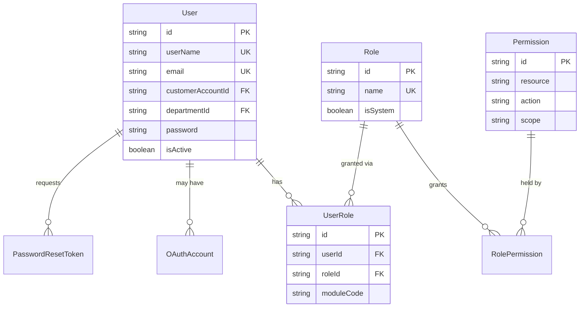
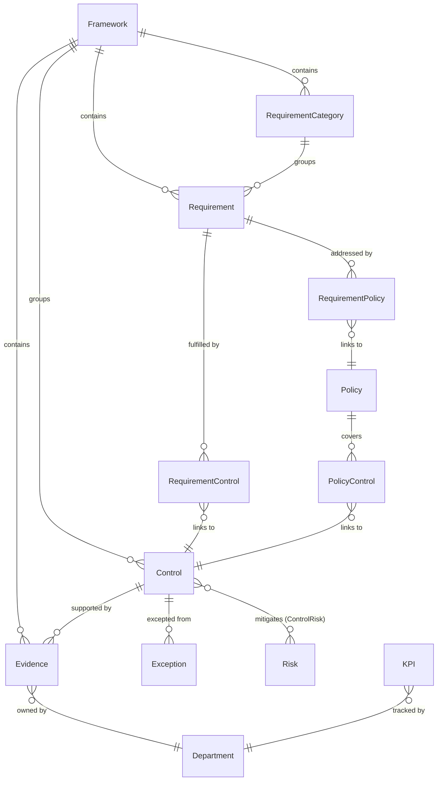
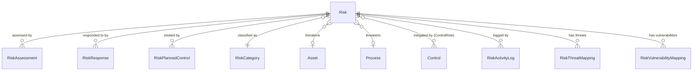
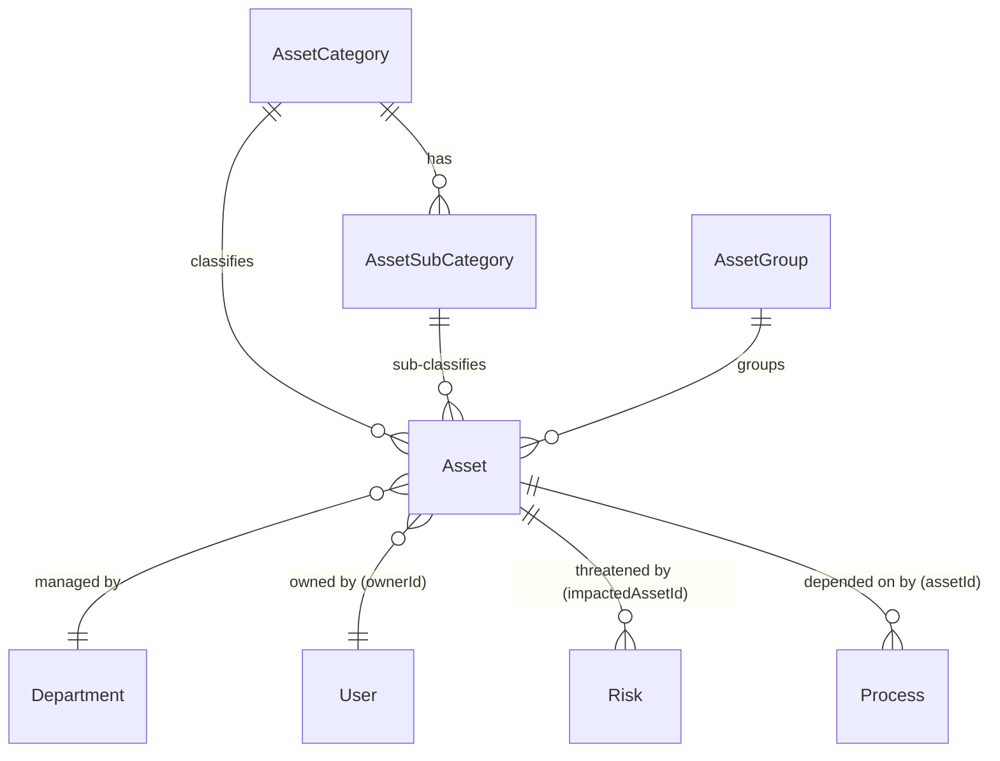
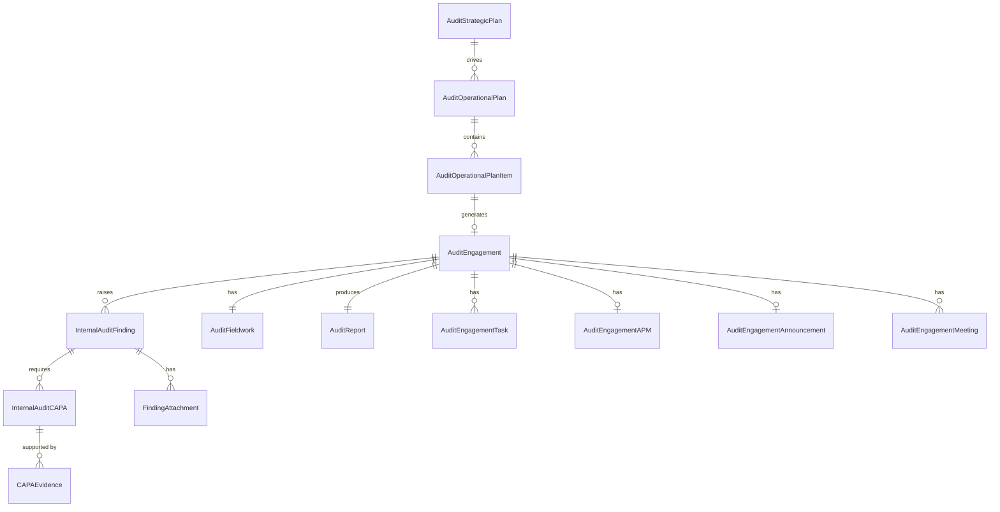
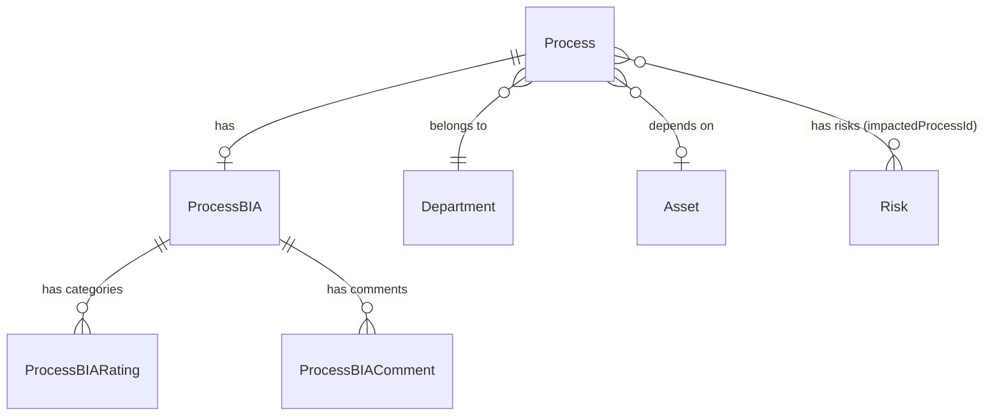
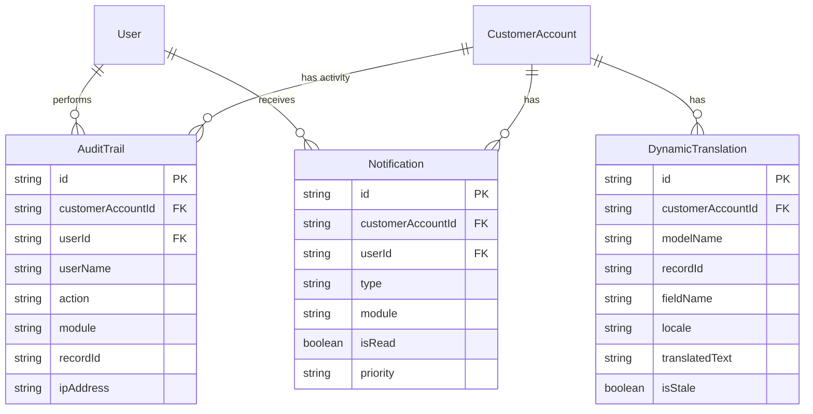
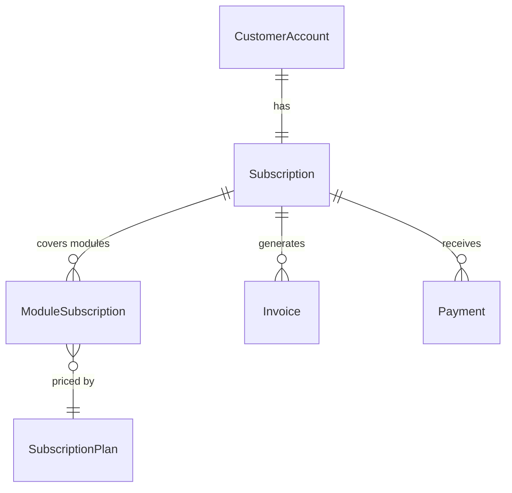

# Schema Reference

**Document:** Complete Database Schema Reference  
**Source:** `prisma/schema.prisma`  
**Last Updated:** 2026-06-29

---

## Table of Contents

1. [How to Read This Document](#1-how-to-read-this-document)
2. [Authentication Models](#2-authentication-models)
3. [Organization Models](#3-organization-models)
4. [Compliance Models](#4-compliance-models)
5. [Risk Models](#5-risk-models)
6. [Asset Models](#6-asset-models)
7. [Internal Audit Models](#7-internal-audit-models)
8. [Process and BIA Models](#8-process-and-bia-models)
9. [System Models](#9-system-models)
10. [Billing Models](#10-billing-models)

---

## 1. How to Read This Document

Each model section follows this pattern:

- **Purpose** — what the model represents and why it exists.
- **Key fields** — the most important columns, with their types and meaning.
- **Relationships** — how this model connects to others.
- **Constraints** — uniqueness rules and required fields.

### Field Type Reference

| Prisma Type | Database Type | Example Values |
|-------------|---------------|----------------|
| `String` | VARCHAR / TEXT | `"Open"`, `"CTRL-001"` |
| `Int` | INTEGER | `3`, `100` |
| `Float` | DOUBLE PRECISION | `3.14`, `95.5` |
| `Boolean` | BOOLEAN | `true`, `false` |
| `DateTime` | TIMESTAMP | `2026-06-29T08:00:00Z` |
| `Bytes` | BYTEA | Binary file content |
| `Json` | JSONB | `{ "key": "value" }` |
| `String?` | NULLABLE VARCHAR | Can be `null` |

### What Is a CUID?

The default primary key format used throughout this schema is `@default(cuid())`. A **CUID** (Collision-resistant Unique Identifier) looks like `clx9abc123def456`. CUIDs are:

- **Unique** across all records (probability of collision is astronomically low).
- **Time-ordered** (newer records have lexicographically greater IDs).
- **Safe for URLs** (no special characters).
- **Harder to enumerate** than auto-incrementing integers (an attacker cannot guess `id = 5` to try accessing record 5).

---

## 2. Authentication Models

### 2.1 `Role`

**Purpose:** Defines a named set of permissions. Roles are assigned to users. Instead of assigning permissions to users individually, you assign a role, and the role grants a set of permissions.

```prisma
model Role {
  id          String           @id @default(cuid())
  name        String           @unique    // "AuditHead", "Reviewer", "Contributor"
  description String?
  isSystem    Boolean          @default(false)  // System roles cannot be deleted
  permissions RolePermission[]            // Which permissions this role grants
  users       UserRole[]                  // Which users have this role
  createdAt   DateTime         @default(now())
  updatedAt   DateTime         @updatedAt
}
```

**Key fields:**
- `name` — globally unique role identifier. Must match the values in `src/lib/permissions.ts`.
- `isSystem` — when `true`, the role cannot be deleted through the UI. All 22 seeded roles are system roles.

**Seeded roles (22 total):**

| Role | Module | Typical User |
|------|--------|-------------|
| `GRCAdministrator` | Platform | Super Admin (Baarez team) |
| `CustomerAdministrator` | All GRC | Client IT/Security Manager |
| `AuditHead` | Internal Audit | Head of Internal Audit |
| `AuditManager` | Internal Audit | Audit Manager |
| `Auditor` | Internal Audit | Auditor staff |
| `Auditee` | Internal Audit | Department being audited |
| `Reviewer` | GRC | Compliance Officer |
| `Contributor` | GRC | Analyst, user adding data |
| `DepartmentReviewer` | GRC | Dept-level reviewer |
| `DepartmentContributor` | GRC | Dept-level data entry |
| `TPRMCustomerAdmin` | TPRM | Client TPRM admin |
| `FactoryAdmin` | TPRM | Assessment Factory admin |
| `TPRMAdmin` | TPRM | TPRM super admin |
| `BusinessOwner` | TPRM | Vendor relationship owner |
| `RelationshipManager` | TPRM | Vendor relationship mgr |
| `TPRMAssessor` | TPRM | Vendor assessor |
| `TPRMApprover` | TPRM | Assessment approver |
| `TPRMAuditor` | TPRM | TPRM auditor |
| `SupportAgentL1` | Support | Level 1 helpdesk |
| `SupportSpecialistL2` | Support | Level 2 specialist |
| `SupportEngineerL3` | Support | Level 3 engineering |
| `SupportManager` | Support | Support manager |

---

### 2.2 `Permission`

**Purpose:** A single, atomic access grant. A permission says "you may perform *action* on *resource*."

```prisma
model Permission {
  id        String           @id @default(cuid())
  resource  String  // e.g., "risk.register", "compliance.evidence"
  action    String  // "view", "create", "edit", "delete", "approve"
  scope     String  @default("all")  // "all", "department", "own"
  roles     RolePermission[]
  createdAt DateTime @default(now())

  @@unique([resource, action, scope])
}
```

**Key fields:**
- `resource` — the application area. Must match a key in `RESOURCES` from `src/lib/permissions.ts`.
- `action` — one of five actions: `view`, `create`, `edit`, `delete`, `approve`.
- `scope` — data visibility boundary:
  - `all` — all tenant data.
  - `department` — only records in the user's department.
  - `own` — only records the user created or owns.

**The unique constraint** `@@unique([resource, action, scope])` means there can only be one permission for each (resource, action, scope) combination. Multiple roles can share the same permission record.

---

### 2.3 `RolePermission`

**Purpose:** Junction table connecting `Role` to `Permission` (many-to-many). A role grants many permissions; a permission can be held by many roles.

```prisma
model RolePermission {
  id           String     @id @default(cuid())
  roleId       String
  role         Role       @relation(...)
  permissionId String
  permission   Permission @relation(...)
  createdAt    DateTime   @default(now())

  @@unique([roleId, permissionId])
}
```

---

### 2.4 `UserRole`

**Purpose:** Assigns roles to users. A user can have multiple roles; a role can be assigned to multiple users. Roles are optionally scoped to a specific module.

```prisma
model UserRole {
  id         String   @id @default(cuid())
  userId     String
  roleId     String
  moduleCode String?  // "GRC" | "TPRM" | "INTERNAL_AUDIT" | null (system-wide)
  user       User     @relation(...)
  role       Role     @relation(...)
  createdAt  DateTime @default(now())

  @@unique([userId, roleId, moduleCode])
}
```

**Key fields:**
- `moduleCode` — when `null`, the role applies system-wide (e.g., `GRCAdministrator`). When set to `"GRC"` or `"INTERNAL_AUDIT"`, the role only grants permissions within that module.

**Example:** A user might have `AuditHead` for module `"INTERNAL_AUDIT"` and `Reviewer` for module `"GRC"`.

---

### 2.5 `User`

**Purpose:** Represents a person who can log in to the system. Users belong to exactly one `CustomerAccount` tenant.

**Key fields:**
- `userName` — globally unique login name (cross-tenant uniqueness prevents conflicts).
- `email` — globally unique email address.
- `customerAccountId` — the tenant this user belongs to.
- `departmentId` — for `department`-scoped RBAC: determines which department data is visible.
- `password` — bcrypt-hashed. `null` for OAuth-only accounts.
- `isActive` — disabled users cannot log in.
- `isBlocked` — temporarily blocked users cannot log in.

**Relationships:**
- `roles` → `UserRole[]` — the roles assigned to this user.
- `departments` — assigned to one department.
- Through roles, the user indirectly has `permissions`.

---

### 2.6 `OAuthAccount`

**Purpose:** Stores OAuth provider credentials for users who log in via Single Sign-On (Google, Microsoft, etc.).

**Key fields:**
- `provider` — OAuth provider name (`"google"`, `"microsoft"`).
- `providerAccountId` — the user's ID at the provider.
- `userId` — links to the `User` record.

---

### 2.7 `PasswordResetToken`

**Purpose:** Stores temporary tokens for password reset requests.

**Key fields:**
- `token` — unique random token sent in the reset email.
- `expiresAt` — expiry time (tokens expire after a set window).
- `email` — the address the reset was requested for.
- `used` — boolean; tokens can only be used once.

---

### Authentication ER Diagram



---

## 3. Organization Models

### 3.1 `CustomerAccount`

**Purpose:** The root tenant record. Every organisation using the GRC platform has exactly one `CustomerAccount`. All business data is parented to this record.

**Key fields:**
- `code` — unique tenant code (e.g., `ACME_001`). Used in URLs and admin views.
- `name` — the organisation's display name.
- `isGrcAdded` — enables the core GRC module.
- `isInternalAuditEnabled` — enables the Internal Audit module.
- `isTprmAdded` — enables the TPRM module.
- `isTechnicalEvidenceEnabled` — enables the Technical Evidence platform.
- `theme` — UI colour theme chosen by the customer admin.
- `emailNotificationsEnabled` — global toggle for non-mandatory email notifications.

---

### 3.2 `Organization`

**Purpose:** Stores the organisation's public profile information — the "About Us" data.

**Key fields:**
- `name`, `email`, `phone`, `website` — contact details.
- `vision`, `mission`, `value` — strategic statements.
- `ceoMessage` — CEO's message shown in the organisation profile.
- `employeeCount`, `branchCount` — workforce statistics.

**Relationships:**
- `branches` → `Branch[]` — physical office locations.
- `dataCenters` → `DataCenter[]` — IT infrastructure locations.
- `cloudProviders` → `CloudProvider[]` — cloud services used.

---

### 3.3 `Department`

**Purpose:** Represents an organisational unit (e.g., IT, Legal, Finance, HR). Most business data is scoped to a department.

**Key fields:**
- `name` — department name. Unique per tenant (`@@unique([customerAccountId, name])`).
- `headId` — optional reference to the department head user.

**Relationships:** Department connects to every major business model. See [Module-Relationships.md](../02-Architecture/Module-Relationships.md) for the full list.

---

### 3.4 `Branch`, `DataCenter`, `CloudProvider`

These three models store infrastructure inventory as part of the organisation profile:

- **`Branch`** — a physical office location with `location` and `address`.
- **`DataCenter`** — a data centre, either on-premise (address) or outsourced (vendor name).
- **`CloudProvider`** — a cloud service provider with `name` and `serviceType` (IaaS, PaaS, SaaS).

---

### 3.5 `Stakeholder`

**Purpose:** External or internal parties who have an interest in the organisation's GRC posture (regulators, board members, customers, auditors).

**Key fields:**
- `name`, `email`, `phone`, `designation` — contact information.
- `type` — classification of the stakeholder.
- `departmentId` — the internal department this stakeholder is associated with.

---

## 4. Compliance Models

### 4.1 `Framework`

**Purpose:** A compliance standard that the organisation is measured against (e.g., ISO 27001, SOC 2 Type II, NIST CSF, PCI-DSS).

**Key fields:**
- `name` — framework name. Unique per tenant.
- `type` — `"Framework"`, `"Standard"`, or `"Regulation"`.
- `status` — `"Subscribed"` (organisation is actively complying), `"Not Subscribed"`, `"Suggested"`, or `"Archived"`.
- `isMasterTemplate` — `true` for GRC-managed master copies; `false` for customer copies.
- `sourceFrameworkId` — when a customer subscribes to a master framework, this field links their copy back to the original. Enables the GRC team to push updates to all subscriber copies.
- `compliancePercentage` — computed field: percentage of requirements with compliant controls.

---

### 4.2 `RequirementCategory`

**Purpose:** Top-level chapters or domains within a framework (e.g., "A.9 Access Control" in ISO 27001).

**Key fields:**
- `name` — category name.
- `frameworkId` — the parent framework.
- `sortOrder` — display order within the framework.

---

### 4.3 `Requirement`

**Purpose:** An individual clause or requirement within a framework (e.g., "A.9.1.1 Access Control Policy"). Requirements form a hierarchy via `parentId`.

**Key fields:**
- `code` — the official standard code (e.g., `A.9.1.1`).
- `level` — hierarchy depth: 1 = top-level, 2 = requirement, 3 = sub-requirement.
- `parentId` — reference to the parent requirement (self-relation for tree structure).
- `requirementType` — `"Mandatory"` or `"Additional"`.

**Relationships:**
- `RequirementControl` junction → `Control[]` — the controls that fulfil this requirement.
- `RequirementPolicy` junction → `Policy[]` — the policies that address this requirement.

---

### 4.4 `Control`

**Purpose:** A specific security or compliance measure implemented by the organisation. Controls are the heart of the compliance module — they bridge requirements (what the standard demands) and evidence (proof that the control works).

**Key fields:**
- `controlCode` — unique code per tenant (e.g., `CTRL-001`).
- `name` — descriptive control name.
- `status` — `"Non Compliant"`, `"Compliant"`, `"Not Applicable"`, or `"Partial Compliant"`.
- `functionalGrouping` — NIST CSF function: Govern, Identify, Protect, Detect, Respond, Recover.
- `CMM levels` (`notPerformed` through `continuouslyImproving`) — Capability Maturity Model descriptions for each maturity level 0–5.
- `ownerId` / `assigneeId` — the user responsible for the control.
- `departmentId` — the department that implements the control.

**Relationships:**
- `evidences` → `Evidence[]` — proof items supporting this control.
- `requirements` via `RequirementControl` — which framework requirements this control addresses.
- `controlRisks` via `ControlRisk` — which risks this control mitigates.

---

### 4.5 `Policy`

**Purpose:** A written governance document — a policy, standard, or procedure. Policies provide the written framework for how controls are implemented.

**Key fields:**
- `code` — unique code per tenant.
- `documentType` — `"Policy"`, `"Standard"`, or `"Procedure"`.
- `version` — document version (e.g., `"1.0"`, `"2.1"`).
- `status` — `"Not Uploaded"`, `"Draft"`, `"Pending Approval"`, `"Approved"`, `"Published"`, `"Needs Review"`.
- `effectiveDate` — when the policy came into force.
- `reviewDate` — when the policy must be reviewed next.
- `aiReviewStatus` / `aiReviewScore` — AI-generated quality assessment fields.

---

### 4.6 `Evidence`

**Purpose:** Proof that a control is implemented. Evidence can be a screenshot, a system-generated report, a log file, or any document demonstrating compliance.

**Key fields:**
- `evidenceCode` — unique code per tenant.
- `status` — `"Not Uploaded"`, `"Draft"`, `"Validated"`, `"Published"`, or `"Need Attention"`.
- `dueDate` — deadline for collecting this evidence.
- `recurrence` — how often this evidence must be refreshed: `"Yearly"`, `"Half-yearly"`, `"Quarterly"`, `"Monthly"`.
- `fileData` (via `EvidenceAttachment`) — uploaded files (encrypted at rest).
- `aiIngestStatus` — whether the file has been processed by the AI engine.
- `aiReviewStatus` — whether the AI has assessed the quality of the evidence.
- `kpiRequired` — whether this evidence item tracks a KPI measurement.

---

### 4.7 `Exception`

**Purpose:** A formal record of a deviation from a policy, control, or compliance requirement. Exceptions acknowledge that a control cannot be fully implemented and document the business justification.

**Key fields:**
- `category` — `"Policy"`, `"Control"`, `"Compliance"`, or `"Risk"`.
- `status` — `"Pending"`, `"Approved"`, `"Authorised"`, `"Submitted for Closure"`, `"Overdue"`, `"RiskAccepted"`, `"Closed"`.
- `startDate` / `endDate` — the exception validity period.
- Links to the relevant `controlId`, `policyId`, `riskId`, `frameworkId`, or `requirementId` depending on category.

---

### 4.8 `KPI`

**Purpose:** Key Performance Indicators that measure compliance health or process effectiveness.

**Key fields:**
- `name`, `description` — what is being measured.
- `targetValue` — the goal.
- `status` — `"On Track"`, `"At Risk"`, `"Off Track"`.
- `departmentId` — the department responsible.
- `kpiReviews` → `KPIReview[]` — historical review records.
- `kpiActionPlans` → `KPIActionPlan[]` — improvement actions when KPI is off track.

---

### Compliance ER Diagram



---

## 5. Risk Models

### 5.1 `RiskCategory`

**Purpose:** High-level classification of risks (e.g., Strategic, Operational, Financial, IT/Cyber). Configurable per tenant.

**Key fields:**
- `name` — category name. Unique per tenant.
- `color` — UI display colour for visual differentiation.
- `status` — `"Active"` or `"Inactive"`.

---

### 5.2 `Risk`

**Purpose:** The central risk record. Represents a potential event that could harm the organisation.

**Key fields:**
- `riskId` — human-readable ID (e.g., `RSK-001`). Unique per tenant.
- `likelihood` / `impact` — 1–5 scale ratings.
- `riskScore` — computed as `likelihood × impact`.
- `riskRating` — textual rating derived from score: `"Low"`, `"Medium"`, `"High"`, `"Very High"`, `"Catastrophic"`.
- **Inherent risk** (`inherentLikelihood`, `inherentImpact`, `inherentRiskScore`) — risk level before any controls.
- **Residual risk** (`residualLikelihood`, `residualImpact`, `residualRiskScore`) — risk level after existing controls.
- **Target risk** (`targetLikelihood`, `targetImpact`, `targetRiskScore`) — desired risk level after planned controls.
- `status` — `"Open"`, `"In Progress"`, `"Closed"`, `"Awaiting Approval"`, `"Pending Assessment"`.
- `assessmentStatus` — tracks the assessment workflow: `"Open"`, `"In-Progress"`, `"Draft"`, `"Submitted"`, `"Approved"`, `"Rejected"`, `"Completed"`.
- `responseStrategy` — chosen treatment: `"Treat"`, `"Transfer"`, `"Avoid"`, `"Accept"`.
- `impactedAssetId` / `impactedProcessId` — links the risk to a specific asset or process.
- `assessmentFormData` — JSON storing per-threat likelihood/impact and per-vulnerability ratings from the risk assessment wizard.

---

### 5.3 `RiskAssessment`

**Purpose:** A formal, point-in-time assessment of a risk. Multiple assessments can exist per risk (initial, periodic, ad-hoc).

**Key fields:**
- `assessmentId` — unique per tenant.
- `riskId` — the risk being assessed.
- `assessmentType` — `"Initial"`, `"Periodic"`, or `"Ad-hoc"`.
- `likelihood`, `impact`, `riskScore`, `riskRating` — assessment scores.
- `likelihoodRationale` / `impactRationale` — written justification.
- `status` — `"Draft"`, `"Submitted"`, `"Approved"`, `"Rejected"`.

---

### 5.4 `RiskResponse`

**Purpose:** Records the organisation's response action to a risk. Distinct from the response *strategy* (Treat/Transfer/Avoid/Accept) on the Risk record — this records specific *actions* taken.

**Key fields:**
- `responseType` — `"Mitigate"`, `"Transfer"`, `"Accept"`, `"Avoid"`.
- `actionTitle` / `actionDescription` — what specifically was done.
- `dueDate` / `completionDate` — timing.
- `effectivenessRating` — 1–5 rating of how effective the response was.
- `status` — `"Open"`, `"In Progress"`, `"Completed"`, `"Overdue"`.

---

### Risk ER Diagram



---

## 6. Asset Models

### 6.1 `AssetCategory`

**Purpose:** Top-level asset classification (e.g., Hardware, Software, Information, People, Services, Facility).

**Key fields:**
- `name` — category name.
- `description` — what types of assets belong here.

---

### 6.2 `AssetSubCategory`

**Purpose:** Second-level classification under an `AssetCategory` (e.g., under "Hardware": Physical Server, Firewall, Switch, Laptop).

**Key fields:**
- `categoryId` — parent category.

---

### 6.3 `AssetGroup`

**Purpose:** A named collection of related assets (e.g., "Production Infrastructure", "Office Endpoints"). Useful for bulk risk analysis.

---

### 6.4 `Asset`

**Purpose:** An individual IT or physical asset that the organisation owns or manages.

**Key fields:**
- `assetId` — human-readable ID. Unique per tenant.
- `categoryId` / `subCategoryId` / `groupId` — classification hierarchy.
- `ownerId` — the user responsible for the asset.
- `custodianId` — the user who day-to-day manages the asset.
- `classificationId` — data classification (Public, Internal, Confidential, Restricted).
- `sensitivityId` — CIA sensitivity rating.
- `lifecycleStatusId` — Active, Decommissioning, or Retired.
- `value` — monetary value of the asset.
- `acquisitionDate` / `nextReviewDate` — lifecycle dates.

**Relationships:**
- `impactedByRisks` → `Risk[]` — risks that threaten this asset.
- `processes` → `Process[]` — processes that depend on this asset.

---

### 6.5 `CIARating`

**Purpose:** Stores the Confidentiality, Integrity, and Availability rating configuration for assets. Separate from the asset record itself — this defines what the rating labels mean.

---

### Asset ER Diagram



---

## 7. Internal Audit Models

### 7.1 `AuditEngagement`

**Purpose:** The primary work unit in the Internal Audit module. Represents a single audit assignment — an event where a department or process is examined.

**Key fields:**
- `auditId` — human-readable ID (e.g., `AUD001`). Unique per tenant.
- `engagementTitle` — descriptive name.
- `status` — `"Planned"`, `"In Progress"`, `"Completed"`, `"Cancelled"`.
- `priority` — `"Low"`, `"Medium"`, `"High"`.
- `currentStage` — the current step in the engagement workflow: `"announcement"`, `"planning"`, `"fieldwork"`, `"reporting"`, `"follow-up"`.
- `stageProgress` — JSON map of `{ stageKey: "completed" | "in_progress" }`.
- `reportingMode` — `"Continuous"` (findings shared individually as found) or `"Aggregated"` (all findings released in the final report).
- `auditHeadId` — audit head isolation: each audit head only sees their own engagements.
- `auditTypeId` — classification of the audit (Internal, Compliance, Financial, IT).
- `auditRating` — overall engagement outcome: `"Satisfactory"`, `"Needs Improvement"`, `"Unsatisfactory"`.
- `plannedHours` / `actualHours` — time tracking.

**Relationships:**
- `fieldwork` → `AuditFieldwork?` — the fieldwork execution record.
- `report` → `AuditReport?` — the final audit report.
- `findings` → `InternalAuditFinding[]` — all findings raised.
- `tasks` → `AuditEngagementTask[]` — task list for team members.
- `apm` → `AuditEngagementAPM?` — Audit Planning Memorandum.
- `announcement` → `AuditEngagementAnnouncement?` — formal notification email.
- `meetings` → `AuditEngagementMeeting[]` — opening, findings discussion, and closing meetings.

---

### 7.2 `InternalAuditFinding`

**Purpose:** An issue or deficiency identified during an audit engagement. Findings drive corrective actions.

**Key fields:**
- `findingId` — human-readable ID (e.g., `FND001`).
- `finding` — the finding title/name.
- `severity` — `"Low"`, `"Medium"`, `"High"`, `"Critical"`.
- `findingType` — `"Absence of Control"`, `"Lack of Operational Effectiveness"`, `"Best Practices"`, `"Non-Compliance"`.
- **The four Cs:**
  - `criteria` — what should be (the standard).
  - `condition` — what is (the observed reality).
  - `cause` — why the gap exists.
  - `effect` — the consequence of the gap.
- `recommendation` — the auditor's suggested remedy.
- `status` — `"Open"`, `"In Progress"`, `"Closed"`, `"Overdue"`, `"Under Review"`.
- `targetDate` — when the finding should be resolved.
- AI fields — `aiReviewStatus`, `aiReviewDescription`, `aiReviewApproved` for AI-assisted finding descriptions.

**Relationships:**
- `capas` → `InternalAuditCAPA[]` — corrective action plans created to address this finding.
- `attachments` → `FindingAttachment[]` — supporting documents uploaded by the auditee.

---

### 7.3 `InternalAuditCAPA`

**Purpose:** A Corrective and Preventive Action plan created in response to a finding. CAPAs track the remediation work.

**Key fields:**
- `capaId` — human-readable ID (e.g., `CAPA001`).
- `findingId` — the finding this CAPA addresses.
- `rootCause` — the underlying cause being addressed.
- `actionPlan` — the steps to be taken.
- `responsiblePersonId` — who is executing the CAPA.
- `dueDate` — deadline.
- `status` — `"Open"`, `"In Progress"`, `"Pending Review"`, `"Closed"`, `"Overdue"`.
- `completionPercentage` — progress tracking.

---

### 7.4 `AuditStrategicPlan`

**Purpose:** A multi-year (3, 4, or 5-year) risk-based audit strategy. Created and owned by the Audit Head.

**Key fields:**
- `planTitle`, `planObjective` — purpose of the plan.
- `planDuration` — number of years covered.
- `status` — `"Draft"`, `"Submitted"`, `"Approved"`, `"Signed"`.
- `signedCopyData` — uploaded signed PDF (stored as Bytes, encrypted).

---

### 7.5 `AuditCategory`

**Purpose:** Classifies audit engagements into types (e.g., IT Audit, Financial Audit, Compliance Audit). Configurable per tenant.

---

### Internal Audit ER Diagram



---

## 8. Process and BIA Models

### 8.1 `Process`

**Purpose:** A business process that the organisation executes. Processes are auditable entities and are linked to risks and assets.

**Key fields:**
- `processCode` — unique per tenant.
- `processType` — `"Primary"`, `"Management"`, or `"Supporting"`.
- `riskRating` — `"Low"`, `"Medium"`, `"High"`, `"Not Assessed"`.
- **RACI model:**
  - `responsibleId` — who does the work.
  - `accountableId` — who is ultimately responsible.
  - `consultedId` — who is consulted.
  - `informedId` — who is kept informed.
- `assetDependency` — `true` if the process depends on a specific asset.
- `kpiMeasurementRequired` — whether a KPI should be tracked for this process.
- `piiCapture` — whether the process captures personally identifiable information.

---

### 8.2 `ProcessBIA`

**Purpose:** Business Impact Analysis for a process. Captures Recovery Time Objective (RTO) and Recovery Point Objective (RPO) — how long the organisation can afford to be without this process.

**Key fields:**
- `rtoHours` — Maximum tolerable downtime in hours.
- `rpoHours` — Maximum tolerable data loss period in hours.
- `processCriticality` — `"Critical"`, `"High"`, `"Medium"`, `"Low"`.
- `impactRating` — calculated score.
- `status` — `"Open"`, `"Pending Approval"`, `"Approved"`, `"Rejected"`.

**Sub-models:**
- `ProcessBIARating` — individual category ratings (Financial, Reputational, Regulatory, Safety, Operational impact).
- `ProcessBIAComment` — comments during the approve/sendback workflow.

---

### 8.3 `InternalAuditProcess`

**Purpose:** Links a process to the audit universe, enabling process-based audit planning.

---

### BIA ER Diagram



---

## 9. System Models

### 9.1 `AuditTrail`

**Purpose:** An immutable activity log of every significant action performed in the system. Provides the "who did what, when" audit history required for compliance.

**Key fields:**
- `customerAccountId` — tenant isolation.
- `userId` / `userName` — who performed the action. `userName` is a snapshot — preserved even if the user is later deleted.
- `action` — `"Create"`, `"Update"`, `"Delete"`, `"Submit"`, `"Approve"`, `"Reject"`, `"Login"`, `"Logout"`, `"View"`, `"Export"`.
- `module` — the module or entity name (e.g., `"Operational Plan"`, `"Risk Register"`).
- `recordId` — the ID of the affected record.
- `description` — optional human-readable detail.
- `ipAddress` — client IP address.

**Indexes:** `customerAccountId`, `userId`, `createdAt`, `module`, `action` — all indexed for fast filtering in the audit trail viewer.

**Important:** AuditTrail rows are never updated or deleted. They are append-only.

---

### 9.2 `Notification`

**Purpose:** In-app notification messages sent to users when significant events occur. Notifications are scoped to a specific module to avoid cross-module noise.

**Key fields:**
- `userId` — the recipient.
- `type` — event type (e.g., `EVIDENCE_DUE`, `RISK_ASSIGNED`, `AUDIT_FINDING`).
- `module` — `"GRC"`, `"TPRM"`, `"INTERNAL_AUDIT"`, or `"TECHNICAL_EVIDENCE"`.
- `priority` — `"low"`, `"normal"`, `"high"`, `"urgent"`.
- `isRead` / `readAt` — read state tracking.
- `relatedEntityType` / `relatedEntityId` — enables "click to navigate" behaviour.
- `link` — the URL to navigate to when the notification is clicked.

---

### 9.3 `DynamicTranslation`

**Purpose:** Stores AI-translated versions of user-entered content in Arabic (`ar`) and Latvian (`lv`).

**Key fields:**
- `modelName` — the Prisma model (e.g., `"Risk"`, `"Control"`).
- `recordId` — the specific record's ID.
- `fieldName` — the specific field (e.g., `"name"`, `"description"`).
- `locale` — `"ar"` or `"lv"` (English is never stored here — it is always the original).
- `translatedText` — the translated content.
- `sourceHash` — hash of the original English text. If the original changes and the hash no longer matches, `isStale` is set to `true`.
- `isStale` — indicates the translation is out of date and should be regenerated on next edit.

**Unique constraint:** `@@unique([customerAccountId, modelName, recordId, fieldName, locale])` — one translation per (tenant, model, record, field, language).

---

### System Models ER Diagram



---

## 10. Billing Models

### 10.1 `Subscription`

**Purpose:** Represents a customer's overall subscription status. One record per tenant.

**Key fields:**
- `customerAccountId` — unique (one subscription per tenant).
- `status` — `ACTIVE`, `CANCELLED`, `SUSPENDED`, `TRIAL`.
- `subscriptionType` — `PAID`, `FREE`, `TRIAL`.
- `autoRenew` — whether to automatically renew.

---

### 10.2 `ModuleSubscription`

**Purpose:** A subscription to a specific module. One row per (subscription, module) pair.

**Key fields:**
- `moduleCode` — `"GRC"`, `"TPRM"`, `"INTERNAL_AUDIT"`, `"TECHNICAL_EVIDENCE"`.
- `tier` — the pricing tier (`BASIC`, `PROFESSIONAL`, `ENTERPRISE`).
- `billingCycle` — `MONTHLY` or `YEARLY`.
- `unitPrice` — price per unit at purchase time (snapshot).
- `userLimit` / `vendorLimit` / `auditLimit` / `frameworkLimit` — licence limits.
- `cycleStart` / `cycleEnd` — active billing period.

---

### Billing ER Diagram



---

*For database migration procedures, see [Migrations.md](Migrations.md). For seeding instructions, see [Seeding.md](Seeding.md).*
