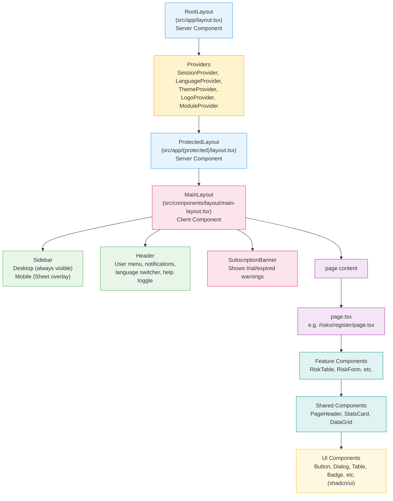

# Frontend Overview

## Table of Contents
1. [What is a Frontend?](#what-is-a-frontend)
2. [What is React?](#what-is-react)
3. [What is Next.js?](#what-is-nextjs)
4. [Server Components vs Client Components](#server-components-vs-client-components)
5. [The App Router](#the-app-router)
6. [How the (protected) Route Group Works](#how-the-protected-route-group-works)
7. [Layout Hierarchy](#layout-hierarchy)
8. [Providers — Wrapping the App with Context](#providers)
9. [Hot Module Replacement in Development](#hot-module-replacement)
10. [Component Hierarchy Diagram](#component-hierarchy-diagram)

---

## What is a Frontend?

A web application has two major sides:

- **Backend**: Code that runs on the server. It talks to databases, processes business logic, enforces security rules. Users never see this code directly.
- **Frontend**: Code that runs in the user's web browser. It renders the visual interface—buttons, tables, forms, charts—and reacts to user input in real time.

When you open the GRC application and see the Risk Register table, click "Add Risk", type into a form, and press "Save"—all of that is the frontend at work. The frontend communicates with the backend by sending HTTP requests (API calls) to fetch or save data.

The GRC frontend is built using three core technologies:
- **React** — The component library
- **Next.js** — The application framework built on top of React
- **TypeScript** — JavaScript with strict type safety (prevents a large class of bugs)

---

## What is React?

React is a JavaScript library created by Meta (Facebook) that lets you build user interfaces from small, reusable pieces called **components**.

### The Component Model

Think of building with LEGO. Each LEGO brick has a specific shape and purpose. You combine bricks to build more complex structures. React components work exactly the same way:

- A `Button` component renders a clickable button with an icon and label.
- A `StatsCard` component renders a metric tile with a number and title.
- A `RiskTable` component renders a full table of risks, and internally uses many `Button`, `Badge`, and `TableRow` components.
- The full Risk Register page composes all of the above together.

Each component:
1. Receives **props** (inputs passed from parent components)
2. Maintains its own **state** (local data that can change over time)
3. Returns **JSX** (a syntax that looks like HTML but is actually JavaScript)

### Why Use React?

Before React, developers modified the web page's DOM (Document Object Model) directly with JavaScript. This became extremely hard to manage on large applications because every interaction could change dozens of page elements in ways that were difficult to reason about.

React introduced a **declarative** mental model: instead of describing the steps to update the page, you declare "given this data, the UI should look like this." React figures out what changed and updates only the necessary parts of the page—this is called **reconciliation**.

### JSX Example

```tsx
// This looks like HTML but is actually TypeScript/JavaScript
function RiskBadge({ level }: { level: "high" | "medium" | "low" }) {
  return (
    <span className={`badge badge-${level}`}>
      {level.toUpperCase()}
    </span>
  );
}

// Used inside another component:
<RiskBadge level="high" />
```

---

## What is Next.js?

Next.js is a framework built on top of React that adds everything React alone does not provide:

| Feature | Plain React | Next.js |
|---------|-------------|---------|
| Routing (URL → page) | You add it yourself (React Router) | Built-in file-system routing |
| Server-side rendering | Manual, complex | Built-in |
| API routes (backend endpoints) | Separate server needed | Built-in under `src/app/api/` |
| Code splitting | Manual | Automatic |
| Image optimisation | Manual | Built-in `<Image>` component |
| Build system | Configure webpack yourself | Zero-config (Turbopack) |

This GRC application uses **Next.js 16.1.1** with the **App Router** (introduced in Next.js 13). The App Router is a modern approach to routing that enables Server Components, streaming, and a cleaner layout system.

---

## Server Components vs Client Components

This is the most critical concept to understand in a Next.js 16 application.

### Server Components (default)

A Server Component runs **exclusively on the server**. It:

- Can directly call databases and internal services (no network round-trip)
- Cannot use `useState`, `useEffect`, or any browser APIs
- Cannot attach event listeners (onClick, onChange)
- Is sent to the browser as rendered HTML — not as JavaScript the browser runs
- Results in **faster page loads** because there is less JavaScript to download and parse

```tsx
// This runs on the server — no "use client" at top
// src/app/(protected)/risks/register/page.tsx

import { prisma } from "@/lib/prisma";

export default async function RiskRegisterPage() {
  // Direct database call — impossible in a browser
  const risks = await prisma.risk.findMany();

  return (
    <div>
      <h1>Risk Register</h1>
      {/* Pass data down to a Client Component for interactive table */}
      <RiskTable risks={risks} />
    </div>
  );
}
```

### Client Components

A Client Component runs **in the browser**. It:

- Must have `"use client"` as its very first line
- Can use `useState`, `useEffect`, `useRef`, and all React hooks
- Can respond to user interactions (button clicks, form input)
- Can access browser APIs (localStorage, window, navigator)
- Sends JavaScript to the browser, which React "hydrates" (attaches event handlers to)

```tsx
"use client";

import { useState } from "react";

export function RiskTable({ risks }: { risks: Risk[] }) {
  const [search, setSearch] = useState("");

  const filtered = risks.filter(r =>
    r.name.toLowerCase().includes(search.toLowerCase())
  );

  return (
    <div>
      <input value={search} onChange={e => setSearch(e.target.value)} />
      <table>
        {filtered.map(risk => <RiskRow key={risk.id} risk={risk} />)}
      </table>
    </div>
  );
}
```

### The Rule of Thumb

> Start with a Server Component. Add `"use client"` only when you need interactivity, state, or browser APIs.

Most pages in this GRC application follow this pattern: the `page.tsx` itself is a Server Component that handles auth and initial data loading, while interactive tables, forms, and modals are Client Components.

In practice, because nearly every page in the GRC application has complex interactive features (modals, search, form validation, permission-based button visibility), the majority of page components are Client Components with `"use client"`.

---

## The App Router

The **App Router** is Next.js's routing system where the **file system IS the routing system**. The folder structure under `src/app/` directly defines the URLs of the application.

### How It Works

| Folder/File | URL |
|-------------|-----|
| `src/app/page.tsx` | `/` (root) |
| `src/app/login/page.tsx` | `/login` |
| `src/app/(protected)/dashboard/page.tsx` | `/dashboard` |
| `src/app/(protected)/risks/register/page.tsx` | `/risks/register` |
| `src/app/(protected)/risks/[id]/page.tsx` | `/risks/abc-123` (dynamic) |

### Special Files

Every folder in the App Router can contain these special files:

| File | Purpose |
|------|---------|
| `page.tsx` | The actual page content shown at that URL |
| `layout.tsx` | Wrapper applied to the page and all nested pages |
| `loading.tsx` | Shown while the page is loading (Suspense boundary) |
| `error.tsx` | Shown when an error occurs |
| `not-found.tsx` | Shown for 404 errors |

### Dynamic Route Segments

Folders with names wrapped in brackets become dynamic URL parameters:

```
src/app/(protected)/risks/[id]/page.tsx
                              ^^^^
                              Matches /risks/anything
```

Inside the page component, you receive the parameter via `context.params`. In Next.js 16, params are returned as a **Promise** and must be awaited:

```tsx
// src/app/(protected)/risks/[id]/page.tsx
interface PageProps {
  params: Promise<{ id: string }>;
}

export default async function RiskDetailPage({ params }: PageProps) {
  const { id } = await params; // Must await — this is a Next.js 16 requirement
  const risk = await prisma.risk.findUnique({ where: { id } });
  // ...
}
```

---

## How the (protected) Route Group Works

A **route group** is a folder surrounded by parentheses. It groups pages together without affecting the URL.

```
src/app/
  (protected)/          ← Route group — does NOT appear in URL
    layout.tsx          ← Applied to ALL pages inside this group
    dashboard/
      page.tsx          ← URL is /dashboard (not /(protected)/dashboard)
    risks/
      register/
        page.tsx        ← URL is /risks/register
  login/
    page.tsx            ← URL is /login (outside the group — no layout)
```

The `(protected)` group serves two purposes:

1. **Shared layout**: The `layout.tsx` inside `(protected)` wraps all authenticated pages in `MainLayout` (which provides the sidebar and header). Pages outside the group, like `/login`, get no layout.

2. **Visual organisation**: All pages that require authentication live in one place, making the codebase easier to navigate.

```tsx
// src/app/(protected)/layout.tsx
import { MainLayout } from "@/components/layout";
import { ConfirmDialog } from "@/components/ui/confirm";

export default function ProtectedLayout({
  children,
}: {
  children: React.ReactNode;
}) {
  return (
    <MainLayout>
      {children}
      <ConfirmDialog />
    </MainLayout>
  );
}
```

Note that this layout file does not check authentication itself. Authentication is handled at a higher level by `src/lib/auth.ts` (NextAuth configuration) and the `withAuth` API wrapper. The `MainLayout` component does check the session state via `useSession()` and redirects to `/login` if the user is unauthenticated.

---

## Layout Hierarchy

Layouts nest. Every `layout.tsx` file wraps all pages at and below its level. This creates a hierarchy:

```
src/app/layout.tsx              ← Root layout (all pages)
  src/app/(protected)/layout.tsx  ← Protected layout (authenticated pages)
    page-specific content
```

### Root Layout (`src/app/layout.tsx`)

The root layout is the outermost wrapper. Every single page in the application is rendered inside it. It sets up:

- The HTML `<html>` and `<body>` tags
- Global CSS imports
- All React Context Providers (SessionProvider, LanguageProvider, ThemeProvider, LogoProvider, ModuleProvider)
- Toast notification containers

```tsx
// src/app/layout.tsx
export default function RootLayout({ children }) {
  return (
    <html lang="en" dir="ltr" suppressHydrationWarning>
      <body className="antialiased" suppressHydrationWarning>
        <SessionProvider refetchOnWindowFocus={false}>
          <LanguageProvider>
            <ThemeProvider>
              <LogoProvider>
                <ModuleProvider>
                  {children}
                </ModuleProvider>
              </LogoProvider>
            </ThemeProvider>
          </LanguageProvider>
        </SessionProvider>
        <Toaster />
        <SonnerToaster position="top-right" richColors />
      </body>
    </html>
  );
}
```

### Protected Layout (`src/app/(protected)/layout.tsx`)

The second-level layout wraps all authenticated pages. It renders `MainLayout`, which provides the sidebar, header, and subscription banner.

### MainLayout (`src/components/layout/main-layout.tsx`)

`MainLayout` is a Client Component (`"use client"`) that:

- Reads the session via `useSession()` from NextAuth
- Manages sidebar collapsed/expanded state (saved to localStorage)
- Manages mobile menu open/closed state
- Applies RTL direction for Arabic language
- Intercepts deep-links to modules the user does not have a subscription for
- Renders the `Sidebar`, `Header`, `SubscriptionBanner`, and page `<main>` content

```
RootLayout
  └── ProtectedLayout
        └── MainLayout
              ├── Sidebar (desktop: always visible; mobile: Sheet overlay)
              ├── Header
              ├── SubscriptionBanner
              └── <main>{children}</main>  ← The actual page.tsx renders here
```

---

## Providers

React Context Providers wrap the entire application tree so that any component at any depth can access shared state without "prop drilling" (passing data through every intermediate layer).

The GRC application has five context providers, all applied in the root layout:

### 1. SessionProvider (NextAuth)

```tsx
<SessionProvider refetchOnWindowFocus={false}>
```

Provides authentication session data to all client components. Any component can call `useSession()` to get the logged-in user's information, roles, and permissions.

`refetchOnWindowFocus={false}` prevents the session from being re-fetched every time the user switches browser tabs—this reduces unnecessary API calls.

### 2. LanguageProvider

```tsx
<LanguageProvider>
```

Source: `src/contexts/LanguageContext.tsx`

Provides:
- `locale` — current language code (`"en"`, `"ar"`, `"lv"`)
- `t(phrase)` — function to translate UI strings
- `isRTL` — boolean, true when locale is Arabic
- `setLocale(code)` — function to change language

Usage in any component:
```tsx
const { t, isRTL } = useLanguage();
<Button>{t("Save Changes")}</Button>
```

### 3. ThemeProvider

```tsx
<ThemeProvider>
```

Source: `src/contexts/ThemeContext.tsx`

Provides light/dark mode support. Reads the user's preference from localStorage and applies a `dark` class to the HTML element, which Tailwind CSS uses to switch color schemes.

### 4. LogoProvider

```tsx
<LogoProvider>
```

Source: `src/contexts/LogoContext.tsx`

Fetches and caches the customer's custom logo URL from `GET /api/settings/logo`. The logo is shown in the sidebar header. Using a context avoids fetching the logo on every page navigation.

### 5. ModuleProvider

```tsx
<ModuleProvider>
```

Source: `src/contexts/ModuleContext.tsx`

Manages which application modules (GRC, TPRM, Internal Audit, Technical Evidence) the current user has access to, based on their subscription and role assignments. Used by `MainLayout` to redirect users who try to access a module they are not subscribed to.

---

## Hot Module Replacement

**Hot Module Replacement (HMR)** is a development-only feature of Next.js and its build tool (Turbopack). When you save a `.tsx` or `.ts` file:

1. Next.js detects the change in milliseconds
2. It compiles only the changed module (not the entire application)
3. It pushes the new code to your running browser session
4. The page updates **without a full page reload**

This means state is preserved during development. If you have a form partially filled out and you change the styling of a button, the form data stays intact after the update.

To start the development server with HMR:

```bash
npm run dev
# Server starts at http://localhost:3000
```

HMR is disabled in production builds (`npm run build`). Production builds are optimised for performance, not developer feedback speed.

---

## Component Hierarchy Diagram



### Key Points from the Diagram

1. **Server Components** (blue) have no client-side JavaScript — they exist only during the server render phase.
2. **Client Components** (pink) ship JavaScript to the browser for interactivity.
3. **Provider components** (yellow) are all Client Components because they use React Context, which requires browser-side JavaScript.
4. The `page.tsx` files are often Client Components in this application because most GRC pages need interactive features (search, modals, filters).
5. **UI components** (bottom layer) are always Client Components because they handle user interactions like button clicks and dialog opens.
