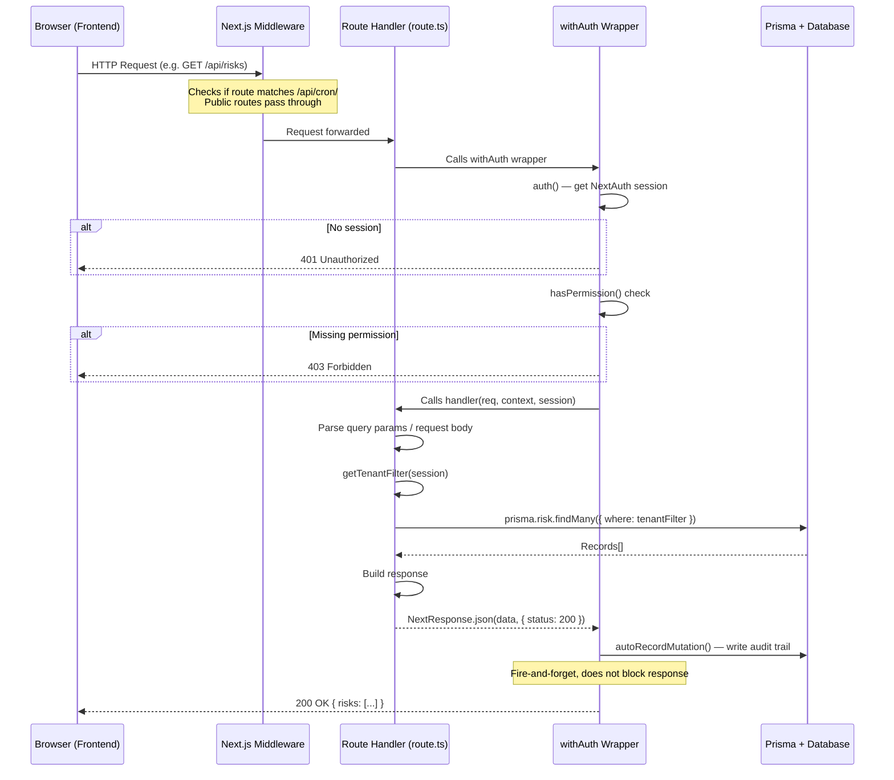

# API Overview

## Table of Contents
1. [What is an API?](#what-is-an-api)
2. [What is REST?](#what-is-rest)
3. [How Next.js API Routes Work](#how-nextjs-api-routes-work)
4. [Route Handlers](#route-handlers)
5. [Request and Response Objects](#request-and-response-objects)
6. [How Authentication is Applied](#how-authentication-is-applied)
7. [How Permissions are Checked](#how-permissions-are-checked)
8. [Error Responses](#error-responses)
9. [Multi-Tenancy in APIs](#multi-tenancy)
10. [Audit Trail Auto-Capture](#audit-trail)
11. [The context.params Promise Pattern](#params-promise)
12. [JSON Format](#json-format)
13. [All API Route Groups](#all-api-route-groups)
14. [API Request Flow Diagram](#api-request-flow-diagram)

---

## What is an API?

**API** stands for **Application Programming Interface**. In the context of web applications, an API is a set of server-side endpoints that the frontend (browser) calls to fetch or save data.

Think of a restaurant:
- The **kitchen** is the database — it stores and prepares all the food (data)
- The **menu** is the API contract — it lists what can be ordered and in what format
- The **waiter** is the API server — it takes your order (request), brings it to the kitchen, and returns the food (response)
- **You** (the diner) are the frontend — you browse the menu, place an order, and consume what comes back

When the Risk Register page loads, the browser (frontend) sends an HTTP request to `/api/risks` — like placing an order. The API server validates who you are, checks what you are allowed to see, fetches the matching risks from the database, and returns them as JSON — the waiter bringing your food.

---

## What is REST?

**REST** (Representational State Transfer) is a set of conventions for designing web APIs. RESTful APIs:

1. Use **URLs to identify resources**: `/api/risks` (a collection), `/api/risks/abc-123` (a specific risk)
2. Use **HTTP methods to describe operations**:
   - `GET` — Retrieve data (read-only, no side effects)
   - `POST` — Create a new record
   - `PATCH` — Partially update an existing record
   - `PUT` — Fully replace an existing record
   - `DELETE` — Delete a record
3. Use **HTTP status codes to communicate results**:
   - `200 OK` — Success
   - `201 Created` — New record created
   - `400 Bad Request` — Request was malformed
   - `401 Unauthorized` — Not logged in
   - `403 Forbidden` — Logged in but lacks permission
   - `404 Not Found` — Record does not exist
   - `500 Internal Server Error` — Unexpected server error

### REST Example

```
GET    /api/risks           → List all risks (paginated)
POST   /api/risks           → Create a new risk
GET    /api/risks/abc-123   → Get risk with ID abc-123
PATCH  /api/risks/abc-123   → Update risk abc-123
DELETE /api/risks/abc-123   → Delete risk abc-123
```

---

## How Next.js API Routes Work

In Next.js App Router, **every `route.ts` file inside `src/app/api/` becomes an HTTP endpoint**. The URL is derived from the folder path, just like page routing.

```
src/app/api/
  risks/
    route.ts           → GET /api/risks, POST /api/risks
    [id]/
      route.ts         → GET /api/risks/:id, PATCH /api/risks/:id, DELETE /api/risks/:id
  internal-audit/
    engagements/
      route.ts         → GET /api/internal-audit/engagements, POST /api/internal-audit/engagements
      [id]/
        route.ts       → GET /api/internal-audit/engagements/:id
  dashboard/
    stats/
      route.ts         → GET /api/dashboard/stats
  notifications/
    route.ts           → GET /api/notifications
```

The route file exports functions named after HTTP methods. Next.js automatically routes requests to the correct exported function:

```ts
// src/app/api/risks/route.ts

// Handles: GET /api/risks
export async function GET(req: NextRequest) { ... }

// Handles: POST /api/risks
export async function POST(req: NextRequest) { ... }
```

No routing configuration file is needed — the file system IS the router.

---

## Route Handlers

A **route handler** is an `async` function exported from a `route.ts` file. It receives a `NextRequest` object, performs its logic, and returns a `NextResponse`.

### Basic Structure

```ts
import { NextRequest, NextResponse } from "next/server";

export async function GET(req: NextRequest) {
  // 1. Parse request parameters
  const url = new URL(req.url);
  const page = Number(url.searchParams.get("page") ?? "1");

  // 2. Perform business logic (database queries, etc.)
  const risks = await prisma.risk.findMany({
    skip: (page - 1) * 20,
    take: 20,
  });

  // 3. Return a JSON response
  return NextResponse.json({ risks, page });
}
```

### Protected Route Handler (the real pattern)

In this application, **no route handler is directly exported**. Instead, every handler is wrapped with `withAuth()` from `src/lib/api-auth.ts`:

```ts
import { withAuth } from "@/lib/api-auth";

// The actual handler function (not exported directly)
async function handler(req, context, session) {
  // session contains the authenticated user's data
  const risks = await prisma.risk.findMany({
    where: { customerAccountId: session.customerAccountId }
  });
  return NextResponse.json({ risks });
}

// Export the wrapped version — withAuth handles auth before calling handler
export const GET = withAuth(handler, { resource: "risk.register", action: "view" });
export const POST = withAuth(createHandler, { resource: "risk.register", action: "create" });
```

---

## Request and Response Objects

### NextRequest

The `NextRequest` object contains everything about the incoming HTTP request:

```ts
req.method          // "GET", "POST", "PATCH", "DELETE"
req.url             // Full URL including query string
req.headers         // HTTP headers (Authorization, Content-Type, etc.)

// Reading query string parameters:
const url = new URL(req.url);
const search = url.searchParams.get("search"); // "?search=cyber" → "cyber"
const page = url.searchParams.get("page");     // "?page=2" → "2"

// Reading JSON body (POST/PATCH):
const body = await req.json();
// body is the parsed JavaScript object from the request body

// Reading form data (file uploads):
const formData = await req.formData();
const file = formData.get("file"); // The uploaded file
```

### NextResponse

```ts
// Return JSON data
return NextResponse.json({ risks: [...] }); // Status 200 by default

// Return JSON with specific status
return NextResponse.json({ error: "Not found" }, { status: 404 });
return NextResponse.json({ risk: {...} }, { status: 201 }); // Created

// Set headers
return NextResponse.json(data, {
  status: 200,
  headers: { "Content-Type": "application/json" },
});
```

---

## How Authentication is Applied

Every API route in this application uses the `withAuth` wrapper from `src/lib/api-auth.ts`. This wrapper:

1. Calls `auth()` from NextAuth to retrieve the current session
2. Returns `401 Unauthorized` if no session exists (user is not logged in)
3. Checks if the user's permissions include the required resource + action
4. Returns `403 Forbidden` if the permission check fails
5. Builds an `authenticatedUser` object with all the user's data
6. Calls your handler function, passing it the `authenticatedUser` as the third argument
7. After a successful mutation (non-GET), automatically records an audit trail entry

```ts
export const GET = withAuth(
  async (req, context, session) => {
    // session is the authenticatedUser object:
    // session.id          - user's database ID
    // session.email       - user's email
    // session.roles       - string[] of role names
    // session.permissions - UserPermission[] (resource, action, scope)
    // session.customerAccountId - the user's tenant ID
    // session.departmentId - user's department (for scoped access)
    // session.auditHeadId  - for internal audit isolation
    return NextResponse.json({ success: true });
  },
  { resource: "risk.register", action: "view" }
);
```

### withAuthOnly

For routes that only need authentication (no specific permission check):

```ts
export const GET = withAuthOnly(async (req, context, session) => {
  // Any logged-in user can call this
  return NextResponse.json({ userId: session.id });
});
```

---

## How Permissions are Checked

The permission check inside `withAuth` uses `hasPermission()` from `src/lib/permissions.ts`.

```ts
const hasAccess = resources.some(r =>
  hasPermission(user.permissions, r, options.action)
);
```

`hasPermission` iterates through the user's permissions array and checks:
1. Does any permission's resource match the required resource? (supports wildcards: `compliance.*`)
2. Does the action match? (`view`, `create`, `edit`, `delete`, `approve`)
3. If the scope is `department` or `own`, is the contextual data provided and does it match?

### Multi-Resource OR Check

A route can be accessible if the user has permission for ANY of multiple resources:

```ts
export const GET = withAuth(handler, {
  resource: ["compliance.governance", "qpost-compliance.governance"], // Either works
  action: "view",
});
```

---

## Error Responses

All error responses follow a consistent JSON format:

```json
{ "error": "Human-readable error message" }
```

### Standard Error Codes

| Status | Code Name | When Used |
|--------|-----------|-----------|
| `400` | Bad Request | Request body is missing required fields or has invalid values |
| `401` | Unauthorized | User is not logged in (no valid session) |
| `403` | Forbidden | User is logged in but lacks the required permission |
| `404` | Not Found | The requested record does not exist |
| `409` | Conflict | Duplicate record or constraint violation |
| `500` | Internal Server Error | Unexpected server-side error |

### Error Response Examples

```ts
// 400 - Validation failure
return NextResponse.json(
  { error: "Risk name is required" },
  { status: 400 }
);

// 401 - Not logged in (returned by withAuth automatically)
return NextResponse.json(
  { error: "Authentication required" },
  { status: 401 }
);

// 403 - No permission (returned by withAuth automatically)
return NextResponse.json(
  { error: "You don't have permission to create risk.register" },
  { status: 403 }
);

// 404 - Record not found
if (!risk) {
  return NextResponse.json({ error: "Risk not found" }, { status: 404 });
}

// 500 - Unexpected error (returned by withAuth's catch block)
return NextResponse.json(
  { error: "Internal server error" },
  { status: 500 }
);
```

---

## Multi-Tenancy in APIs

This is a **multi-tenant** application — multiple organisations (customers) use the same application with completely isolated data. A user from Organisation A must never see Organisation B's risks.

Multi-tenant isolation is enforced by the `getTenantFilter()` and `validateTenantAccess()` helpers in `src/lib/api-auth.ts`.

### How It Works

Every user belongs to a `customerAccountId`. All database records also have a `customerAccountId`. API queries always filter by the user's `customerAccountId`:

```ts
import { getTenantFilter } from "@/lib/api-auth";

export const GET = withAuth(async (req, context, session) => {
  const tenantFilter = getTenantFilter(session);
  // For a regular user: tenantFilter = { customerAccountId: "cust-abc-123" }
  // For a GRCAdministrator: tenantFilter = {} (sees all data)

  const risks = await prisma.risk.findMany({
    where: {
      ...tenantFilter, // Enforces tenant isolation
      // Other conditions
    },
  });

  return NextResponse.json({ risks });
}, { resource: "risk.register", action: "view" });
```

### Validating Access to a Specific Record

When fetching a single record, validate that it belongs to the user's tenant:

```ts
const risk = await prisma.risk.findUnique({ where: { id } });

if (!risk || !validateTenantAccess(session, risk.customerAccountId)) {
  return NextResponse.json({ error: "Risk not found" }, { status: 404 });
}
// Return 404 even for access denial — do not reveal that the record exists
```

### Audit Head Isolation (Internal Audit Module)

Internal Audit has an additional layer of isolation: within a single customer account, there can be multiple `AuditHead` users. Each AuditHead only sees data created under their "team". This is enforced by `getAuditHeadFilter()`:

```ts
import { getTenantFilter, getAuditHeadFilter } from "@/lib/api-auth";

const engagements = await prisma.auditEngagement.findMany({
  where: {
    ...getTenantFilter(session),     // Customer account isolation
    ...getAuditHeadFilter(session),  // Audit head isolation (if applicable)
  },
});
```

---

## Audit Trail Auto-Capture

Every successful mutation (POST, PATCH, DELETE) automatically generates an audit trail record. This happens inside `withAuth` after the handler returns a successful response (status 200-299).

The audit record captures:
- Who performed the action (userId, userName, userRole)
- What they did (Create/Update/Delete/Approve)
- Which module (e.g., "Risk Management")
- Which record (extracted from route params if available)
- When (timestamp, auto-set by the database)
- From where (IP address from request headers)

This requires **no code in the handler itself** — it is fully automatic for any route wrapped with `withAuth`. The only exception is the audit trail reader itself, which is skipped to avoid recursive logging.

To view audit trail records: navigate to `/internal-audit/audit-trail` (Internal Audit users) or via the admin interface.

---

## The context.params Promise Pattern

In Next.js 16 API routes with dynamic segments (e.g., `[id]`), the route parameters are wrapped in a **Promise** and must be awaited.

```ts
// src/app/api/risks/[id]/route.ts

interface RouteContext {
  params: Promise<{ id: string }>;
}

export const GET = withAuth(
  async (req: NextRequest, context: RouteContext, session) => {
    const { id } = await context.params; // MUST await — Next.js 16 requirement

    const risk = await prisma.risk.findUnique({ where: { id } });

    if (!risk) {
      return NextResponse.json({ error: "Risk not found" }, { status: 404 });
    }

    return NextResponse.json({ risk });
  },
  { resource: "risk.register", action: "view" }
);
```

**Common mistake**: Accessing `context.params.id` without awaiting. TypeScript will catch this — `context.params` is `Promise<{id: string}>`, not `{id: string}`, so accessing `.id` directly would return `undefined`.

---

## JSON Format

All API requests and responses use JSON format.

### Request Headers

When sending data (POST/PATCH), include the Content-Type header:

```ts
fetch("/api/risks", {
  method: "POST",
  headers: { "Content-Type": "application/json" },
  body: JSON.stringify({ name: "Cybersecurity Risk", level: "high" }),
});
```

### Response Format

API responses typically return one of these formats:

```json
// Single record
{ "risk": { "id": "...", "name": "...", "level": "high" } }

// List of records
{ "risks": [...], "total": 42, "page": 1 }

// Simple success
{ "message": "Risk deleted successfully" }
{ "success": true }

// Error
{ "error": "Descriptive error message" }
```

---

## All API Route Groups

The API has over 300 endpoints organised in these groups:

### Core Business Logic APIs

| Group | Base Path | Description |
|-------|-----------|-------------|
| Risks | `/api/risks/` | Risk register CRUD, assessment, response |
| Compliance | `/api/compliance/` | Regulatory intelligence |
| Controls | `/api/controls/` | Compliance controls CRUD |
| Frameworks | `/api/frameworks/` | Compliance frameworks CRUD |
| Governance | `/api/governance/` | Policies, procedures CRUD |
| Evidence | `/api/evidence/` | Evidence management CRUD |
| Assets | `/api/assets/` | Asset inventory CRUD |
| Internal Audit | `/api/internal-audit/` | All audit workflow endpoints |
| BIA | `/api/bia/` | Business impact analysis |
| Organization | `/api/organization/` | Profile, departments, processes |
| Users | `/api/users/` | User management |

### Supporting APIs

| Group | Base Path | Description |
|-------|-----------|-------------|
| Notifications | `/api/notifications/` | User notification fetch + mark read |
| Dashboard | `/api/dashboard/stats` | Dashboard metrics |
| Audit Logs | `/api/audit-logs/` | Audit trail viewer |
| Translations | `/api/translations/` | Dynamic data translation |
| Settings | `/api/settings/` | Customer settings, logo |
| Artifacts | `/api/artifacts/` | Document artifacts |
| TPRM | `/api/tprm/` | Third-party risk management |

### AI-Powered APIs

| Group | Base Path | Description |
|-------|-----------|-------------|
| AI Evidence | `/api/ai/evidence/` | Evidence ingestion, review |
| AI Governance | `/api/ai/governance/` | Policy generation |
| AI Risk | `/api/ai/risk-evaluation/`, `/api/ai/risk-semantic-match/` | Risk analysis |
| AI Compliance | `/api/ai/compliance/` | Control query, self-assessment |
| AI Voice | `/api/ai/voice/` | Speech-to-text, text-to-speech |
| AI Chatbot | `/api/ai/chatbot-seed/` | Help chatbot initialisation |

### System APIs

| Group | Base Path | Description |
|-------|-----------|-------------|
| Auth | `/api/auth/` | NextAuth sign in, sign out, session |
| Bootstrap | `/api/bootstrap/` | First-run setup |
| Cron | `/api/cron/due-reminders` | Scheduled due date reminders |
| Master Data | `/api/risk-categories/`, `/api/asset-groups/`, etc. | Lookup data CRUD |

---

## API Request Flow Diagram


