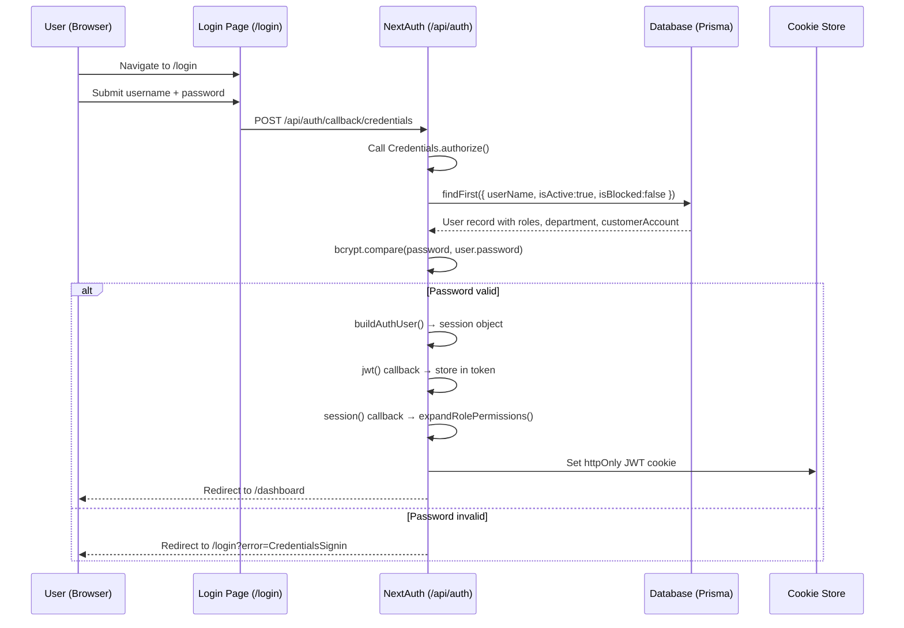
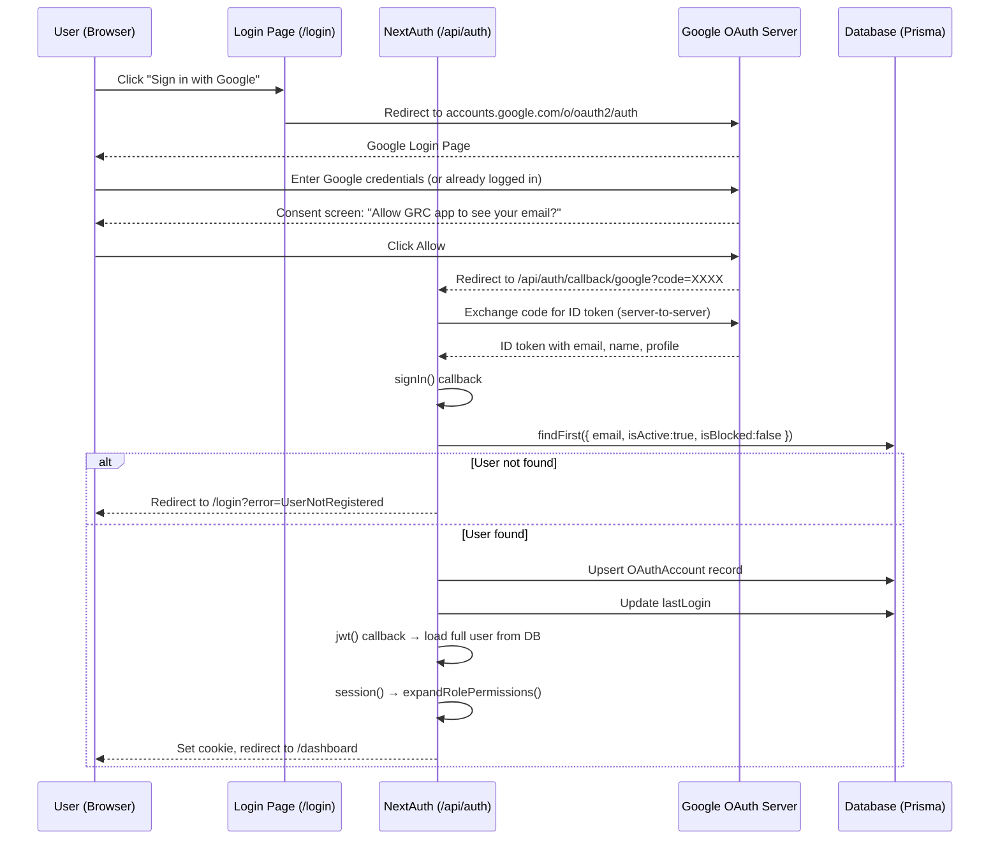

# Authentication Overview

This document explains every layer of the GRC application's authentication system,
from first principles through to the exact code that enforces it. No prior knowledge
of JWT, OAuth, or NextAuth is assumed.

---

## Table of Contents

1. [Core Concepts](#1-core-concepts)
2. [What Is a Session?](#2-what-is-a-session)
3. [What Is a JWT?](#3-what-is-a-jwt)
4. [What Is OAuth and SSO?](#4-what-is-oauth-and-sso)
5. [NextAuth v5](#5-nextauth-v5)
6. [Three Authentication Methods](#6-three-authentication-methods)
7. [Login Page Flow](#7-login-page-flow)
8. [JWT Session Lifecycle](#8-jwt-session-lifecycle)
9. [Rolling 30-Minute Inactivity Window](#9-rolling-30-minute-inactivity-window)
10. [Session Data Structure](#10-session-data-structure)
11. [Token Storage and Cookie Security](#11-token-storage-and-cookie-security)
12. [Sequence Diagrams](#12-sequence-diagrams)
13. [Audit Trail for Auth Events](#13-audit-trail-for-auth-events)

---

## 1. Core Concepts

### Authentication vs. Authorization

These two words sound alike and are frequently confused. They mean very different things.

**Authentication** answers: "Who are you?"

It is the process of verifying someone's identity. When you type a username and
password and the application checks them against its records, that is authentication.
The application is confirming you are who you claim to be.

Analogy: A nightclub checking your ID at the door. The bouncer verifies your name
matches your face. They do not yet decide whether you may enter the VIP section—
that is a separate decision.

**Authorization** answers: "What are you allowed to do?"

It is the process of deciding which resources or actions an authenticated identity
is permitted to use. After the application knows who you are, it checks what you are
allowed to see and do.

Analogy: The nightclub bouncer confirms you are 21 (authentication). The wristband
you receive at the door then tells staff you are a VIP and may enter the private
lounge (authorization).

In the GRC application:
- Authentication happens at the `/login` page (credentials, Google, or Microsoft).
- Authorization happens everywhere else (the RBAC system checks your role and permissions before serving any page or API response).

### The Authentication Stack in This Application

```
User's browser
      ↓  HTTPS (TLS)
Next.js 16 App Router (src/app/)
      ↓
NextAuth v5  (src/lib/auth.ts)
      │
      ├── Credentials provider  → bcrypt password verification
      ├── Google OAuth provider → Google identity server
      └── Microsoft Entra ID   → Microsoft identity server
            ↓
       Prisma ORM (src/lib/prisma.ts)
            ↓
       PostgreSQL / SQLite database
```

---

## 2. What Is a Session?

### The Stateless Problem

HTTP (the protocol your browser uses to talk to web servers) is inherently
stateless. Every HTTP request is independent. The server has no built-in
memory of previous requests.

This creates a problem: after you log in, how does the server know you are
still logged in on the next page you visit?

### Three Historical Solutions

**Solution 1 — Send credentials on every request.** Terrible for usability
and security. Rejected immediately.

**Solution 2 — Server-side sessions.** After login, the server generates a
random session ID (e.g., `a3f9b2...`), stores your identity next to it in
memory or a database, and sends the ID to your browser as a cookie. On every
subsequent request, your browser sends the cookie, the server looks up the ID,
and finds your identity. Problem: does not scale well across multiple server
instances without a shared session store.

**Solution 3 — Client-side tokens (JWT).** After login, the server creates a
cryptographically signed token that contains your identity directly. The server
sends this token to your browser. On every subsequent request, your browser
sends the token back, and the server verifies the signature without querying a
database. This is what this application uses.

### Session in This Application

When you log in, NextAuth creates a JWT containing your user ID, roles,
permissions, module flags, and tenant ID. The JWT is stored in an httpOnly
cookie in your browser. Every request to the application sends this cookie
automatically. The server verifies the JWT's cryptographic signature on every
request.

---

## 3. What Is a JWT?

### The Structure

A JSON Web Token (JWT, pronounced "jot") is a compact, URL-safe string that
carries claims (pieces of information) in a verifiable way.

A JWT has three parts separated by dots:

```
eyJhbGciOiJIUzI1NiIsInR5cCI6IkpXVCJ9
.
eyJ1c2VySWQiOiIxMjMiLCJyb2xlIjoiQXVkaXRIZWFkIn0
.
SflKxwRJSMeKKF2QT4fwpMeJf36POk6yJV_adQssw5c
```

**Part 1 — Header** (base64-encoded JSON):
```json
{
  "alg": "HS256",
  "typ": "JWT"
}
```
Tells the receiver which algorithm was used to sign the token.

**Part 2 — Payload** (base64-encoded JSON):
```json
{
  "sub": "user-abc-123",
  "role": "AuditHead",
  "customerAccountId": "tenant-xyz",
  "iat": 1719600000,
  "exp": 1719601800
}
```
The actual data (claims). `iat` = issued at (Unix timestamp). `exp` = expiry
(Unix timestamp). The server will reject any token whose `exp` is in the past.

**Part 3 — Signature**:
The signature is computed as:
```
HMAC-SHA256(
  base64(header) + "." + base64(payload),
  SERVER_SECRET
)
```
The `SERVER_SECRET` is stored only on the server (the `NEXTAUTH_SECRET`
environment variable). If anyone tampers with the payload, the signature will
not match and the server will reject the token.

### Why JWTs Are Safe

- Only the server knows the secret, so tokens cannot be forged.
- The payload is base64-encoded (not encrypted). Do not store sensitive data
  like passwords in a JWT payload. This application stores only non-sensitive
  session metadata (user ID, roles, tenant ID).
- The signature prevents tampering. If you try to change `role` from `Auditor`
  to `AuditHead` in a token, the signature will fail verification.

### What This Application Stores in the JWT

As defined in `src/types/next-auth.d.ts`, the token contains:

| Field | Type | Purpose |
|-------|------|---------|
| `sub` | string | User ID (set by NextAuth) |
| `id` | string | Application-level user ID (overrides sub for OAuth users) |
| `role` | string | Primary role name (legacy field) |
| `roles` | string[] | All assigned role names |
| `permissions` | UserPermission[] | Expanded permission list (computed from roles) |
| `customerAccountId` | string \| null | Tenant (customer organization) ID |
| `customerAccountCode` | string \| null | Short code for the tenant |
| `customerAccountName` | string \| null | Display name of the tenant |
| `departmentId` | string \| null | User's department ID |
| `departmentName` | string \| null | User's department display name |
| `auditHeadId` | string \| null | For audit team members: their Audit Head's ID |
| `isGrcAdded` | boolean | GRC module enabled for tenant |
| `isTprmAdded` | boolean | TPRM module enabled for tenant |
| `isInternalAuditEnabled` | boolean | Internal Audit module enabled |
| `isTechnicalEvidenceEnabled` | boolean | Technical Evidence module enabled |
| `isQpostComplianceEnabled` | boolean | QPost Compliance module enabled |
| `subscriptionStatus` | string \| null | Current subscription status |
| `subscriptionType` | string \| null | Subscription type |
| `roleModules` | string[] | Module codes the user has roles in |
| `iat` | number | Issued-at timestamp |
| `exp` | number | Expiry timestamp |

---

## 4. What Is OAuth and SSO?

### The Password Problem

Imagine you work at a company that uses 20 different software tools. Without
SSO, you have 20 separate passwords. You forget them, reuse weak ones, and
waste time logging into each tool every morning.

### OAuth 2.0 Explained

OAuth 2.0 is an authorization protocol that lets users grant one application
access to their account at another application, without sharing their password.

The key players:
- **Resource Owner**: You, the user.
- **Client**: The GRC application (it wants to know who you are).
- **Authorization Server**: Google or Microsoft (they know who you are and
  manage your identity).
- **Resource Server**: In OAuth for login, this is the same as the
  authorization server (it returns your profile after authorization).

### The OAuth Login Flow in Plain English

1. You click "Sign in with Google" on the GRC login page.
2. Your browser redirects to Google's login page.
3. You log into Google (or you are already logged in).
4. Google shows a consent screen: "The GRC app wants to see your name and
   email address. Allow?"
5. You click Allow.
6. Google redirects your browser back to the GRC application with a
   short-lived authorization code in the URL.
7. The GRC application (server-side) exchanges this code for an ID token
   (directly from Google, server-to-server). This exchange is secure because
   the application's client secret is only known to the server.
8. The GRC application reads your email from the ID token, looks up your user
   record in its database, creates a session JWT, and logs you in.

### What Is SSO?

Single Sign-On (SSO) means you sign in once (to Google or Microsoft) and can
access multiple applications without logging in again.

Workplace example: An employee signs into their Windows machine each morning
using Microsoft Entra ID (formerly Azure AD). Throughout the day, when they
open any corporate application that supports Microsoft SSO, they are
automatically logged in — no additional password required. The applications
trust Microsoft's assertion that the employee's identity has been verified.

In this GRC application, both Google OAuth and Microsoft Entra ID act as SSO
providers. If your organization already uses Google Workspace or Microsoft 365,
your employees can log into the GRC app with their existing corporate credentials.

**Important constraint**: SSO is not open registration. Users must first be
pre-registered in the GRC database by an administrator. When an OAuth login
is attempted, the system checks whether the email address from the OAuth
provider exists as an active, unblocked user. If not, login is rejected with
a `UserNotRegistered` error.

---

## 5. NextAuth v5

### What Is NextAuth?

NextAuth (now called Auth.js) is a TypeScript authentication library for
Next.js applications. It handles the complex, security-critical work of:
- Managing OAuth 2.0 flows with multiple providers.
- Creating and verifying JWTs.
- Setting secure cookies.
- Providing React hooks to access the session.
- Exposing server-side session utilities.

The configuration lives entirely in `src/lib/auth.ts` (585 lines).

### Key Exports from auth.ts

```typescript
export const { handlers, signIn, signOut, auth } = NextAuth({ ... });
```

| Export | Purpose |
|--------|---------|
| `handlers` | HTTP handler functions, mounted at `/api/auth/[...nextauth]` |
| `signIn` | Server action to programmatically start login |
| `signOut` | Server action to destroy session |
| `auth` | Function to read the current session from server components or API routes |

### Configuration File Structure

```
NextAuth({
  trustHost: true,                // Trust X-Forwarded-Host header (required for Vercel)
  cookies: { ... },               // Custom cookie names and security options
  providers: [ ... ],             // Credentials, Google, MicrosoftEntraID
  pages: { signIn: '/login' },    // Custom login page route
  callbacks: {
    signIn(),                     // Runs on every login attempt
    jwt(),                        // Runs when JWT is created or refreshed
    session(),                    // Transforms JWT into session object
  },
  events: {
    signIn(),                     // Fires after successful login (audit trail)
    signOut(),                    // Fires after logout (audit trail)
  },
  session: {
    strategy: 'jwt',
    maxAge: 30 * 60,             // 30 minutes
    updateAge: 5 * 60,           // Refresh token every 5 minutes
  },
  jwt: { maxAge: 30 * 60 },
})
```

---

## 6. Three Authentication Methods

### Method 1: Credentials (Username/Password)

This is the traditional login method. The user types a username (or email)
and password into the login form.

#### What Is bcrypt?

Passwords must never be stored in plain text in a database. If the database
is breached, plain-text passwords are immediately compromised.

bcrypt is a password-hashing function. It takes a plain-text password and
produces a fixed-length hash string that looks like:
```
$2a$12$N9qo8uLOickgx2ZMRZoMyeIjZAgcfl7p92ldGxad68LJZdL17lhWy
```

The key properties:
- **One-way**: You cannot reverse the hash to get the original password.
- **Salt**: A random value is incorporated into each hash, so the same password
  produces a different hash each time. This defeats "rainbow table" attacks
  (precomputed tables of common password hashes).
- **Slow by design**: bcrypt deliberately takes ~100ms per comparison, making
  brute-force attacks impractical.

To verify a login, bcrypt re-runs the hash with the same salt and compares the
result. The application uses `bcryptjs`, a pure-JavaScript implementation.

#### Credentials Flow in Code

From `src/lib/auth.ts`, the `authorize` function:

1. Receives `credentials.username` and `credentials.password`.
2. Queries the database for a user with matching `userName` or `email` (case-insensitive).
3. Verifies `isActive: true, isBlocked: false`.
4. If the user has no `password` field (SSO-only user), rejects the login.
5. Calls `bcrypt.compare(inputPassword, user.password)`.
6. If the comparison passes, calls `buildAuthUser()` to construct the session object.
7. Fires a fire-and-forget update to set `lastLogin` on the user record.
8. Returns the user object to NextAuth.

If any step fails, `authorize` returns `null`, and NextAuth redirects to
`/login?error=CredentialsSignin`.

#### TPRM Role Auto-Repair

A special case exists for TPRM users. Some users have a `tprmRole` field
(a legacy string like `"Business Owner"`) but may not have the corresponding
`UserRole` record in the database. The `ensureTprmUserRole` function checks
for this mismatch and creates the missing `UserRole` row on first login.
This is transparent to the user.

### Method 2: Google OAuth

Google OAuth uses the standard OAuth 2.0 Authorization Code flow.

Configuration:
```typescript
Google({
  clientId: process.env.AUTH_GOOGLE_ID,
  clientSecret: process.env.AUTH_GOOGLE_SECRET,
})
```

Required environment variables:
- `AUTH_GOOGLE_ID` — OAuth client ID from Google Cloud Console.
- `AUTH_GOOGLE_SECRET` — OAuth client secret.

#### signIn Callback for OAuth

For OAuth logins, NextAuth calls the `signIn` callback with the user's profile
from Google. The callback:

1. Extracts the user's email from the OAuth profile.
2. Queries the GRC database for a user with that email (`isActive: true, isBlocked: false`).
3. If not found, redirects to `/login?error=UserNotRegistered`.
4. If found, upserts an `OAuthAccount` record (for audit purposes).
5. Updates `lastLogin` on the user record.
6. Returns `true` to allow the login.

#### jwt Callback for OAuth

Because the OAuth `user` object only contains the data from Google (name, email,
profile picture), the `jwt` callback must query the database to load roles,
permissions, and tenant data, just as in the credentials flow.

### Method 3: Microsoft Entra ID

Microsoft Entra ID (formerly Azure Active Directory) uses the same OAuth 2.0
flow as Google.

Configuration:
```typescript
MicrosoftEntraID({
  clientId: process.env.AUTH_MICROSOFT_ENTRA_ID_ID,
  clientSecret: process.env.AUTH_MICROSOFT_ENTRA_ID_SECRET,
})
```

Required environment variables:
- `AUTH_MICROSOFT_ENTRA_ID_ID` — Application (client) ID from Azure portal.
- `AUTH_MICROSOFT_ENTRA_ID_SECRET` — Client secret.

The signIn and jwt callbacks behave identically to the Google flow. Users must
be pre-registered in the GRC database with the same email address configured
in their Microsoft Entra account.

---

## 7. Login Page Flow

The login page is at `src/app/login/`. Here is the complete user journey for
a credentials login:

```
1. User navigates to https://app.example.com
2. Next.js middleware detects no session cookie → redirects to /login
3. User sees the login form (username, password, Google button, Microsoft button)

--- CREDENTIALS PATH ---
4. User types username "alice@corp.com" and password "MyPass123"
5. User clicks "Sign In"
6. Browser POSTs to /api/auth/callback/credentials
7. NextAuth calls Credentials.authorize({ username, password })
8. authorize() queries DB: find user WHERE userName='alice@corp.com' AND isActive=true
9. bcrypt.compare("MyPass123", storedHash) → true
10. buildAuthUser() constructs session object with roles, permissions, module flags
11. NextAuth calls jwt() callback → stores all fields in JWT token
12. NextAuth sets secure httpOnly cookie with JWT
13. Browser redirects to /dashboard (or the original page the user was on)

--- ERROR PATH ---
If user not found OR password wrong OR user blocked:
  authorize() returns null
  NextAuth redirects to /login?error=CredentialsSignin
  Login page shows "Invalid credentials" error

--- GOOGLE OAuth PATH ---
4. User clicks "Sign in with Google"
5. Browser redirects to accounts.google.com/o/oauth2/auth?client_id=...
6. User authenticates with Google (or session is already active)
7. Google redirects to /api/auth/callback/google?code=XXXX
8. NextAuth exchanges code for ID token (server-to-server call to Google)
9. signIn() callback verifies email exists in GRC database
10. jwt() callback loads full user data from database
11. Cookie set, browser redirects to dashboard
```

---

## 8. JWT Session Lifecycle

### Creation

The JWT is created the moment authentication succeeds. The `jwt` callback in
`src/lib/auth.ts` is called with `user` set (the object returned by
`authorize()` or built from the OAuth profile). All custom fields are written
to the `token` object.

### The session() Callback

After the `jwt` callback, NextAuth calls the `session` callback to build the
session object that React components will access via `useSession()`. This is
where permissions are expanded from role names:

```typescript
session.user.permissions = expandRolePermissions(
  session.user.roles,
  {
    isGrcAdded: session.user.isGrcAdded,
    isTprmAdded: session.user.isTprmAdded,
    isInternalAuditEnabled: session.user.isInternalAuditEnabled,
    isTechnicalEvidenceEnabled: session.user.isTechnicalEvidenceEnabled,
    isQpostComplianceEnabled: session.user.isQpostComplianceEnabled,
  }
);
```

`expandRolePermissions()` lives in `src/lib/permissions.ts`. It reads the
`ROLE_PERMISSIONS` matrix, expands wildcards (e.g., `organization.*` becomes
every `organization.X` resource), filters resources by module flags, and
returns a flat list of `{ resource, action, scope }` objects.

This flat list is what every API route and React component checks. Roles are
never checked directly during page rendering — only the expanded permissions.

### Refresh

On every request where the token is older than 5 minutes, NextAuth re-issues
a new token (sliding the expiry window forward). The `jwt` callback is called
again without a `user` object — at this point it simply returns the existing
token unchanged (the permissions expansion in `session()` happens fresh each time).

### Expiry

If the user makes no request for 30 minutes, the token expires. The next
request finds an expired token, the session is treated as null, and the user
is redirected to `/login`.

---

## 9. Rolling 30-Minute Inactivity Window

The session configuration in `src/lib/auth.ts`:

```typescript
session: {
  strategy: 'jwt',
  maxAge: 30 * 60,      // Token lives for 30 minutes from last activity
  updateAge: 5 * 60,    // Re-issue a fresh token if existing one is >5 min old
},
jwt: {
  maxAge: 30 * 60,
}
```

### What "Rolling" Means

A rolling session extends its expiry on every activity, rather than counting
down from a fixed creation time.

Timeline example:
```
09:00:00  User logs in          → token expires at 09:30:00
09:05:30  User loads a page     → token is 5m30s old (>5 min), refreshed
                                  → new token expires at 09:35:30
09:35:00  User loads a page     → token is ~30s old (<5 min), NOT refreshed
                                  → token still expires at 09:35:30
09:35:30  Token expires
09:40:00  User tries to load    → no valid session → redirected to /login
```

This balance protects against session hijacking (tokens expire quickly when
abandoned) while providing a good experience for active users (session never
expires mid-work).

### The `updateAge` Threshold

`updateAge: 5 * 60` means NextAuth only bothers issuing a new token if the
current one is more than 5 minutes old. Without this threshold, every single
request would issue a new Set-Cookie header, adding unnecessary overhead.

---

## 10. Session Data Structure

When a React component or API route reads the session, it sees the following
structure (from `src/types/next-auth.d.ts`):

```typescript
session.user = {
  // Identity
  id: string,                    // Database UUID
  name: string | null,           // Full name
  email: string | null,          // Email address

  // Legacy fields (kept for backward compatibility)
  role: string,                  // Primary role name
  department: string,            // Department name

  // Department scoping
  departmentId: string | null,
  departmentName: string | null,

  // Multi-tenant isolation
  customerAccountId: string | null,   // Tenant UUID
  customerAccountCode: string | null, // Short code (e.g., "ACME")
  customerAccountName: string | null, // Display name

  // Audit team scoping
  auditHeadId: string | null,    // For auditors: their Audit Head's user ID

  // Module subscription flags
  isGrcAdded: boolean,
  isTprmAdded: boolean,
  isInternalAuditEnabled: boolean,
  isTechnicalEvidenceEnabled: boolean,
  isQpostComplianceEnabled: boolean,

  // Subscription metadata
  subscriptionStatus: SubscriptionStatus | null,
  subscriptionType: SubscriptionType | null,

  // RBAC
  roles: string[],               // e.g., ["AuditHead"]
  roleModules: string[],         // e.g., ["INTERNAL_AUDIT"]
  permissions: UserPermission[], // Expanded from roles, filtered by module flags
}
```

### Accessing the Session

**In a Server Component or API route:**
```typescript
import { auth } from '@/lib/auth';

const session = await auth();
if (!session?.user) redirect('/login');
const userId = session.user.id;
```

**In a Client Component:**
```typescript
import { useSession } from 'next-auth/react';

const { data: session, status } = useSession();
if (status === 'loading') return <Spinner />;
if (!session) return <p>Not logged in</p>;
const userName = session.user.name;
```

---

## 11. Token Storage and Cookie Security

### Why httpOnly Cookies, Not localStorage?

JavaScript running in the browser (including malicious injected scripts from
XSS attacks) cannot access httpOnly cookies. If the JWT were stored in
`localStorage`, any XSS attack could steal it and hijack the session.

httpOnly cookies are sent automatically by the browser with every request but
are invisible to JavaScript.

### Cookie Configuration

From `src/lib/auth.ts`:

```typescript
cookies: {
  sessionToken: {
    name: process.env.NODE_ENV === 'production'
      ? '__Secure-authjs.session-token'
      : 'authjs.session-token',
    options: {
      httpOnly: true,     // Not accessible to JavaScript
      sameSite: 'lax',   // Sent with same-site requests and top-level navigations
      path: '/',          // Valid for entire domain
      secure: process.env.NODE_ENV === 'production',  // HTTPS only in production
    },
  },
  csrfToken: {
    name: process.env.NODE_ENV === 'production'
      ? '__Host-authjs.csrf-token'
      : 'authjs.csrf-token',
    options: {
      httpOnly: true,
      sameSite: 'lax',
      path: '/',
      secure: process.env.NODE_ENV === 'production',
    },
  },
}
```

| Option | Value | Why |
|--------|-------|-----|
| `httpOnly` | true | Hides cookie from JavaScript (XSS protection) |
| `sameSite: lax` | lax | Cookie sent for navigation from external sites (login redirects), but not for cross-site sub-resource requests (CSRF protection) |
| `secure` | true in production | Cookie only sent over HTTPS |
| `__Secure-` prefix | production only | Browser only sends cookie over secure connections (HTTPS) |
| `__Host-` prefix (CSRF) | production only | Cookie scoped to exact host, not subdomains |

### CSRF Protection

Cross-Site Request Forgery (CSRF) tricks a logged-in user's browser into
sending a forged request to the application. NextAuth includes built-in CSRF
protection using a separate CSRF token cookie and the `sameSite: lax` setting.
POST requests to `/api/auth/*` require a valid CSRF token.

---

## 12. Sequence Diagrams

### Credentials Login



### Google OAuth Login



---

## 13. Audit Trail for Auth Events

Every login and logout is recorded in the `AuditTrail` table. This is handled
by NextAuth's `events` configuration in `src/lib/auth.ts`:

```typescript
events: {
  async signIn({ user }) {
    await recordAuditTrail({
      customerAccountId,
      userId: user.id,
      userName: user.name,
      userRole: user.role,
      action: 'Login',
      module: 'Authentication',
    });
  },
  async signOut(message) {
    await recordAuditTrail({
      customerAccountId,
      userId,
      userName,
      userRole: role,
      action: 'Logout',
      module: 'Authentication',
    });
  },
}
```

These events fire after successful authentication (not on failed attempts).
Failed login attempts are not recorded — they only result in the redirect to
`/login?error=CredentialsSignin`. System administrators can review the audit
trail via the Internal Audit module's Audit Trail page.
