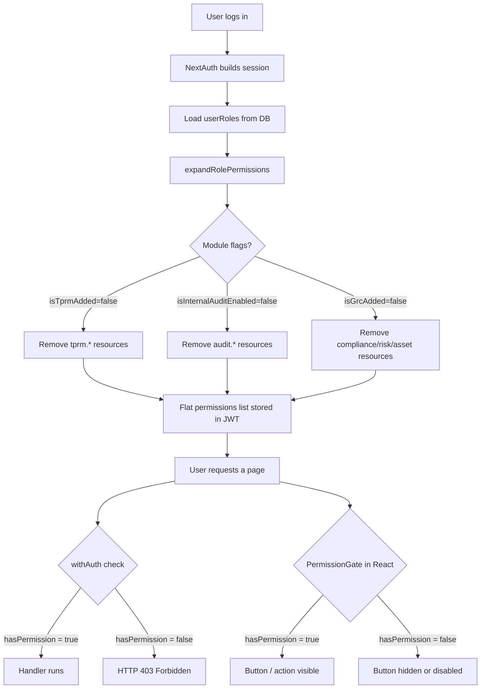

# Role-Based Access Control (RBAC)

This document explains the GRC application's permission system from first principles.
It covers every role, how roles translate to permissions, and how module subscription
flags modify what any role can see.

---

## Table of Contents

1. [What Is RBAC?](#1-what-is-rbac)
2. [Why RBAC Instead of Per-User Permissions?](#2-why-rbac-instead-of-per-user-permissions)
3. [The Permission Model](#3-the-permission-model)
4. [All 25 Roles Explained](#4-all-25-roles-explained)
5. [Role Hierarchy and Groupings](#5-role-hierarchy-and-groupings)
6. [Permission Structure](#6-permission-structure)
7. [Module Flag Filtering](#7-module-flag-filtering)
8. [Multi-Module Role Assignments](#8-multi-module-role-assignments)
9. [How Roles Are Assigned](#9-how-roles-are-assigned)
10. [How to Check Permissions](#10-how-to-check-permissions)
11. [Role Display Overrides](#11-role-display-overrides)
12. [Flow Diagram](#12-flow-diagram)

---

## 1. What Is RBAC?

Role-Based Access Control (RBAC) is an approach to restricting application
features to authorized users. Instead of granting permissions directly to
individual users, you define **roles** (job-function descriptions), attach
**permissions** to each role, and then assign one or more roles to each user.

The key insight is that roles describe job functions, not individuals. A company
might have 500 auditors, and all 500 need exactly the same capabilities in the
audit module. Rather than configuring 500 individual permission sets, you define
one `Auditor` role with the right permissions and assign it to all 500 users.

**Analogy**: A hospital has doctors, nurses, receptionists, and administrators.
Each job function has a different set of capabilities. A nurse can view patient
records and chart medications; a receptionist can book appointments but not view
clinical records. The hospital defines these capabilities by role, then assigns
roles to staff. When a new nurse is hired, they receive the `Nurse` role and
immediately have exactly the right level of access.

---

## 2. Why RBAC Instead of Per-User Permissions?

| Per-User Permissions | RBAC |
|----------------------|------|
| 500 users × 100 permissions = 50,000 configuration rows | 25 roles × 100 permissions = 2,500 rows; user assignment is just one row per user |
| Difficult to audit ("what can John do?") | Easy to audit ("what can an Auditor do?") |
| Hard to update ("give all auditors a new capability" = 500 updates) | Trivial to update (change one role definition) |
| Inconsistent — drifts over time as admins make one-off exceptions | Consistent by design |

---

## 3. The Permission Model

Every permission in this application is described by three components:

```
resource + action + scope
```

**Resource**: A string identifying a feature or data area.
Format: `module.area` (e.g., `compliance.governance`, `audit.fieldwork`).

**Action**: What the user wants to do to the resource.
The five actions are: `view`, `create`, `edit`, `delete`, `approve`.

**Scope**: How broadly the action applies.
- `all` — The user can act on any record in the tenant.
- `department` — The user can only act on records belonging to their department.
- `own` — The user can only act on records they personally created/own.

Example: A `DepartmentReviewer` has `risk.register: view, create, edit, delete` with `scope: own`. This means they can manage risks, but only risks where they are the owner.

---

## 4. All 25 Roles Explained

### System Roles (Platform-Level)

These roles are not assigned within a customer organization. They operate at the
platform level, spanning all tenants or the factory environment.

#### GRCAdministrator
**Purpose**: The platform superadmin. Glimmora staff who manage the GRC platform itself.

**What they can do**:
- Manage customer accounts (create tenants, enable/disable modules).
- Manage compliance frameworks, controls, governance templates, and evidence globally.
- View the cross-tenant Internal Audit account overview.
- Manage TPRM at the account overview level.
- Manage email settings and templates for all customers.
- Manage subscription pricing, bundle discounts, and all customer subscriptions.

**What they cannot do**:
- Access individual customer organization data (departments, employees, risk registers).
- Perform customer-side workflow tasks (creating risks, writing findings, etc.).
- Access customer-specific dashboards.

**Key technical detail**: When `getTenantFilter()` is called with a GRCAdministrator
session and `globalAccess: true`, it returns an empty filter (sees all tenants).
Without `globalAccess`, it filters by their own `customerAccountId`.

#### TPRMAdmin
**Purpose**: TPRM platform administrator with cross-account view.

**What they can do**:
- View the TPRM account overview (all tenants).
- Manage all assessments and task queues across accounts.

#### FactoryAdmin
**Purpose**: Assessment Factory administrator within the TPRM factory environment.

**What they can do**:
- Manage factory users (create FactoryAssessor accounts).
- Full access to the assessment factory workflow.
- View factory reports.

#### FactoryAssessor
**Purpose**: Performs assessments within the factory environment.

**What they can do**:
- Full access to assessment factory workflow.
- View factory reports (read-only; cannot manage users).

---

### Customer Organization Roles

These roles are assigned within a specific customer tenant. They drive access to
GRC, Compliance, Risk, and Asset modules.

#### CustomerAdministrator
**Purpose**: The customer-side superadmin. Typically the Chief Compliance Officer or IT
Risk Manager who manages the organization's GRC program.

**What they can do**:
- Full access to all Organization module pages (profile, users, departments, settings).
- Full CRUD on all Compliance module resources (frameworks, controls, governance, evidence, exceptions, KPIs).
- Full CRUD on all Asset Management resources (inventory, classification, reports).
- Full CRUD on Risk Management (register, assessment, response, risk matrix) — but **cannot approve** risk responses (this right belongs to Reviewers).
- Manage TPRM users, vendors, configurations, and monitoring.
- Manage Internal Audit settings and view audit risk registers.
- View the entire Audit Trail for their organization.
- Manage support tickets for their organization.

**What they cannot do**:
- Create Internal Audit strategic plans (AuditHead only).
- Approve risk responses (Reviewer/DepartmentReviewer only).

#### Reviewer
**Purpose**: Senior content reviewer with full CRUD across modules but no admin access.

**What they can do**:
- Full CRUD on Compliance, Asset Management, and Risk Management.
- View Organization dashboards and manage processes and departments.
- Approve risk responses (this is the primary differentiator from CustomerAdministrator).

**What they cannot do**:
- Access Organization profile, user management, or settings pages.
- Access Internal Audit module.
- Access compliance settings (Master Data).

#### DepartmentReviewer
**Purpose**: Department-level reviewer. Manages content scoped to their department,
and holds approval authority for department-level items.

**What they can do**:
- View and approve compliance controls, governance documents, evidence, and exceptions
  scoped to their department.
- Create, edit, and manage risks where they are the owner (`scope: own`).
- Approve risk responses for risks they own.
- Manage assets they personally own (`asset.my-inventory`, `scope: own`).

**What they cannot do**:
- See other departments' data (records not in their department or not owned by them).
- Access compliance settings, full asset inventory, or audit pages (except Audit Risk Register read-only).
- Create or delete strategic plans.

#### DepartmentContributor
**Purpose**: Department-level contributor. Creates and edits content within their department.
The most commonly assigned role for general staff.

**What they can do**:
- Create and edit compliance controls, governance documents, evidence, and exceptions
  within their department.
- Create, edit, and delete risks within their department.
- Create and manage assets they personally own.

**What they cannot do**:
- Approve anything (no `approve` action).
- See other departments' data.
- Access admin settings, user management, or audit pages.

#### Contributor
**Purpose**: Legacy role, now hidden from the UI. Kept for backward compatibility with
existing users who were assigned this role before the Department-scoped roles replaced it.
New users should be assigned `DepartmentContributor` instead.

---

### Internal Audit Roles

These roles are scoped entirely to the Internal Audit module. They are assigned by the
CustomerAdministrator when setting up an audit team.

The Internal Audit module has a two-level hierarchy:
- A **CustomerAdministrator** can create multiple Audit Heads within their organization.
- Each **AuditHead** manages their own team of Audit Managers, Auditors, and Auditees.
- Data isolation: Audit Head A cannot see Audit Head B's engagements.

#### AuditHead
**Purpose**: Head of the internal audit function. Full authority over the entire audit
lifecycle, including creating strategic plans.

**What they can do**:
- Full access to every Internal Audit page: dashboard, audit universe, audit charter,
  risk identification, risk register, strategic plans, operational plans, engagement planning,
  independence & objectivity, fieldwork, reports, CAPA tracking, document library, risk universe.
- View-only access to audit settings (cannot change configuration).
- View the audit trail for their own activity.

**Strategic Plan restriction**: Only the AuditHead can **create** strategic plans.
AuditManagers can view them; Auditors can view them; no one else can.

**Data isolation key**: The `auditHeadId` field on every audit record is set to the
AuditHead's user ID. Their team members have `auditHeadId` set in their session,
pointing back to this AuditHead. API filters use this to enforce isolation.

#### AuditManager
**Purpose**: Senior auditor who manages engagements. Almost identical to AuditHead
but cannot create Strategic Plans.

**What they can do**:
- Everything AuditHead can do, except creating Strategic Plans (view-only).
- Full edit access to Operational Plans.

#### Auditor
**Purpose**: Practitioner who conducts audits. (Note: In the UI, the `Auditee` role key
is displayed as "Auditor" — see Section 11.)

**What they can do**:
- Dashboard, audit universe, charter, risk identification, risk register (full access).
- View-only on strategic and operational plans.
- Full access to fieldwork, reports, CAPA, document library, risk universe.
- Independence & Objectivity: view, create, edit (not delete).
- View audit settings.

#### AuditUser
**Purpose**: Read-only audit observer. Can see all audit content but cannot modify anything.

**What they can do**:
- View-only access to: audit universe, charter, risk identification, risk register,
  engagement planning, independence, fieldwork, reports, CAPA, document library.
- No dashboard access.
- No settings or risk universe access.

#### Auditee
**Purpose**: Department staff who respond to audit requests. Strictly limited to
the pages where they need to provide information.

**What they can do**:
- View fieldwork (limited to their department).
- Edit fieldwork (update status, add evidence — department-scoped).
- View audit reports (department-scoped).
- View and update CAPA items (department-scoped).

**What they cannot do**:
- Access any other audit page (no dashboard, no audit universe, no planning, no documents).
- Access any other module (no compliance, risk, asset, organization admin).

---

### TPRM Roles

TPRM (Third-Party Risk Management) has two categories of roles:
1. **Client-side roles** (organization staff who manage vendor relationships).
2. **Vendor-side roles** (the vendor's representatives responding to assessments).

#### BusinessOwner
**Purpose**: The client organization's executive sponsor for a vendor relationship.

**What they can do**:
- Dashboard, assessments, inventory, reports, issues, contracts, monitoring, support
  — all scoped to their dedicated Business Owner workspace (BO-prefixed pages).
- Manage their RM and vendor users.
- View and create/edit assessments.
- View master data.

#### RelationshipManager
**Purpose**: Day-to-day manager of a vendor relationship. Similar to BusinessOwner
but without user management capability.

**What they can do**:
- RM-specific workspace: dashboard, assessments, inventory, reports, issues, contracts,
  monitoring, support.
- View and create/edit assessments.
- View master data.

#### TPRMAssessor
**Purpose**: The professional who conducts vendor assessments (questionnaire reviews,
evidence gathering).

**What they can do**:
- Full access to the assessor workspace: dashboard, assessments, inventory, monitoring,
  follow-ups, issue register, assessment factory, templates, support.
- View and edit assessments.

#### TPRMApprover
**Purpose**: Approves completed vendor assessments before they are finalized.

**What they can do**:
- Same workspace as TPRMAssessor.
- Can additionally `approve` assessments (the `approve` action on `tprm.assessments`).

#### TPRMAuditor
**Purpose**: Read-only auditor of the TPRM process. Reviews assessments for compliance.

**What they can do**:
- View-only access to all assessor workspace pages.
- View TPRM reports.

#### InternalITTeam
**Purpose**: Internal IT staff assigned remediation tasks from TPRM issue findings.

**What they can do**:
- Full access to `tprm.it-issues` — the IT-assigned issues page.
- No access to any other TPRM page.

#### AccountManager
**Purpose**: The vendor organization's primary contact. Responds to assessments and
manages their Subject Matter Experts (SMEs).

**What they can do**:
- Manage assessments assigned to their email address.
- Manage follow-ups.
- Create and manage SME users.
- Access vendor support.

**Vendor isolation**: AccountManagers only see assessments where their email is set
as the `accountManagerEmail` on the vendor record. The `getAMEmail()` and
`getAMVendorIds()` helpers in `api-auth.ts` implement this isolation.

#### TPRMSME
**Purpose**: Subject Matter Expert on the vendor side. Responds to specific
assessment questions delegated by the AccountManager.

**What they can do**:
- Same as AccountManager, except cannot manage other SMEs.
- Inherits vendor access from their parent AccountManager (via `createdById` lookup).

---

### Support Ticketing Roles

These roles follow a tiered support model (L1 → L2 → L3 escalation, with Manager oversight).

#### SupportAgentL1
**Purpose**: First-line support. Handles and triages tickets assigned to them.

**What they can do**:
- View and create/edit tickets — but only those assigned to or created by them (`scope: own`).
- View support dashboard and console.

#### SupportSpecialistL2
**Purpose**: Domain specialist. Handles escalations from L1.

**What they can do**:
- Full ticket access across all tickets in the system (`scope: all`).
- View dashboard and console.

#### SupportEngineerL3
**Purpose**: Engineering support. Handles code/API/infrastructure issues.

**What they can do**:
- Same as L2: full ticket access, dashboard, console.

#### SupportManager
**Purpose**: Manages the support function.

**What they can do**:
- Full access to all support resources: tickets, console, dashboard.
- Manage the knowledge base (create/edit/delete articles).
- Manage support settings (routing rules, categories, SLAs).
- Can delete tickets (L1/L2/L3 cannot).

---

## 5. Role Hierarchy and Groupings

```
Platform Level
├── GRCAdministrator          (full system admin)
├── TPRMAdmin                 (TPRM platform admin)
├── FactoryAdmin              (factory admin)
└── FactoryAssessor           (factory worker)

Customer Organization Level
├── CustomerAdministrator     (tenant admin)
├── Reviewer                  (org-wide reviewer with approve rights)
├── DepartmentReviewer        (dept-scoped reviewer + approve)
├── DepartmentContributor     (dept-scoped contributor)
└── Contributor               (deprecated, use DepartmentContributor)

Internal Audit (hierarchical team)
├── AuditHead                 (full control, strategic plans)
│   ├── AuditManager          (almost full, no strategic plan create)
│   ├── Auditor               (practitioner)
│   ├── AuditUser             (read-only observer)
│   └── Auditee               (respondent only)

TPRM Client-Side
├── BusinessOwner             (executive sponsor)
├── RelationshipManager       (relationship manager)
├── TPRMAssessor              (assessment performer)
├── TPRMApprover              (assessment approver)
├── TPRMAuditor               (audit observer)
└── InternalITTeam            (IT remediation)

TPRM Vendor-Side
├── AccountManager            (vendor primary contact)
└── TPRMSME                   (vendor subject matter expert)

Support
├── SupportManager            (full support access)
├── SupportEngineerL3         (engineering tier)
├── SupportSpecialistL2       (functional tier)
└── SupportAgentL1            (first-line tier)
```

---

## 6. Permission Structure

Permissions are defined in `src/lib/permissions.ts` as a `ROLE_PERMISSIONS` map.
Each role entry is an array of `RolePermissionDef` objects:

```typescript
interface RolePermissionDef {
  resource: string;         // e.g., 'compliance.governance' or 'organization.*'
  actions: Action[] | ['*']; // ['view', 'create', 'edit'] or ['*'] (all actions)
  scope: Scope;             // 'all', 'department', or 'own'
}
```

### Wildcard Resources

A resource can be a wildcard:
- `organization.*` matches `organization.dashboard`, `organization.profile`,
  `organization.users`, `organization.department`, etc.
- `*` matches every resource in the application.

`expandRolePermissions()` expands wildcards by iterating the full `RESOURCES`
map and including every matching resource.

### Wildcard Actions

`actions: ['*']` expands to `['view', 'create', 'edit', 'delete', 'approve']`.

### Scope Precedence

When checking if a user has permission, scopes are checked from most permissive
to least:
1. `all` — Immediately grants access regardless of record ownership.
2. `department` — Grants access if the record's `departmentId` matches the user's `departmentId`.
3. `own` — Grants access if the record's `ownerId` matches the user's `id`.

If a user has multiple permission entries for the same resource and action with
different scopes, `getPermissionScope()` returns the most permissive one.

---

## 7. Module Flag Filtering

The same role can have different effective permissions depending on which modules
the customer has subscribed to. This is controlled by `expandRolePermissions()`:

```typescript
expandRolePermissions(roleNames, {
  isGrcAdded: true,
  isTprmAdded: false,
  isInternalAuditEnabled: true,
  isTechnicalEvidenceEnabled: false,
  isQpostComplianceEnabled: false,
})
```

The function applies these rules (for non-system roles):
- If `isTprmAdded: false`, all `tprm.*` resources are excluded.
- If `isInternalAuditEnabled: false`, all `audit.*` resources are excluded.
- If `isTechnicalEvidenceEnabled: false`, all `technical-evidence.*` resources are excluded.
- If `isGrcAdded: false`, all `compliance.*`, `asset.*`, and `risk.*` resources are excluded.
- If `isQpostComplianceEnabled: false`, all `qpost-compliance.*` resources are excluded.
- If `isQpostComplianceEnabled: true`, all `compliance.*` resources are excluded
  (QPost and standard compliance are mutually exclusive).

**System roles are exempt from module flag filtering.** GRCAdministrator, TPRMAdmin,
FactoryAdmin, FactoryAssessor, BusinessOwner, RelationshipManager, TPRMAssessor,
TPRMApprover, TPRMAuditor, AccountManager, TPRMSME, and InternalITTeam always
receive their full permission set regardless of subscription flags. This is because
these roles operate at the platform or vendor level and are not subject to customer-level
subscription gates.

---

## 8. Multi-Module Role Assignments

A user can be assigned multiple roles in different modules simultaneously.

The `UserRole` table links users to roles with an optional `moduleCode`:

```
UserRole {
  userId:     "user-abc"
  roleId:     "role-auditor"
  moduleCode: "INTERNAL_AUDIT"  ← scopes this role to the IA module
}
```

Valid module codes: `GRC`, `TPRM`, `INTERNAL_AUDIT`, `TECHNICAL_EVIDENCE`.
System roles (GRCAdministrator, TPRMAdmin, etc.) have `moduleCode: null`.

The `roleModules` field in the session lists which modules the user holds at
least one non-null module-code role in. This drives the **workspace picker**
(the module selection screen that lets users switch between GRC, TPRM, and
Internal Audit workspaces).

Example: A user assigned as `CustomerAdministrator` (moduleCode=GRC) and
`AuditHead` (moduleCode=INTERNAL_AUDIT) will have `roleModules: ["GRC", "INTERNAL_AUDIT"]`
and can switch between the GRC workspace and the Internal Audit workspace.

---

## 9. How Roles Are Assigned

1. The **CustomerAdministrator** opens Organization > Users.
2. They click "Assign Role" on a user.
3. An `AssignRoleDialog` presents the available roles (certain roles are hidden
   from this UI — `Contributor` and internal system roles are not selectable).
4. The selected role is written to the `UserRole` table with the appropriate `moduleCode`.

The user's next login will pick up the new role (the session is rebuilt from
the database on each login and on each JWT refresh).

---

## 10. How to Check Permissions

### In React Components — usePermissions Hook

```typescript
import { usePermissions } from '@/hooks/usePermissions';

function RiskPage() {
  const { canView, canCreate, canEdit, canDelete, canApprove, isLoading } =
    usePermissions('risk.register');

  if (isLoading) return <Spinner />;

  return (
    <div>
      {canCreate && <Button>New Risk</Button>}
      {canEdit && <Button>Edit</Button>}
      {canApprove && <Button>Approve</Button>}
    </div>
  );
}
```

### In React Components — PermissionGate

```tsx
import { PermissionGate } from '@/components/ui/permission-gate';

<PermissionGate resource="compliance.governance" action="delete">
  <Button variant="destructive">Delete Policy</Button>
</PermissionGate>
```

### In API Routes — withAuth Wrapper

```typescript
import { withAuth } from '@/lib/api-auth';

export const DELETE = withAuth(
  async (req, context, session) => {
    const { id } = await context.params;
    await prisma.risk.delete({ where: { id } });
    return NextResponse.json({ success: true });
  },
  { resource: 'risk.register', action: 'delete' }
);
```

The `withAuth` wrapper calls `hasPermission(session.permissions, resource, action)`
before invoking the handler. If the check fails, it returns HTTP 403.

### Checking Multiple Resources (OR logic)

```typescript
export const GET = withAuth(
  handler,
  { resource: ['risk.register', 'risk.dashboard'], action: 'view' }
);
```

The user gains access if they have `view` permission on **either** resource.

---

## 11. Role Display Overrides

Some roles are displayed to users under a different name than their internal key.
This is defined in `ROLE_DISPLAY_OVERRIDES` in `permissions.ts`:

```typescript
export const ROLE_DISPLAY_OVERRIDES: Record<string, string> = {
  Auditee: 'Auditor',
};
```

The internal key `Auditee` is shown to users as "Auditor". This is because the
legacy `Auditor` role was retired and replaced. The `Auditee` role now represents
the practitioner who conducts fieldwork, and users know this as "Auditor".

The internal key is never changed — it is used in the database, permission matrix,
API auth checks, and session expansion.

Use `getRoleDisplayName(role)` to get the user-facing name:
```typescript
import { getRoleDisplayName } from '@/lib/permissions';
getRoleDisplayName('Auditee'); // → 'Auditor'
getRoleDisplayName('AuditHead'); // → 'AuditHead' (no override)
```

---

## 12. Flow Diagram


