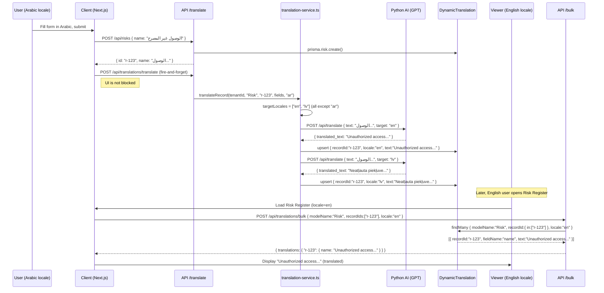

# Dynamic Translation

This document is a deep-dive into the dynamic data translation system: how
user-entered content in any language is automatically translated and served in
the viewer's language.

---

## Table of Contents

1. [The Problem Dynamic Translation Solves](#1-the-problem-dynamic-translation-solves)
2. [Architecture Overview](#2-architecture-overview)
3. [Python AI Backend](#3-python-ai-backend)
4. [Source Language Auto-Detection](#4-source-language-auto-detection)
5. [End-to-End Translation Flow](#5-end-to-end-translation-flow)
6. [translation-config.ts Registry](#6-translation-configts-registry)
7. [Adding a New Translatable Model](#7-adding-a-new-translatable-model)
8. [Staleness Detection](#8-staleness-detection)
9. [Client-Side Cache](#9-client-side-cache)
10. [GRC Acronym Preservation](#10-grc-acronym-preservation)
11. [Script Validation](#11-script-validation)
12. [Error Handling and Fallback](#12-error-handling-and-fallback)
13. [API Reference](#13-api-reference)
14. [Sequence Diagram](#14-sequence-diagram)

---

## 1. The Problem Dynamic Translation Solves

### The Limitation of Static Translations

The static translation system (`t()` function) handles the application's own
text: button labels, column headers, menu items, error messages. These strings
are authored by developers and translated once.

But a GRC application stores content that users create: risk descriptions,
control objectives, audit findings, policy documents, CAPA action plans,
vendor assessment responses. This content is written by human users in whatever
language they are working in at the time.

### The Multi-Language Team Scenario

Consider this scenario:

1. An Arabic-speaking compliance officer creates a new risk and writes:
   - Name: "الوصول غير المصرح به إلى الأنظمة المالية"
   - Description: "يمكن أن يؤدي الوصول غير المصرح به إلى أنظمة المحاسبة..."

2. An English-speaking auditor opens the Risk Register. They see:
   - Name: "الوصول غير المصرح به إلى الأنظمة المالية"
   - Description: "يمكن أن يؤدي الوصول غير المصرح به..."

Without dynamic translation, the English-speaking auditor cannot understand
the content. Dynamic translation solves this by automatically generating English
(and Latvian) translations whenever the Arabic content is saved.

### Why Not Translate in the Browser?

Browser-side translation (e.g., Google Translate API) would:
- Expose an API key in client-side code (security risk).
- Generate a translation request on every page load (expensive and slow).
- Produce inconsistent results (different translation on each load).

This system translates once (on create/edit), stores the result, and serves
cached translations instantly.

---

## 2. Architecture Overview

```
┌─────────────────────────────────────────────────────────────┐
│ Frontend                                                      │
│                                                               │
│  triggerTranslation() ──► POST /api/translations/translate   │
│  (fire-and-forget after save)                                │
│                                                               │
│  useTranslatedData() ──► POST /api/translations/bulk         │
│  (read-only, fetches existing translations)                  │
│                                                               │
│  useTranslatedRecord() ──► GET /api/translations/{model}/{id}│
│  (single record detail page)                                 │
└─────────────────────────────────────────────────────────────┘
         ↓                              ↓
┌─────────────────┐          ┌──────────────────────┐
│ translation-    │          │ Database              │
│ service.ts      │          │ DynamicTranslation    │
│ (server-side)   │          │ table                 │
│                 │◄────────►│                       │
│ translateRecord │          │ { customerAccountId,  │
│ getBulkTrans-   │          │   modelName,          │
│ lations()       │          │   recordId,           │
│                 │          │   fieldName,          │
│ PythonBackend   │          │   locale,             │
│ Provider        │          │   translatedText,     │
└────────┬────────┘          │   sourceHash,         │
         │                   │   isStale }           │
         ▼                   └──────────────────────┘
┌─────────────────┐
│ Python AI API   │
│ (RunPod/FastAPI)│
│                 │
│ POST /api/trans-│
│ late            │
│ GPT-based LLM   │
│ Auto-detects    │
│ source language │
└─────────────────┘
```

---

## 3. Python AI Backend

### Technology Stack

The translation backend is a Python FastAPI service deployed on RunPod (a
GPU compute platform). It uses a GPT-based language model for translations.

The Python API is separate from the Next.js application and communicates over
HTTPS. The Next.js application calls it via the `aiApiClient` (an Axios instance
with authentication headers).

### Configuration

Environment variables required:
- `AI_API_BASE_URL`: Base URL of the Python API (e.g., `https://api.runpod.io/...`).
- `PYTHON_API_SECRET`: Shared secret for authenticating requests.

The `PythonBackendProvider.isConfigured()` method returns `false` if either
variable is missing. When not configured, all `translateRecord()` calls are
silently skipped — the application degrades gracefully (untranslated original
text is displayed).

### Request Format

```typescript
POST {AI_API_BASE_URL}/api/translate
Authorization: Bearer {PYTHON_API_SECRET}

{
  "Original_Text": "Unauthorized access to financial systems",
  "target_language_code": "ar",
  "model_config": { "populate_by_name": true }
}
```

### Response Format

```json
{
  "translated_text": "الوصول غير المصرح به إلى الأنظمة المالية",
  "original_text": "Unauthorized access to financial systems",
  "target_language_code": "ar"
}
```

### Parallel Translation

For efficiency, all fields of a record are translated in parallel using
`Promise.allSettled()`. If one field's translation fails, the others continue:

```typescript
const promises = texts.map(text => this.translateSingle(text, targetLocale));
const results = await Promise.allSettled(promises);
// results[i].status === 'fulfilled' | 'rejected'
```

Each text is translated individually (the Python API takes one text at a time).

---

## 4. Source Language Auto-Detection

When `translateRecord()` is called without an explicit `sourceLocale`, it
auto-detects the language from the content:

```typescript
function detectSourceLocale(texts: string[]): string {
  const combined = texts.join(' ');

  // Arabic: Unicode ranges covering all Arabic script variants
  // U+0600–U+06FF: Basic Arabic
  // U+0750–U+077F: Arabic Supplement
  // U+08A0–U+08FF: Arabic Extended-A
  // U+FB50–U+FDFF: Arabic Presentation Forms-A
  // U+FE70–U+FEFF: Arabic Presentation Forms-B
  const arabicChars = (combined.match(
    /[؀-ۿݐ-ݿࢠ-ࣿﭐ-﷿ﹰ-]/g
  ) || []).length;

  // Latvian: specific diacritical marks not found in common Latin languages
  // ā, č, ē, ģ, ī, ķ, ļ, ņ, š, ū, ž
  const latvianChars = (combined.match(/[āčēģīķļņšūž]/gi) || []).length;
  const latinChars = (combined.match(/[a-zA-Z]/g) || []).length;

  if (arabicChars > 2) return 'ar';
  if (latvianChars > 0 && latinChars > 0) return 'lv';
  return 'en';
}
```

The thresholds (2 Arabic characters, any Latvian diacritics with Latin) are
chosen to avoid false positives from incidental Arabic characters in otherwise
English text (e.g., brand names, copied content).

### Client-Side Source Locale

On the client side, `triggerTranslation()` does not auto-detect — it reads the
current locale directly from `localStorage`:

```typescript
const sourceLocale = (
  typeof window !== 'undefined' && localStorage.getItem('locale')
) || 'en';
```

This is more reliable than character analysis for short field values.

---

## 5. End-to-End Translation Flow

### Step 1: User Creates or Edits a Record

The user fills in a form and submits it. The form calls the API to save the record.

```typescript
// Example: Creating a risk
const response = await fetch('/api/risks', {
  method: 'POST',
  body: JSON.stringify({ name, description, treatment }),
});
const savedRisk = await response.json();
```

### Step 2: Client Triggers Translation (Fire-and-Forget)

After receiving the successful API response, the client triggers translation.
This does not block the UI:

```typescript
triggerTranslation('Risk', savedRisk.id, {
  name: savedRisk.name,
  description: savedRisk.description,
  treatment: savedRisk.treatment,
});
```

`triggerTranslation()` internally:
1. Cleans null/undefined/empty fields.
2. Reads `sourceLocale` from `localStorage`.
3. Invalidates any cached translations for this record.
4. Fires `POST /api/translations/translate` without awaiting.

### Step 3: API Route Relays to translation-service.ts

```typescript
// In the API route for POST /api/translations/translate:
const { modelName, recordId, fields, sourceLocale } = await req.json();
await translateRecord(customerAccountId, modelName, recordId, fields, sourceLocale);
```

### Step 4: translation-service.ts Determines Target Locales

```typescript
const allLocales = ['en', 'ar', 'lv'];
const targetLocales = allLocales.filter(l => l !== effectiveSourceLocale);
// If source is 'ar', targets are ['en', 'lv']
// If source is 'en', targets are ['ar', 'lv']
```

### Step 5: Python API Translates Each Field

For each target locale, `PythonBackendProvider.translate()` is called with
the field values. The results are upserted into the `DynamicTranslation` table.

**Skip condition**: If the translation returned from the Python API is identical
to the source text (indicating the backend returned a passthrough fallback
rather than a real translation), the row is NOT stored. This prevents the
translation system from storing "translations" that are just copies of the
original.

```typescript
if (translatedText === field.value) {
  logInfo('Skipping identical translation — backend likely unavailable');
  return null;
}
```

### Step 6: User Switches Language and Views List

When the user's colleague (or the same user in a different language) loads
the Risk Register list page:

```typescript
const { data: translatedRisks } = useTranslatedData(risks, {
  modelName: 'Risk',
});
```

The hook:
1. Extracts all record IDs.
2. Checks the in-memory cache.
3. POSTs to `/api/translations/bulk` if cache miss.
4. Receives `{ translations: { "risk-123": { name: "Unauthorized access...", description: "..." } } }`.
5. Overlays the translated values: `{ ...risk, name: "Unauthorized access...", description: "..." }`.
6. Returns the modified array for rendering.

### Step 7: Translation Not Yet Available

If translation has not completed yet (the Python API is still processing),
`/api/translations/bulk` returns an empty object for that record. The hook
falls back to the original values (in the source language).

---

## 6. translation-config.ts Registry

All translatable models are registered in `src/lib/translation-config.ts`.

### Why a Registry?

The registry serves two purposes:
1. It tells `translateRecord()` which fields to include when called with a
   model name, so callers don't have to list fields explicitly.
2. It allows the bulk translation API to validate that a requested model is
   registered (security check — prevents arbitrary model names being passed).

### Registry Structure

```typescript
// src/lib/translation-config.ts

export interface TranslatableField {
  name: string;                // Prisma field name
  type: 'string' | 'text';    // 'text' for long-form content
  maxLength?: number;          // Optional: helps backend manage token limits
}

export interface TranslatableModel {
  model: string;               // Prisma model name
  fields: TranslatableField[];
}

export const TRANSLATABLE_MODELS: TranslatableModel[] = [
  {
    model: 'Risk',
    fields: [
      { name: 'name', type: 'string' },
      { name: 'description', type: 'text' },
      { name: 'treatment', type: 'text' },
    ],
  },
  {
    model: 'Control',
    fields: [
      { name: 'name', type: 'string' },
      { name: 'description', type: 'text' },
      { name: 'objective', type: 'text' },
    ],
  },
  // ... 164 models total
];

export const TARGET_LOCALES = ['ar', 'lv'];

export function isTranslatable(modelName: string): boolean {
  return TRANSLATABLE_MODELS.some(m => m.model === modelName);
}

export function getTranslatableFields(modelName: string): TranslatableField[] {
  return TRANSLATABLE_MODELS.find(m => m.model === modelName)?.fields ?? [];
}
```

---

## 7. Adding a New Translatable Model

When you create a new Prisma model that has user-facing text fields:

**Step 1**: Add the model to `src/lib/translation-config.ts`:
```typescript
{
  model: 'VendorIncident',
  fields: [
    { name: 'title', type: 'string' },
    { name: 'description', type: 'text' },
    { name: 'resolution', type: 'text' },
  ],
},
```

**Step 2**: In the POST API route handler (after creating the record):
```typescript
if (customerAccountId) {
  void translateRecord(
    customerAccountId,
    'VendorIncident',
    incident.id,
    {
      title: incident.title,
      description: incident.description,
      resolution: incident.resolution,
    }
  );
}
```

**Step 3**: In the PATCH/PUT API route handler (after updating the record):
```typescript
if (customerAccountId) {
  void translateRecord(
    customerAccountId,
    'VendorIncident',
    incident.id,
    {
      title: updated.title,
      description: updated.description,
      resolution: updated.resolution,
    }
  );
}
```

**Step 4**: In the form component (client-side, after save):
```typescript
// After successful API response:
triggerTranslation('VendorIncident', savedIncident.id, {
  title: savedIncident.title,
  description: savedIncident.description,
  resolution: savedIncident.resolution,
});
```

**Step 5**: In the list page component:
```typescript
const { data: translatedIncidents } = useTranslatedData(incidents, {
  modelName: 'VendorIncident',
});
```

**Step 6**: In the detail page component:
```typescript
const { data: translatedIncident } = useTranslatedRecord(incident, {
  modelName: 'VendorIncident',
});
```

---

## 8. Staleness Detection

When a user edits a record, the source text may have changed. The previously
stored translation is now stale (it translates the old text, not the new).

### How It Works

Every `DynamicTranslation` row stores a `sourceHash`: the MD5 hash of the
source text at the time the translation was generated.

```typescript
function hashText(text: string): string {
  return createHash('md5').update(text).digest('hex');
}
```

When `translateRecord()` is called after an edit, it:
1. Calls `markTranslationsStale()` to compare the new field values against
   the stored hashes.
2. If a hash differs, marks that translation row as `isStale: true`.
3. Then generates and stores fresh translations (which overwrite the stale ones
   with `isStale: false`).

### Displaying Stale Translations

Stale translations are displayed to users — the old (stale) translation is
still more useful than showing the untranslated source text. The `isStale`
flag is currently used for internal monitoring only (admin can see the count
of stale translations via `getStaleTranslationCount()`).

### Automatic Refresh

A background job (`refreshStaleTranslations()`) can be triggered from an
admin action to re-translate all stale items. This takes a callback function
that fetches the current field value from the source record:

```typescript
await refreshStaleTranslations(tenantId, async (model, recordId, field) => {
  const record = await prisma[model].findUnique({ where: { id: recordId } });
  return record?.[field] ?? null;
});
```

---

## 9. Client-Side Cache

`useTranslatedData` maintains an in-memory cache to avoid redundant API calls.

### Cache Key

```typescript
function getCacheKey(modelName: string, locale: string, recordIds: string[]): string {
  const sortedIds = [...recordIds].sort();
  return `${modelName}:${locale}:${sortedIds.join(',')}`;
}
```

Example: `"Risk:ar:risk-123,risk-456,risk-789"`

### Cache TTL

The cache TTL is **5 minutes** (`CACHE_TTL = 5 * 60 * 1000`). After 5 minutes,
the next request for the same records will re-fetch from the API.

### Cache Eviction

The cache is evicted:
1. **Time-based**: Entries older than 5 minutes are ignored (lazy eviction).
2. **Size-based**: When the cache exceeds 200 entries, all expired entries are
   purged.
3. **Manual**: After `triggerTranslation()`, all cache entries for that record's
   model and ID are deleted immediately:
   ```typescript
   for (const [key] of translationCache) {
     if (key.startsWith(`${modelName}:`) && key.includes(recordId)) {
       translationCache.delete(key);
     }
   }
   ```
4. **Language switch**: `clearTranslationCache()` (called from the language
   switcher) clears the entire cache so translations for the new locale are fetched.

---

## 10. GRC Acronym Preservation

The LLM may translate GRC-specific acronyms that should remain in English.
For example, "CAPA" (Corrective and Preventive Action) should not be translated
to an Arabic equivalent — it is an industry-standard term.

The `restoreAcronyms()` function checks if the original text contained any
of the preserved acronyms and verifies they appear in the translation.
The preserved acronym list comes from `src/lib/grc-glossary.ts`.

```typescript
function restoreAcronyms(translatedText: string, originalText: string): string {
  let result = translatedText;
  for (const acronym of PRESERVED_ACRONYMS) {
    if (originalText.includes(acronym) && !result.includes(acronym)) {
      // Acronym was lost in translation
      // Best-effort: GPT usually preserves these — this is a safety check
    }
  }
  return result;
}
```

Examples of preserved acronyms: `ISO`, `SOC`, `GDPR`, `NIST`, `CAPA`, `KPI`,
`BCP`, `BIA`, `GRC`, `TPRM`, `ISMS`.

---

## 11. Script Validation

The translation scripts apply a validation check to detect cases where the AI
model may have generated incorrect script output. The primary concern is Arabic
translations that contain CJK (Chinese/Japanese/Korean) characters — a known
failure mode of some LLMs when confused about the target language.

```typescript
function validateTranslation(text: string, targetLocale: string): boolean {
  if (targetLocale === 'ar') {
    // Reject if CJK characters appear in an Arabic translation
    const hasCJK = /[一-鿿぀-ゟ゠-ヿ]/.test(text);
    if (hasCJK) return false;
  }
  return true;
}
```

If validation fails, the translation is not stored (the fallback to original
text applies).

---

## 12. Error Handling and Fallback

Every layer of the dynamic translation system is designed to fail gracefully:

| Layer | Failure | Fallback |
|-------|---------|---------|
| `triggerTranslation()` on client | Network error, API unavailable | Logs error, does nothing. User sees original text until next edit. |
| `translateRecord()` in API | Python API unavailable | Logs error, skips storing. Returns void (does not throw). |
| `PythonBackendProvider.translate()` | Single field fails | `Promise.allSettled` continues other fields. Returns original text for failed field. |
| Python API returns identical text | Backend fallback detected | Translation not stored (identical-text check). |
| `useTranslatedData` fetch fails | Network error | Logs error, returns original `data` array. |
| Translation not found in DB | Record never translated | Returns empty object. Hook shows original text. |

The application never crashes or shows an error to the user due to translation
failures. Translations are always a best-effort enhancement.

---

## 13. API Reference

### POST /api/translations/translate

Triggers translation for a record.

Request:
```json
{
  "modelName": "Risk",
  "recordId": "risk-uuid-123",
  "fields": {
    "name": "Unauthorized access to financial systems",
    "description": "Financial data exposure risk..."
  },
  "sourceLocale": "en"
}
```

Response: `204 No Content` (translation happens asynchronously)

### POST /api/translations/bulk

Fetches existing translations for multiple records.

Request:
```json
{
  "modelName": "Risk",
  "recordIds": ["risk-123", "risk-456", "risk-789"],
  "locale": "ar"
}
```

Response:
```json
{
  "translations": {
    "risk-123": {
      "name": "الوصول غير المصرح به إلى الأنظمة المالية",
      "description": "..."
    },
    "risk-456": {
      "name": "مخاطر التسرب البياني"
    }
  }
}
```

Records with no translations are absent from the response object. The client
falls back to original text for absent records.

### GET /api/translations/{modelName}/{recordId}?locale={locale}

Fetches existing translations for a single record (used by `useTranslatedRecord`).

Response:
```json
{
  "translations": {
    "name": "الوصول غير المصرح به",
    "description": "..."
  }
}
```

---

## 14. Sequence Diagram


