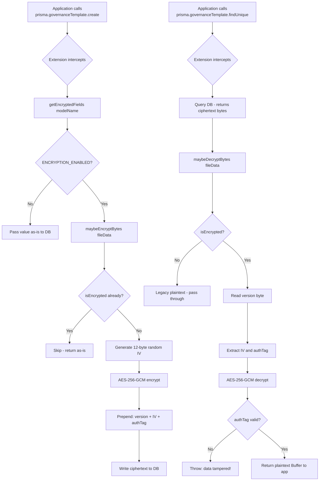

# Field-Level Encryption

This document explains the GRC application's encryption-at-rest system: what
encryption is, why individual database fields are encrypted rather than the
whole disk, how AES-256-GCM works in plain terms, and everything a developer
needs to know to operate, maintain, and extend the system.

---

## Table of Contents

1. [What Is Encryption?](#1-what-is-encryption)
2. [Encryption at Rest vs. In Transit](#2-encryption-at-rest-vs-in-transit)
3. [Why Field-Level Instead of Full-Disk?](#3-why-field-level-instead-of-full-disk)
4. [What Is AES-256-GCM?](#4-what-is-aes-256-gcm)
5. [Implementation Overview](#5-implementation-overview)
6. [Ciphertext Format](#6-ciphertext-format)
7. [The FIELD_ENCRYPTION_KEY Environment Variable](#7-the-field_encryption_key-environment-variable)
8. [The Kill Switch](#8-the-kill-switch)
9. [Prisma Client Extension](#9-prisma-client-extension)
10. [Which Fields Are Encrypted](#10-which-fields-are-encrypted)
11. [encrypted-fields.ts Registry](#11-encrypted-fieldsts-registry)
12. [Raw SQL Exception Sites](#12-raw-sql-exception-sites)
13. [Key Rotation](#13-key-rotation)
14. [Migration of Existing Data](#14-migration-of-existing-data)
15. [How to Add a New Encrypted Field](#15-how-to-add-a-new-encrypted-field)
16. [Security Best Practices](#16-security-best-practices)
17. [Encryption Flow Diagram](#17-encryption-flow-diagram)

---

## 1. What Is Encryption?

Encryption is the process of transforming readable data (plaintext) into an
unreadable form (ciphertext) that can only be decoded by someone possessing
the correct key.

A simple analogy: imagine you have a document containing your company's
financial projections. You lock it in a safe. Even if someone breaks into the
building and finds the safe, they cannot read the document without the
combination. Encryption is the digital equivalent of a safe.

The "key" in digital encryption is a string of bits (often 32 bytes = 256 bits
for AES-256). Anyone with the key can encrypt (lock) and decrypt (unlock) data.
Without the key, the ciphertext is computationally unbreakable — brute-forcing
a 256-bit key would take longer than the age of the universe with all current
computing power.

---

## 2. Encryption at Rest vs. In Transit

### Encryption in Transit

When data travels over a network, it can be intercepted ("man-in-the-middle"
attacks). TLS/HTTPS encrypts data in transit — every HTTP request and response
between the user's browser and the application server is encrypted.

This application enforces HTTPS in production (the `secure` cookie flag and
the reverse proxy configuration). Data transmitted over the network is always
encrypted.

### Encryption at Rest

Even with HTTPS, data stored in the database is stored in plaintext by default.
If a database backup file is stolen, or if an attacker gains access to the
database server's storage, they can read everything.

"Encryption at rest" means the data stored on disk (in the database) is
encrypted. Even if the database files are copied, the data inside them is
unreadable without the encryption key.

### Full-Disk Encryption vs. Field-Level Encryption

**Full-disk encryption** (e.g., Linux dm-crypt, AWS EBS encryption) encrypts
the entire storage volume. It is transparent to the application. However, it
only protects against physical disk theft — anyone with access to the running
database can still read all data.

**Field-level encryption** (what this application uses) encrypts specific
sensitive fields in the database. The application encrypts the data before
writing it and decrypts it after reading. This means:
- Database administrators cannot read sensitive file contents.
- A database dump contains encrypted ciphertext, not readable data.
- Only the application with the correct `FIELD_ENCRYPTION_KEY` can read the data.

---

## 3. Why Field-Level Instead of Full-Disk?

| Criterion | Full-Disk Encryption | Field-Level Encryption |
|-----------|---------------------|----------------------|
| Granularity | All or nothing | Per field |
| Protects against DB admin | No | Yes |
| Protects against DB dump theft | Only if disk is unmounted | Yes |
| Impact on query performance | Negligible | Negligible (encrypted fields are not queried) |
| Key management complexity | Managed by OS/cloud | Managed by application |
| Auditability | Cannot distinguish which fields are sensitive | Explicit registry of sensitive fields |

The fields encrypted in this application (`fileData` columns) store raw binary
file content: uploaded documents, evidence attachments, governance templates.
These are the most sensitive data assets — they contain actual document content
that could include confidential business information, personal data, or legally
privileged material.

These fields are also never used in WHERE clauses, JOINs, or ORDER BY clauses,
making field-level encryption cost-free in terms of query performance.

---

## 4. What Is AES-256-GCM?

### AES (Advanced Encryption Standard)

AES is the world's most widely used symmetric encryption algorithm. "Symmetric"
means the same key is used for both encryption and decryption (as opposed to
asymmetric/public-key cryptography where a public key encrypts and a private
key decrypts).

The "256" refers to the key size: 256 bits (32 bytes). Larger keys mean harder
brute force. AES-256 is considered quantum-resistant for the foreseeable future.

AES operates on fixed-size blocks of data (128 bits). For larger data, a mode
of operation is needed.

### GCM (Galois/Counter Mode)

GCM is a mode of operation for AES that provides two properties:

1. **Confidentiality**: The ciphertext is indistinguishable from random noise
   without the key (the actual encryption).

2. **Integrity (Authentication)**: GCM produces an authentication tag (16 bytes)
   alongside the ciphertext. When decrypting, the tag is verified. If anyone
   has tampered with the ciphertext (even by flipping one bit), the tag
   verification fails and decryption throws an error.

Together these properties are called "Authenticated Encryption with Associated
Data" (AEAD). It means the system can detect both:
- Data corruption (accidental).
- Data tampering (deliberate attack).

### IV (Initialization Vector)

GCM requires a nonce (number used once) also called an IV (Initialization
Vector). This is a 12-byte random value generated freshly for each encryption
operation. The IV ensures that encrypting the same plaintext twice produces
different ciphertexts (preventing pattern analysis).

The IV is not secret — it is stored alongside the ciphertext and used during
decryption. What matters is that no two encryptions ever reuse the same IV
with the same key.

### Summary

AES-256-GCM with a 32-byte key, a 12-byte random IV per encryption, and a
16-byte authentication tag is the gold standard for symmetric authenticated
encryption. It is used in TLS 1.3, HTTPS, and virtually all modern secure
communication.

---

## 5. Implementation Overview

The implementation lives in `src/lib/encryption.ts`.

```typescript
const ALGO = 'aes-256-gcm';
const KEY_LENGTH = 32;    // bytes (256 bits)
const IV_LENGTH = 12;     // bytes (GCM standard)
const AUTH_TAG_LENGTH = 16; // bytes
const VERSION_BYTE = 0x01;  // Future-proofing: supports multiple key versions
```

**Core functions:**

| Function | Purpose |
|----------|---------|
| `encryptBytes(buffer)` | Encrypt a Buffer, returns Buffer |
| `decryptBytes(buffer)` | Decrypt a Buffer, returns Buffer |
| `maybeEncryptBytes(value)` | Encrypt or passthrough (checks kill switch, skips if already encrypted) |
| `maybeDecryptBytes(value)` | Decrypt or passthrough (detects plaintext rows) |
| `isEncrypted(value)` | Returns true if the Buffer starts with VERSION_BYTE |
| `isEncryptionEnabled()` | Reads ENCRYPTION_ENABLED env var (cached) |

---

## 6. Ciphertext Format

Every encrypted value is a Buffer with this byte layout:

```
Byte Position   Length     Content
─────────────────────────────────────────────────────────────
0               1 byte     Version byte (0x01)
1–12            12 bytes   IV (random nonce, unique per encryption)
13–28           16 bytes   Authentication tag (tamper detection)
29–N            N bytes    Ciphertext (encrypted content)
─────────────────────────────────────────────────────────────
Total minimum length: 29 bytes (+ at least 1 byte of ciphertext)
```

The version byte (`0x01`) serves two purposes:
1. **Detection**: `isEncrypted()` checks for this byte to distinguish encrypted
   values from legacy plaintext rows. During the migration window, existing rows
   still contain unencrypted data. This allows the system to detect and decrypt
   encrypted rows while passing through plaintext rows unchanged.
2. **Future versioning**: If the algorithm or key format ever changes, the
   version byte can be `0x02`, `0x03`, etc. The decryption function can branch
   on the version byte to support multiple key versions simultaneously.

---

## 7. The FIELD_ENCRYPTION_KEY Environment Variable

The encryption key is a 32-byte random value stored as a base64 string in the
`FIELD_ENCRYPTION_KEY` environment variable.

### Generating a Key

```bash
node -e "console.log(require('crypto').randomBytes(32).toString('base64'))"
# Example output: xK3mN+lZ7pQ2rT8vU1wY0aB5cD6eF9gH2iJ4kL7mN8o=
```

### Setting the Key

**Local development**: Add to `.env.local`:
```
FIELD_ENCRYPTION_KEY=xK3mN+lZ7pQ2rT8vU1wY0aB5cD6eF9gH2iJ4kL7mN8o=
```

**Production (DigitalOcean / Vercel)**: Set via the platform's encrypted
environment variable store. Never commit the key to version control.

### Key Loading

```typescript
function getMasterKey(): Buffer {
  const raw = process.env.FIELD_ENCRYPTION_KEY;
  if (!raw) {
    throw new Error('FIELD_ENCRYPTION_KEY is not set...');
  }
  const key = Buffer.from(raw, 'base64');
  if (key.length !== KEY_LENGTH) {
    throw new Error(`FIELD_ENCRYPTION_KEY must decode to 32 bytes (got ${key.length})`);
  }
  return key;
}
```

The key is loaded on demand (when `encryptBytes` or `decryptBytes` is called),
not at startup. This means the application can boot without the key set, as
long as encryption is disabled (kill switch off).

---

## 8. The Kill Switch

The kill switch allows gradual rollout: deploy the encryption code first,
validate everything works, then enable encryption.

```typescript
// ENCRYPTION_ENABLED=true → encryption active
// ENCRYPTION_ENABLED=false (or unset) → passthrough (no-op)

export function isEncryptionEnabled(): boolean {
  if (_enabledCache === null) {
    _enabledCache = process.env.ENCRYPTION_ENABLED === 'true';
  }
  return _enabledCache;
}
```

**The kill switch is cached** (`_enabledCache`): the env var is read once on
the first call and the result is reused. This prevents repeated env var lookups
on hot paths (every database read).

### Deployment Strategy with the Kill Switch

The recommended deployment approach for the GRC application:

1. **Step 1 — Deploy code changes**: Push the encryption code to both UAT and
   production. Both have `ENCRYPTION_ENABLED=false`. No behavioral change.

2. **Step 2 — Enable on UAT**: Set `ENCRYPTION_ENABLED=true` on UAT environment.
   Run `npm run encrypt:migrate` against the UAT database.

3. **Step 3 — Validate UAT**: Test read and write operations for 24–48 hours.
   Verify file upload, download, and rendering all work correctly.

4. **Step 4 — Enable on Production**: Set `ENCRYPTION_ENABLED=true` on
   production. Run `npm run encrypt:migrate` against the production database.

5. **Step 5 — Verify Production**: Run `npm run encrypt:verify` to spot-check
   that rows are encrypted and can be decrypted.

If issues arise on production, setting `ENCRYPTION_ENABLED=false` immediately
disables encryption. Existing encrypted rows will fail to decrypt (the Prisma
extension uses `maybeDecryptBytes`, which calls `isEncrypted()` first — if
encryption is disabled, the raw ciphertext is returned as-is). This means the
kill switch cannot be used as an emergency "undo" after migration; it is for
pre-migration rollout control only.

---

## 9. Prisma Client Extension

The Prisma client in `src/lib/prisma.ts` is extended with an auto-encrypt/
decrypt extension. This extension intercepts Prisma's `create`, `update`,
`upsert`, and `findMany`/`findUnique`/`findFirst` operations and transparently
applies encryption and decryption to registered fields.

### How the Extension Works

**On write operations** (create, update, upsert):
1. The extension inspects the input data.
2. For each model, it looks up `getEncryptedFields(modelName)`.
3. For each registered field present in the input, it calls `maybeEncryptBytes(value)`.
4. The modified input (with encrypted values) is passed to the actual Prisma operation.

**On read operations** (findMany, findUnique, findFirst):
1. The query executes normally.
2. The extension post-processes the result.
3. For each registered field present in the result, it calls `maybeDecryptBytes(value)`.
4. The decrypted values are returned to the caller.

### Transparency

Because encryption/decryption is handled inside the extension, all application
code that uses the Prisma client does not need to know about encryption:

```typescript
// Writing — plaintext in, extension encrypts before DB write:
await prisma.governanceTemplate.create({
  data: {
    name: 'Information Security Policy',
    fileData: Buffer.from(fileContent),  // Plain Buffer — extension encrypts it
  },
});

// Reading — extension decrypts before returning:
const template = await prisma.governanceTemplate.findUnique({
  where: { id },
});
// template.fileData is already decrypted — plain Buffer
```

---

## 10. Which Fields Are Encrypted

Currently, `fileData` (Bytes columns) on four models are encrypted:

| Prisma Model | Field | Description |
|-------------|-------|-------------|
| `fieldworkEvidenceAttachment` | `fileData` | Evidence files attached to audit fieldwork |
| `internalAuditDocument` | `fileData` | Documents in the Internal Audit document library |
| `governanceTemplate` | `fileData` | Governance policy/procedure template files |
| `auditEngagementAPMAttachment` | `fileData` | Attachments on audit engagement APM items |

These are the models where users upload actual document content (PDFs, Word
documents, spreadsheets) that may contain confidential information.

---

## 11. encrypted-fields.ts Registry

The registry lives in `src/lib/encrypted-fields.ts`:

```typescript
export const ENCRYPTED_FIELDS: Record<string, EncryptedFieldSpec[]> = {
  fieldworkEvidenceAttachment: [{ field: 'fileData', type: 'bytes' }],
  internalAuditDocument: [{ field: 'fileData', type: 'bytes' }],
  governanceTemplate: [{ field: 'fileData', type: 'bytes' }],
  auditEngagementAPMAttachment: [{ field: 'fileData', type: 'bytes' }],
};
```

The Prisma model names used as keys are the **camelCase Prisma client property
names** (the same names used to call `prisma.modelName.findMany()` etc.).

Two helper functions are exported:

- `getEncryptedFields(modelName)`: Returns the list of encrypted field specs for
  a model (used by the Prisma extension).
- `listAllEncryptedFields()`: Returns all (model, field) pairs (used by migration
  and verification scripts).

---

## 12. Raw SQL Exception Sites

The Prisma client extension only intercepts ORM operations (`findMany`,
`create`, etc.). It does NOT intercept raw SQL calls (`$queryRaw`,
`$executeRaw`). Any raw SQL that touches an encrypted field must manually
encrypt/decrypt.

**Golden rule**: Do not use `$queryRaw` or `$executeRaw` on tables that have
encrypted fields. If you must, use `maybeEncryptBytes` / `maybeDecryptBytes`
from `@/lib/encryption`.

The audit of all raw SQL sites is maintained in `docs/encryption-raw-sql-audit.md`.
Update this document whenever you add, change, or remove a `$queryRaw` /
`$executeRaw` call that involves an encrypted model.

Example of correctly handled raw SQL:
```typescript
import { maybeEncryptBytes, maybeDecryptBytes } from '@/lib/encryption';

// Writing via raw SQL:
const encryptedData = maybeEncryptBytes(fileBuffer);
await prisma.$executeRaw`
  UPDATE "GovernanceTemplate"
  SET "fileData" = ${encryptedData}
  WHERE id = ${id}
`;

// Reading via raw SQL:
const rows = await prisma.$queryRaw<{ fileData: Buffer }[]>`
  SELECT "fileData" FROM "GovernanceTemplate" WHERE id = ${id}
`;
const decryptedData = maybeDecryptBytes(rows[0]?.fileData);
```

---

## 13. Key Rotation

Keys should be rotated every 90 days or after any suspected compromise.

```bash
npm run encrypt:rotate-key
```

This script:
1. Generates a new 32-byte random key.
2. Re-encrypts every encrypted field in every row: reads the current value
   (decrypted with the old key), re-encrypts with the new key, writes back.
3. Updates the `FIELD_ENCRYPTION_KEY` environment variable in the deployment
   platform.

**Important**: The old key must remain available during rotation (to decrypt
existing rows). The script handles this transitional period automatically.

After successful rotation, verify with:
```bash
npm run encrypt:verify
```

---

## 14. Migration of Existing Data

When encryption is first enabled on a database that has existing unencrypted rows:

```bash
npm run encrypt:migrate
```

This script:
1. Iterates all models and fields in the `ENCRYPTED_FIELDS` registry.
2. For each model, fetches rows where the `fileData` column is not yet encrypted
   (`isEncrypted(value)` returns `false`).
3. Encrypts the value and writes it back.
4. Skips already-encrypted rows (idempotent — safe to run multiple times).

The migration is designed to be run with the application running. The Prisma
extension's `maybeEncryptBytes` and `maybeDecryptBytes` handle the transitional
state where some rows are encrypted and some are not:
- `maybeEncryptBytes`: Skips rows that are already encrypted (no double-encryption).
- `maybeDecryptBytes`: Passes through rows that are not yet encrypted (legacy rows work).

---

## 15. How to Add a New Encrypted Field

When you have a new `Bytes` column that should be encrypted:

**Step 1**: Confirm the field meets the criteria:
- It is never used in a WHERE clause, ORDER BY, JOIN, or DISTINCT.
- It is never interpolated into raw SQL strings.
- It is never used in full-text search.

**Step 2**: Add to the registry in `src/lib/encrypted-fields.ts`:
```typescript
export const ENCRYPTED_FIELDS: Record<string, EncryptedFieldSpec[]> = {
  // ... existing entries ...
  myNewModel: [{ field: 'sensitiveData', type: 'bytes' }],
};
```

**Step 3**: Search the entire codebase for usages of this field in raw SQL:
```bash
grep -rn "myNewModel" src/ --include="*.ts"
grep -rn "sensitiveData" src/ --include="*.ts"
```

For any `$queryRaw` or `$executeRaw` hit, wrap with `maybeEncryptBytes` /
`maybeDecryptBytes`.

**Step 4**: Run the migration to encrypt existing rows:
```bash
npm run encrypt:migrate
```

**Step 5**: Verify the migration:
```bash
npm run encrypt:verify
```

**Step 6**: Update `docs/SECURITY.md` Section 5 (encrypted fields list) and
`docs/encryption-raw-sql-audit.md` with any new raw SQL exception sites.

---

## 16. Security Best Practices

**Key management:**
- Never commit `FIELD_ENCRYPTION_KEY` to version control (`.gitignore` should
  block `.env*` files).
- Store the key in the deployment platform's encrypted environment variable
  store (DigitalOcean encrypted env vars, Vercel environment variables).
- Maintain an offline backup of the key in a password manager.
- Rotate every 90 days.

**Logging:**
- Never log decrypted file contents.
- Use `safeLog` from `@/lib/safe-log` for any logging near sensitive data.
  It automatically redacts known-sensitive fields.

**Access control:**
- The encryption key is only accessible to the application process.
- Database administrators can see the encrypted bytes but cannot decrypt them
  without the key (this is the entire point of field-level encryption).

**Incident response:**
If the `FIELD_ENCRYPTION_KEY` is compromised:
1. Generate a new key immediately.
2. Run `npm run encrypt:rotate-key` to re-encrypt all data with the new key.
3. Revoke access to any system that may have had access to the old key.
4. Audit access logs to determine what data may have been exposed.

---

## 17. Encryption Flow Diagram


