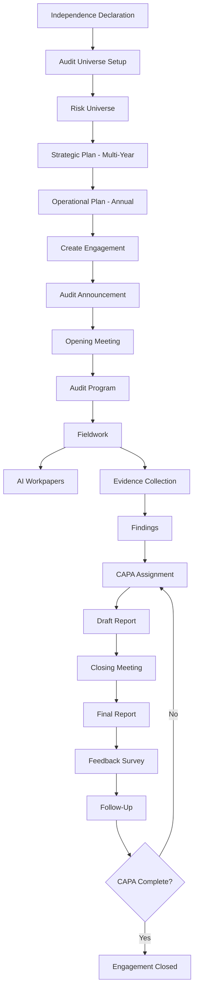

# Internal Audit Module

## Table of Contents

1. [What is Internal Audit?](#what-is-internal-audit)
2. [Why Organizations Need Internal Audit](#why-organizations-need-internal-audit)
3. [Roles in Internal Audit](#roles-in-internal-audit)
4. [The Complete Audit Lifecycle](#the-complete-audit-lifecycle)
5. [Step-by-Step Walkthrough](#step-by-step-walkthrough)
   - [Step 1: Independence and Objectivity Declaration](#step-1-independence-and-objectivity-declaration)
   - [Step 2: Audit Universe](#step-2-audit-universe)
   - [Step 3: Risk Universe](#step-3-risk-universe)
   - [Step 4: Strategic Plan](#step-4-strategic-plan)
   - [Step 5: Operational Plan](#step-5-operational-plan)
   - [Step 6: Audit Engagement Creation](#step-6-audit-engagement-creation)
   - [Step 7: Engagement Announcement](#step-7-engagement-announcement)
   - [Step 8: Opening Meeting](#step-8-opening-meeting)
   - [Step 9: Audit Program](#step-9-audit-program)
   - [Step 10: Fieldwork](#step-10-fieldwork)
   - [Step 11: AI Workpapers](#step-11-ai-workpapers)
   - [Step 12: Findings Documentation](#step-12-findings-documentation)
   - [Step 13: CAPA](#step-13-capa)
   - [Step 14: Draft Report](#step-14-draft-report)
   - [Step 15: Closing Meeting](#step-15-closing-meeting)
   - [Step 16: Final Report](#step-16-final-report)
   - [Step 17: Feedback Survey](#step-17-feedback-survey)
   - [Step 18: Follow-Up](#step-18-follow-up)
6. [Settings Module](#settings-module)
7. [Document Library](#document-library)
8. [Key Pages and URLs](#key-pages-and-urls)
9. [Role-Based Access Matrix](#role-based-access-matrix)

---

## What is Internal Audit?

**Internal audit** is an independent, objective assurance and consulting activity designed to add value to and improve an organisation's operations. It helps an organisation accomplish its objectives by bringing a systematic, disciplined approach to evaluate and improve the effectiveness of risk management, control, and governance processes.

Unlike **external audit** (performed by independent accounting firms to verify financial statements for shareholders), internal audit is performed *by the organisation's own staff* (or contracted experts) and reports to the **Audit Committee** or **Board of Directors**.

Think of internal audit as a quality-control function that examines whether the rest of the organisation is doing what it says it will do:
- Are controls operating effectively?
- Are policies being followed?
- Are risks being managed appropriately?
- Are there opportunities to improve efficiency?

### Internal vs External Audit

| Dimension | Internal Audit | External Audit |
|-----------|---------------|----------------|
| Performed by | Organisation's own audit staff | Independent accounting/consulting firm |
| Reports to | Audit Committee / Board | Shareholders / regulators |
| Frequency | Continuous, year-round | Annual or periodic |
| Scope | Any aspect of operations | Primarily financial statements |
| Primary standard | IIA Standards (IPPF) | ISAs (International Standards on Auditing) |
| Output | Audit findings, CAPA | Auditor's opinion, management letter |

---

## Why Organizations Need Internal Audit

### Governance

Boards and executive management cannot personally verify that every policy, procedure, and control is working correctly. Internal audit provides that assurance through independent testing and reporting.

### Regulatory Compliance

Many regulations and frameworks explicitly require internal audit:
- **ISO 27001** (Clause 9.2) — requires regular internal audits of the ISMS.
- **SOX (Sarbanes-Oxley)** — requires audit of internal controls over financial reporting.
- **Basel III/IV** — banking regulations requiring audit of risk frameworks.
- **HIPAA** — healthcare data protection requiring regular audits.

### Risk Management

Internal audit acts as the **third line of defence** in the Three Lines Model:
- **First line:** Operational management (owns and manages risks day-to-day).
- **Second line:** Risk and Compliance functions (oversee and challenge first line).
- **Third line:** Internal Audit (provides independent assurance to the board).

### Value Creation

Beyond assurance, modern internal audit identifies:
- Process inefficiencies that waste resources.
- Control gaps that expose the organisation to fraud or error.
- Best practices from one business unit that could benefit others.

---

## Roles in Internal Audit

### AuditHead

The **Chief Audit Executive (CAE)** or Head of Internal Audit. Has full access to all Internal Audit functionality.

**Responsibilities:**
- Approves the Independence Declaration for all auditors.
- Signs off on the Strategic Plan (multi-year audit schedule).
- Approves Operational Plans (annual calendar).
- Reviews and approves the final audit report.
- Has read/write access to all audit-related data.

### AuditManager

Manages individual audit engagements. Typically a senior auditor who oversees fieldwork teams.

**Responsibilities:**
- Creates and manages audit engagements.
- Assigns auditors to engagements.
- Reviews workpapers and evidence gathered by auditors.
- Writes draft findings and escalates to AuditHead for approval.
- Manages CAPA tracking.

### Auditor

The day-to-day fieldwork executor.

**Responsibilities:**
- Executes audit procedures defined in the audit program.
- Requests evidence from auditees.
- Prepares workpapers.
- Documents findings.
- Cannot approve findings (that requires AuditManager or above).

### Auditee

The employee or department being audited. A read-limited role that only sees what is relevant to them.

**Responsibilities:**
- Receives evidence requests and uploads supporting documents.
- Reviews draft findings and submits management responses.
- Implements CAPA actions assigned to them.
- Completes feedback surveys after the audit.

---

## The Complete Audit Lifecycle

---

## Step-by-Step Walkthrough

### Step 1: Independence and Objectivity Declaration

**URL:** `/internal-audit/declarations`

**What it is:** Before an auditor can participate in any engagement, they must sign a declaration confirming they have no conflicts of interest with the audit subject. This is a fundamental requirement of the IIA Standards (Standard 1100 – Independence and Objectivity).

**Who does it:** Every auditor (including AuditHead and AuditManagers) must complete a declaration for each engagement period (typically annually or per engagement).

**What it captures:**
- Auditor's name, role, and engagement
- Declaration of no financial interest in the auditee department
- Declaration of no personal relationship with auditee management
- No prior employment in the auditee department within the past 2 years
- Signature and date

**System behaviour:**
- The declaration form is presented when an auditor is assigned to an engagement.
- If not declared, the auditor is blocked from accessing fieldwork tools.
- The AuditHead reviews and approves all declarations.
- Declarations are stored as a PDF-printable record for audit trail purposes.
- The system supports generating a PDF of the signed declaration via browser print.

**API:** `GET/POST /api/internal-audit/declarations`

---

### Step 2: Audit Universe

**URL:** `/internal-audit/audit-universe`

**What it is:** A complete inventory of every auditable entity in the organisation. Think of it as the "master list" of everything that *could* be audited. Without this list, audit planning is ad hoc and inconsistent.

**Structure:**
- **Categories** — High-level groupings (e.g., Finance, IT, HR, Operations, Procurement).
- **Auditable Entities** — Individual processes, systems, or business units within each category.

**What it shows:**
- Org-chart-style tree of all categories and entities.
- For each entity: how many times it has been audited, current risk level, last audit date.
- Stat cards: total categories, total processes, total risks, total engagements.
- Colour-coded status indicators: Planned, In Progress, Completed, etc.

**See also:** [Audit Universe Feature Documentation](./Audit-Universe.md)

---

### Step 3: Risk Universe

**URL:** `/internal-audit/risk-universe`

**What it is:** A visualisation of all risks associated with auditable entities, grouped by department. This drives **risk-based audit planning** — audits are prioritised for the highest-risk areas.

**What it shows:**
- Department-level risk heat map.
- Risk counts by category (Operational, Financial, Compliance, Strategic).
- Trend charts showing how risk levels have changed over time.

**Integration:** The Risk Universe pulls from the `InternalAuditRisk` table, which is separate from the general Risk Register (used by the Risk Management module) to allow the Internal Audit team to maintain their own risk view.

---

### Step 4: Strategic Plan

**URL:** `/internal-audit/strategic-plans`

**What it is:** A multi-year audit schedule (typically 3–5 years) that maps out which auditable entities will be audited in which years. It ensures comprehensive coverage of the entire audit universe over the planning horizon.

**Key fields:**
- Plan name and description
- Planning period (e.g., 2025–2027)
- Objective and methodology
- Risk-based prioritisation rationale
- Coverage percentage (what % of the audit universe is planned)

**How it works:**
1. AuditHead creates a new Strategic Plan for the planning period.
2. Auditable entities are added to the plan and assigned to a specific year.
3. Resource estimates (auditor-hours) are associated with each entity.
4. The plan is reviewed and approved by the Audit Committee.

**Status transitions:** Draft → Under Review → Approved → Active → Archived

**API:** `GET/POST /api/internal-audit/strategic-plans`

---

### Step 5: Operational Plan

**URL:** `/internal-audit/operational-plans`

**What it is:** An annual audit calendar that translates the Strategic Plan into specific, time-boxed engagements for the current year. Includes quarterly breakdowns and budget allocations.

**Key fields:**
- Year and quarter breakdown
- List of planned engagements per quarter
- Staffing plan (which auditors are allocated to which engagements)
- Budget (total audit days/hours allocated)
- Quarterly progress report generation

**What it produces:**
- A calendar view showing which audits are planned for Q1, Q2, Q3, Q4.
- Quarterly reports that summarise completed vs planned engagements.

**Status transitions:** Draft → Active → Completed

**API:** `GET/POST /api/internal-audit/operational-plans`

---

### Step 6: Audit Engagement Creation

**URL:** `/internal-audit/engagements`

**What it is:** The creation of a specific audit engagement for one auditable entity. Each engagement has a defined scope, objectives, team, budget, and timeline.

**Key fields:**
- Engagement name and reference number
- Auditable entity (from the Audit Universe)
- Audit type (Financial, Operational, Compliance, IT, Forensic)
- Audit objectives (what the audit aims to achieve)
- Scope (what is included/excluded)
- Assigned AuditManager and Auditors
- Planned start and end dates
- Budget (planned audit hours)

**Status lifecycle:**
`Draft` → `Announced` → `Opening Meeting` → `Fieldwork` → `Reporting` → `Closing Meeting` → `Follow-Up` → `Closed`

**API:** `GET/POST /api/internal-audit/engagements`

---

### Step 7: Engagement Announcement

**What it is:** A formal notification to the auditee department that an audit will be conducted. This is a professional courtesy that gives the auditee time to prepare, and is required by IIA Standards.

**What happens:**
1. AuditManager drafts the announcement with engagement details, scope, and timeline.
2. The system generates a notification to all auditee department heads.
3. Email template `AUDIT_ANNOUNCEMENT` is triggered.
4. The engagement status moves from `Draft` to `Announced`.

**Content of announcement:**
- Engagement name and objectives
- Planned fieldwork dates
- List of areas/processes to be reviewed
- Documents requested in advance
- Audit team contacts

---

### Step 8: Opening Meeting

**URL:** Within engagement detail page → `Opening Meeting` tab

**What it is:** The first formal meeting between the audit team and the auditee. It sets the tone for the engagement, clarifies scope, and confirms logistics.

**System support:**
- AuditManager schedules the meeting and the system sends calendar invitations (`OPENING_MEETING_INVITE` email).
- Meeting minutes are recorded directly in the system.
- The meeting record captures: date, attendees, agenda items, discussion notes, action items.

**Outcome:** After the opening meeting, the engagement transitions to `Fieldwork` status.

---

### Step 9: Audit Program

**URL:** Within engagement → `Audit Program` tab

**What it is:** A detailed list of audit procedures (tests) that the auditor will perform. It is the "recipe" for the audit — each procedure specifies what to test, how to test it, and what evidence to collect.

**Structure of an audit procedure:**
- Procedure reference number
- Objective (what risk or control this procedure tests)
- Step-by-step instructions
- Expected evidence
- Completion status (Not Started / In Progress / Completed)
- Assigned auditor
- Notes and conclusions

**AI-assisted program generation:** The system can suggest audit procedures based on the engagement type and industry. See [Step 11: AI Workpapers](#step-11-ai-workpapers).

---

### Step 10: Fieldwork

**URL:** `/internal-audit/fieldwork`

**What it is:** The core execution phase of the audit. Auditors collect evidence, test controls, and document their work in workpapers.

**Three main fieldwork tools:**

#### Evidence Requests
- Auditors create formal requests for specific documents from auditees.
- Each request specifies: what is needed, why, and the deadline.
- System sends `EVIDENCE_REQUEST` email to the auditee.
- Auditees upload files directly in the portal.
- Auditors review uploaded files and mark requests as fulfilled or send follow-ups.
- Follow-up reminders are sent automatically via the `due-reminders` cron job.

#### Workpapers
- Electronic audit workpapers that record the auditor's analysis.
- Each workpaper is linked to a specific audit procedure.
- Workpapers capture: procedure performed, evidence reviewed, observations, and conclusion.
- Workpapers go through a review-and-approval cycle (Auditor → AuditManager).

#### Attachments
- Files uploaded by both auditors (e.g., screenshots, test results) and auditees.
- Stored as encrypted `fileData` Bytes in the `FieldworkEvidenceAttachment` table.

**API:** `GET/POST /api/internal-audit/fieldwork`

---

### Step 11: AI Workpapers

**URL:** Within fieldwork → `AI Workpapers` tab

**What it is:** An AI-powered feature that automatically generates draft workpapers and audit procedure templates based on the engagement's context and objectives.

**How it works:**
1. Auditor provides the engagement type, risk area, and objective.
2. The AI service analyses the context and generates:
   - Suggested audit procedures.
   - Relevant control testing steps.
   - Sample evidence request templates.
   - Preliminary conclusions framework.
3. The auditor reviews, customises, and approves the AI-generated content.
4. AI-generated workpapers are clearly tagged as AI-assisted in the UI.

**Benefit:** Reduces workpaper preparation time by 40–60%. Particularly useful for junior auditors who benefit from structured templates for unfamiliar audit areas.

**AI backend:** Calls the Python AI API endpoint. Requires `PYTHON_API_SECRET` environment variable.

---

### Step 12: Findings Documentation

**URL:** `/internal-audit/findings`

**What it is:** Formal documentation of audit observations — where the actual facts differ from the expected standard (control failure, policy non-compliance, process inefficiency).

**A finding contains:**
- **Finding title** — concise description (e.g., "Privileged Access Not Reviewed Quarterly")
- **Finding reference** — auto-generated code (e.g., FIND-2025-042)
- **Condition** — what was actually observed.
- **Criteria** — the standard, policy, or requirement that should have been met.
- **Cause** — root cause analysis (why the gap exists).
- **Effect/Impact** — the business risk or consequence of the finding.
- **Risk rating** — Critical / High / Medium / Low / Informational.
- **Recommendation** — what the audit team suggests to fix the gap.
- **Management response** — the auditee's formal reply and action plan.
- **Agreed action date** — when the auditee commits to fixing it.
- **Status** — Draft / Issued / Response Received / Closed.

**System workflow:**
1. Auditor drafts the finding.
2. AuditManager reviews and approves.
3. Finding is issued to the auditee (`FINDING_RAISED` email sent).
4. Auditee submits management response.
5. Finding is linked to a CAPA.

**API:** `GET/POST /api/internal-audit/findings`

---

### Step 13: CAPA

**URL:** `/internal-audit/capa-tracking`

**What it is:** CAPA stands for **Corrective and Preventive Actions**. Once a finding is raised, a CAPA defines the specific actions that will be taken to:
- **Correct** the current problem (corrective action).
- **Prevent** it from recurring (preventive action).

**A CAPA record contains:**
- Linked finding(s)
- Action title and description
- Responsible person (assigned to)
- Target completion date
- Priority (Critical / High / Medium / Low)
- Action type (Corrective / Preventive / Both)
- Status: Open → In Progress → Completed → Verified → Closed
- Evidence of completion (uploaded attachments)
- Verification notes (auditor's sign-off)

**Automated reminders:** The `due-reminders` cron job sends `CAPA_DUE_REMINDER` 24 hours before the due date.

**Verification:** After the responsible person marks the CAPA as complete, an auditor must verify that the corrective action was actually implemented before the CAPA is closed.

**API:** `GET/POST /api/internal-audit/capa-tracking`

---

### Step 14: Draft Report

**URL:** Within engagement → `Report` tab

**What it is:** The audit team assembles all findings, management responses, and conclusions into a formal draft report for review before issuance.

**Structure of an audit report:**
1. **Executive Summary** — overview for board/senior management.
2. **Scope and Objectives** — what was reviewed and why.
3. **Methodology** — how the audit was conducted.
4. **Summary of Findings** — table of all findings by risk rating.
5. **Detailed Findings** — full finding write-ups with management responses.
6. **Overall Opinion** — the audit team's overall assessment.
7. **Appendices** — evidence references, testing summary.

The draft is reviewed by the AuditHead and shared with the auditee for comment before finalisation.

---

### Step 15: Closing Meeting

**What it is:** A formal meeting to present the draft findings to auditee management, discuss management responses, and agree on CAPA timelines.

**System support:**
- AuditManager schedules the meeting; the system sends `CLOSING_MEETING_INVITE` emails.
- Meeting minutes are recorded in the system.
- Any amendments to findings or CAPA timelines are recorded.
- Attendance is logged for the audit trail.

---

### Step 16: Final Report

**URL:** `/internal-audit/reports`

**What it is:** The official, signed audit report issued after the closing meeting. It incorporates all management responses and is distributed to the Audit Committee, senior management, and (where required) regulators.

**Key actions:**
1. AuditHead approves the final report.
2. System generates a formatted PDF version.
3. `AUDIT_REPORT_ISSUED` email is sent to all distribution list recipients.
4. The engagement status changes to `Report Issued`.
5. Report is stored in the Document Library.

**Distribution list:** Configured per engagement — may include Audit Committee Chair, CEO, CFO, department heads, and external regulators.

**API:** `POST /api/internal-audit/report/[id]`

---

### Step 17: Feedback Survey

**URL:** Within engagement → `Feedback` tab

**What it is:** A short survey sent to auditees after the audit to gather feedback on the audit process itself — not the findings. This helps the Internal Audit function improve its methodology, communication, and professionalism.

**Survey content (typical):**
- Was the audit scope communicated clearly?
- Was the audit team professional and respectful?
- Were findings accurate and fairly presented?
- Were timelines reasonable?
- Overall satisfaction rating (1–5).
- Open-ended comments.

**System sends** `FEEDBACK_SURVEY_INVITE` email to all auditees after the final report is issued.

**Results** are visible to AuditHead and AuditManager for continuous improvement tracking.

---

### Step 18: Follow-Up

**URL:** `/internal-audit/capa-tracking` (filtered by engagement)

**What it is:** The monitoring phase after the report is issued. Internal audit tracks whether all agreed CAPA actions are implemented on time.

**Process:**
1. Responsible persons implement their CAPAs and upload evidence of completion.
2. Auditors verify each CAPA is genuinely complete.
3. Overdue CAPAs trigger escalation to the AuditHead.
4. Once all CAPAs for an engagement are verified, the engagement is closed.

**Engagement closure:** The engagement status moves to `Closed` only when:
- All findings have received management responses.
- All CAPAs are verified as complete.
- The final report has been issued.
- The AuditHead signs off on closure.

---

## Settings Module

**URL:** `/internal-audit/settings`

The Settings module provides master-data configuration for the entire Internal Audit function. These settings shape what options appear in dropdowns throughout the module.

### Categories

**URL:** `/internal-audit/categories`

Defines the top-level groupings for the Audit Universe (e.g., Finance, IT, Operations). Categories determine how auditable entities are organised in the org-chart view.

### Audit Types

**URL:** `/internal-audit/audit-types`

Defines the types of audits that can be conducted:
- Financial Audit
- Operational Audit
- Compliance Audit
- IT Audit
- Forensic Audit
- Follow-Up Audit
- Special Investigation

### Periodicity / Frequency

**URL:** `/internal-audit/periodicity` / `/internal-audit/process-frequency`

Defines how often each auditable entity should be audited:
- Annual
- Biennial (every 2 years)
- Triennial (every 3 years)
- Risk-based (triggered by risk events)

### Scoring Configuration

**URL:** `/internal-audit/scoring-config` and `/internal-audit/scoring-ranges`

Defines how findings are rated:
- **Probability / Likelihood levels** — Very Low, Low, Medium, High, Very High
- **Impact levels** — Negligible, Minor, Moderate, Major, Critical
- **Risk scoring matrix** — Probability × Impact = Risk Score
- **Scoring ranges** — what numerical range maps to which risk label

### Risk Factors

**URL:** `/internal-audit/risk-factors`

Risk factors used to prioritise which entities in the Audit Universe should be audited first. Examples:
- Financial materiality
- Regulatory exposure
- Prior audit findings
- Management changes
- System changes
- Fraud risk indicators

### Nature of Controls / Nature of Implementation

**URL:** `/internal-audit/nature-of-controls` and `/internal-audit/nature-of-implementation`

Master data for classifying controls tested during fieldwork:
- **Nature of control:** Preventive, Detective, Corrective, Directive
- **Nature of implementation:** Manual, Automated, IT-Dependent Manual

---

## Document Library

**URL:** `/internal-audit/documents`

The Internal Audit Document Library is an AI-searchable repository of all documents relevant to the internal audit function:
- Audit charters
- Audit methodology guides
- Prior audit reports
- Audit programs and templates
- Working papers
- Training materials

### AI Search

The document library integrates with the AI backend to provide natural-language search across all stored documents. Auditors can type a question like "What were the findings related to access management in the last IT audit?" and the system returns relevant document excerpts.

### Document Storage

Documents are stored as encrypted bytes in the `InternalAuditDocument` table. The encryption is transparent via the Prisma client extension.

**API:** `GET/POST /api/internal-audit/documents`

---

## Key Pages and URLs

| Page | URL |
|------|-----|
| Internal Audit Dashboard | `/internal-audit` |
| Declarations | `/internal-audit/declarations` |
| Audit Universe | `/internal-audit/audit-universe` |
| Risk Universe | `/internal-audit/risk-universe` |
| Strategic Plans | `/internal-audit/strategic-plans` |
| Operational Plans | `/internal-audit/operational-plans` |
| Engagements List | `/internal-audit/engagements` |
| Engagement Detail | `/internal-audit/engagements/[id]` |
| Fieldwork | `/internal-audit/fieldwork` |
| Findings | `/internal-audit/findings` |
| CAPA Tracking | `/internal-audit/capa-tracking` |
| Reports | `/internal-audit/reports` |
| Document Library | `/internal-audit/documents` |
| Audit Charter | `/internal-audit/audit-charter` |
| Settings – Categories | `/internal-audit/categories` |
| Settings – Audit Types | `/internal-audit/audit-types` |
| Settings – Scoring Config | `/internal-audit/scoring-config` |
| Settings – Risk Factors | `/internal-audit/risk-factors` |

---

## Role-Based Access Matrix

| Feature | AuditHead | AuditManager | Auditor | Auditee |
|---------|-----------|-------------|---------|---------|
| View Audit Universe | Read/Write | Read/Write | Read | — |
| Manage Categories | Read/Write | Read | — | — |
| Create Strategic Plan | Read/Write | Read | — | — |
| Approve Strategic Plan | Yes | No | No | No |
| Create Operational Plan | Read/Write | Read/Write | Read | — |
| Create Engagement | Read/Write | Read/Write | — | — |
| Assign Auditors | Yes | Yes | No | No |
| Approve Independence Declaration | Yes | No | No | No |
| Create/Edit Audit Program | Read/Write | Read/Write | Read/Write | — |
| Create Evidence Request | Yes | Yes | Yes | No |
| Respond to Evidence Request | Yes | Yes | Yes | Yes |
| Create Workpaper | Yes | Yes | Yes | No |
| Approve Workpaper | Yes | Yes | No | No |
| Draft Finding | Yes | Yes | Yes | No |
| Approve Finding | Yes | Yes | No | No |
| Issue Finding to Auditee | Yes | Yes | No | No |
| Submit Management Response | — | — | — | Yes |
| Create CAPA | Yes | Yes | Yes | No |
| Complete CAPA Action | Yes | Yes | Yes | Yes |
| Verify CAPA | Yes | Yes | No | No |
| Generate Draft Report | Yes | Yes | No | No |
| Approve Final Report | Yes | No | No | No |
| View Reports | Yes | Yes | Yes | Own only |
| Complete Feedback Survey | — | — | — | Yes |
| View Audit Trail | Yes | Yes | No | No |
| Manage Settings | Yes | Limited | — | — |

**Legend:** Read/Write = create, view, edit; Read = view only; Yes/No = permitted/not permitted; — = no access; Own only = can only see their own records.
