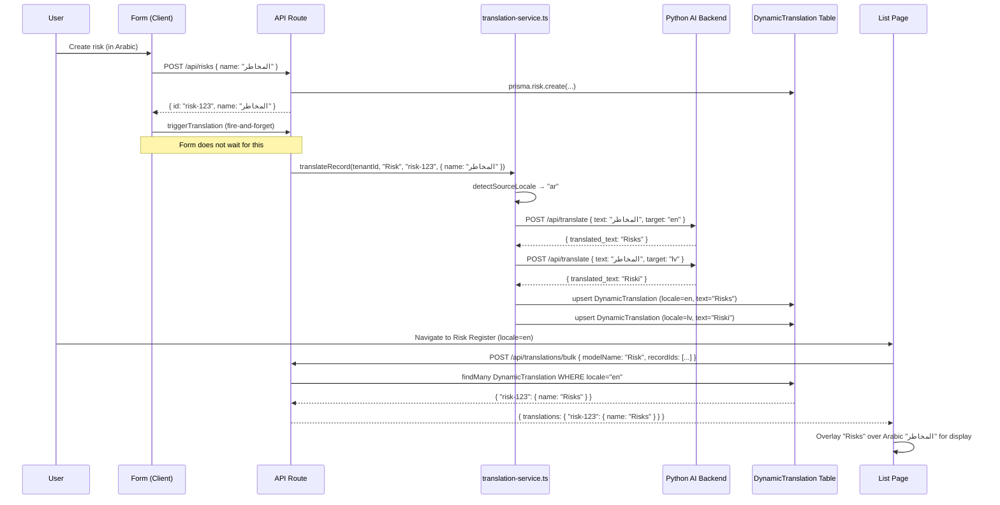

# Internationalization (i18n)

This document explains the GRC application's complete internationalization
architecture: what i18n is, why this application supports three languages,
how the two-layer translation system works, and everything a developer needs
to know to add new strings or new languages.

---

## Table of Contents

1. [What Is i18n and l10n?](#1-what-is-i18n-and-l10n)
2. [Why These Three Languages?](#2-why-these-three-languages)
3. [What Is RTL?](#3-what-is-rtl)
4. [The Two-Layer Translation System](#4-the-two-layer-translation-system)
5. [Layer 1 — Static UI Strings](#5-layer-1--static-ui-strings)
6. [Layer 2 — Dynamic User Data](#6-layer-2--dynamic-user-data)
7. [Language Detection Priority](#7-language-detection-priority)
8. [RTL Layout Implementation](#8-rtl-layout-implementation)
9. [Language Switcher](#9-language-switcher)
10. [How to Add a New UI String](#10-how-to-add-a-new-ui-string)
11. [How to Add a 4th Language](#11-how-to-add-a-4th-language)
12. [Common Mistakes](#12-common-mistakes)
13. [Flow Diagrams](#13-flow-diagrams)

---

## 1. What Is i18n and l10n?

### Internationalization (i18n)

Internationalization is the engineering process of designing software so that
it can be adapted to multiple languages and regions without changing the source
code. The "18" in "i18n" refers to the 18 letters between "i" and "n" in
"internationalization".

A software system is internationalized when:
- All user-visible strings are externalized (not hardcoded in source files).
- The layout can accommodate text that flows right-to-left.
- Date and number formats can be adapted per locale.
- Fonts support the required character sets.

### Localization (l10n)

Localization is the process of actually adapting the internationalized software
for a specific locale. This includes translating strings, adjusting layouts for
RTL languages, and adapting any locale-specific content.

In this application, "l10n" refers specifically to translating the UI strings
and user-entered data into the supported languages.

---

## 2. Why These Three Languages?

The three supported languages are English (default), Arabic, and Latvian.

- **English**: The universal business language and the default for the application.
  All source strings are written in English.

- **Arabic**: Required for customers in GCC (Gulf Cooperation Council) countries
  including UAE, Saudi Arabia, Qatar, Kuwait, Bahrain, and Oman. Arabic is an
  RTL language requiring special layout handling.

- **Latvian**: Required for European Union customers. Latvian uses the Latin
  script with additional diacritical characters (ā, č, ē, ģ, ī, ķ, ļ, ņ, š, ū, ž).

---

## 3. What Is RTL?

### Left-to-Right vs. Right-to-Left

Languages like English, French, German, and Latvian are written left-to-right
(LTR): the first character of a word appears on the left, and reading proceeds
to the right. Page layouts flow naturally left-to-right: the sidebar is on the
left, content expands rightward, navigation links are left-aligned.

Arabic (and Hebrew) is written right-to-left (RTL): reading proceeds from right
to left. A UI designed for LTR languages feels backwards to Arabic readers.

### What RTL Requires in Practice

When the user switches to Arabic:
- The entire page layout must mirror horizontally.
- The sidebar moves from the left edge to the right edge.
- Back/forward arrows point in the opposite direction.
- Table columns reorder so the first column is on the right.
- Text alignment changes from `text-left` to `text-right`.
- Icon positions that have semantic directional meaning (e.g., a back arrow)
  must be flipped 180 degrees.
- The HTML `dir` attribute must be set to `rtl` on the `<html>` element.

### Tailwind RTL Support

This application uses Tailwind CSS's built-in RTL variants. The `dir` attribute
on the `<html>` element triggers these variants:

```tsx
// Margin on the left in LTR, on the right in RTL:
<div className="ltr:ml-4 rtl:mr-4">

// Flip an arrow icon for RTL:
<ChevronRight className="ltr:rotate-0 rtl:rotate-180" />

// Padding left in LTR, padding right in RTL:
<button className="ltr:pl-3 rtl:pr-3">
```

---

## 4. The Two-Layer Translation System

The application has two distinct translation mechanisms for two distinct problems:

```
┌─────────────────────────────────────────────────────────┐
│ LAYER 1: Static UI Strings                               │
│                                                           │
│ Problem: Button labels, column headers, page titles, and │
│ form labels are hardcoded in the source code.            │
│                                                           │
│ Solution: Excel → JSON → t() function                    │
│ Files: /i18n/translations.xlsx → /locales/en.json,      │
│        ar.json, lv.json                                   │
│ Runtime: LanguageContext.tsx provides t()                │
└─────────────────────────────────────────────────────────┘

┌─────────────────────────────────────────────────────────┐
│ LAYER 2: Dynamic User Data                               │
│                                                           │
│ Problem: Users enter data (risk names, control          │
│ descriptions, policy titles) in one language, but       │
│ other users viewing the same data may use a different   │
│ language.                                                │
│                                                           │
│ Solution: Python AI backend (GPT) → DynamicTranslation  │
│ table in the database                                    │
│ Runtime: useTranslatedData hook + triggerTranslation()  │
└─────────────────────────────────────────────────────────┘
```

These two layers are completely independent. A page uses both: `t()` for its
structural labels and `useTranslatedData()` for the actual data it displays.

---

## 5. Layer 1 — Static UI Strings

### Architecture

```
/i18n/translations.xlsx        ← Single source of truth (Excel)
         ↓ (build script)
scripts/generate-translations.ts
         ↓ outputs
/locales/en.json               ← English strings
/locales/ar.json               ← Arabic translations
/locales/lv.json               ← Latvian translations
         ↓ (imported at runtime)
src/contexts/LanguageContext.tsx
         ↓ (React context)
const { t } = useLanguage()   ← Used in every component
```

### The Excel File

`/i18n/translations.xlsx` is a spreadsheet with columns:

| key (English phrase) | ar (Arabic) | lv (Latvian) |
|---------------------|-------------|--------------|
| Save | حفظ | Saglabāt |
| Cancel | إلغاء | Atcelt |
| Add New | إضافة جديد | Pievienot jaunu |
| Risk Register | سجل المخاطر | Risku reģistrs |

The English phrase IS the key. There is no separate dot-notation key system
like `"buttons.save"`. This approach:
- Makes it immediately obvious what each translation is for.
- Eliminates the need to maintain a separate key registry.
- Allows the `t()` function to fall back gracefully (if a translation is
  missing, the English phrase itself is displayed, not a broken key like
  `"buttons.save"`).

### generate-translations.ts

This script (`scripts/generate-translations.ts`) reads the Excel file and
produces the three JSON files in `/locales/`. It validates:
- Every row has a non-empty English phrase.
- Arabic and Latvian translations are present (warns if missing).

Run it whenever new translations are added to the Excel file:
```bash
npx tsx scripts/generate-translations.ts
```

### LanguageContext

`src/contexts/LanguageContext.tsx` provides:
- `locale`: The current locale string (`'en'`, `'ar'`, or `'lv'`).
- `t(phrase)`: Translates an English phrase to the current locale.
- `isRTL`: Boolean, `true` when locale is `'ar'`.
- `setLocale(locale)`: Change the current language.

The context wraps the entire application in the root layout. It stores the
selected locale in `localStorage` (key: `'locale'`) so the user's language
preference persists across sessions.

### Using t() in a Component

```typescript
'use client';
import { useLanguage } from '@/contexts/LanguageContext';

export default function RiskPage() {
  const { t } = useLanguage();

  return (
    <div>
      <h1>{t("Risk Register")}</h1>
      <Button>{t("Add New")}</Button>
      <TableHead>{t("Risk Name")}</TableHead>
      <TableHead>{t("Status")}</TableHead>
    </div>
  );
}
```

### Phrase-Based Keys vs. Dot-Notation

This application uses phrase-based keys. Comparison:

| Phrase-based (`t("Save")`) | Dot-notation (`t("buttons.save")`) |
|-----------------------------|-------------------------------------|
| Falls back to English phrase if missing | Shows broken key if missing |
| Key is self-documenting | Requires lookup to understand |
| Easy to write — just wrap the English text | Must maintain a parallel key hierarchy |
| Can find all usages with text search | Requires IDE tooling |

### Development Warnings

In development (`NODE_ENV !== 'production'`), `LanguageContext` logs a console
warning for any phrase passed to `t()` that is not found in the loaded JSON:

```
[i18n] Missing translation for "en": "My New Feature Label"
```

This is the signal to add the phrase to the Excel file and regenerate.

---

## 6. Layer 2 — Dynamic User Data

### The Problem

Static translations cover the application's own text (labels, buttons, headings).
But users create data — they write risk names like "Unauthorized access to
financial systems", policy titles like "Information Security Policy", audit
findings, and more.

These user-entered strings are stored in the database in the language the user
typed them. A user working in Arabic might create a risk named "الوصول غير
المصرح به إلى الأنظمة المالية". A colleague viewing the same risk register in
English should see the English translation.

### Architecture

```
User creates/edits a record (in any language)
         ↓
triggerTranslation('Risk', id, { name, description })  [client-side, fire-and-forget]
OR
translateRecord(customerAccountId, 'Risk', id, { name, description }) [API route, server-side]
         ↓
POST /api/translations/translate
         ↓
translation-service.ts → detectSourceLocale() → PythonBackendProvider
         ↓
Python FastAPI (RunPod) → GPT → translated text
         ↓
prisma.dynamicTranslation.upsert() for each (locale, field)
         ↓
DynamicTranslation table:
  { customerAccountId, modelName, recordId, fieldName, locale, translatedText, sourceHash }
         ↓
User loads list page with useTranslatedData(records, { modelName: 'Risk' })
         ↓
POST /api/translations/bulk → returns { translations: { recordId: { fieldName: text } } }
         ↓
Translated text overlaid onto records for display
```

### When Translations Are Triggered

Translations are triggered ONLY on create and edit. They are never triggered
automatically when viewing data (to avoid expensive background API calls on
every page load).

**Client-side trigger** (in forms, after successful save):
```typescript
// After successful API response that created/updated the record:
triggerTranslation('Risk', savedRisk.id, {
  name: savedRisk.name,
  description: savedRisk.description,
  treatment: savedRisk.treatment,
});
```

**Server-side trigger** (in API route handlers, after DB write):
```typescript
// In POST or PATCH handler, after prisma create/update:
if (customerAccountId) {
  void translateRecord(
    customerAccountId,
    'Risk',
    risk.id,
    { name: risk.name, description: risk.description }
  );
}
```

### Source Language Auto-Detection

When the user submits data, the system auto-detects what language they typed in:

```typescript
function detectSourceLocale(texts: string[]): string {
  const combined = texts.join(' ');

  // Arabic Unicode ranges (covers standard Arabic, supplements, presentation forms)
  const arabicChars = combined.match(
    /[؀-ۿݐ-ݿࢠ-ࣿﭐ-﷿ﹰ-]/g
  )?.length ?? 0;

  // Latvian-specific diacritics
  const latvianChars = combined.match(/[āčēģīķļņšūž]/gi)?.length ?? 0;
  const latinChars = combined.match(/[a-zA-Z]/g)?.length ?? 0;

  if (arabicChars > 2) return 'ar';
  if (latvianChars > 0 && latinChars > 0) return 'lv';
  return 'en';  // Default
}
```

This is used when `sourceLocale` is not explicitly provided to `translateRecord()`.
The frontend `triggerTranslation()` reads the current locale from `localStorage`
and passes it explicitly, so auto-detection is mainly the server-side fallback.

### The DynamicTranslation Model

Each translated field-value is stored as a row:

```
DynamicTranslation {
  id                 String
  customerAccountId  String   (tenant isolation)
  modelName          String   e.g., "Risk"
  recordId           String   e.g., "risk-uuid-123"
  fieldName          String   e.g., "name"
  locale             String   e.g., "ar"
  translatedText     String   e.g., "الوصول غير المصرح به"
  sourceHash         String   MD5 hash of the original text (staleness detection)
  isStale            Boolean  true if source text changed after translation
  translatedBy       String   "python-gpt"
  createdAt          DateTime
  updatedAt          DateTime
}
```

Unique constraint: `(customerAccountId, modelName, recordId, fieldName, locale)`.

### Staleness Detection

When a record is edited, `markTranslationsStale()` computes the MD5 hash of
the new field value and compares it to the stored `sourceHash`. If they differ,
the translation is marked `isStale: true`.

Stale translations are still displayed to users (the old translation is better
than nothing). They are re-translated on the next create/edit cycle.

### The Frontend Hook

```typescript
// On a list page:
const { data: translatedRisks, isLoading } = useTranslatedData(risks, {
  modelName: 'Risk',
});
// Use translatedRisks instead of risks for display
```

The hook:
1. Checks the in-memory cache (5-minute TTL, up to 200 entries).
2. If cache miss, POSTs to `/api/translations/bulk`.
3. Overlays translated field values onto the original records.
4. Falls back to original records on error.

The hook makes API calls for ALL locales, including English. This is because
records might have been entered in Arabic or Latvian and then need English
translations too. There is no `if (locale === 'en') return;` early exit.

### Lookup Helper Pattern

For dropdowns that show category/department names, use a `useCallback` helper:

```typescript
const { data: translatedCategories } = useTranslatedData(categories, {
  modelName: 'RiskCategory',
});

const getCategoryName = useCallback(
  (id: string) => translatedCategories.find(c => c.id === id)?.name,
  [translatedCategories]
);

// Usage in table:
<TableCell>{getCategoryName(risk.categoryId) || risk.categoryName}</TableCell>
```

### translation-config.ts Registry

All translatable models must be registered in `src/lib/translation-config.ts`.
This registry maps model names to the fields that should be translated:

```typescript
// Example entries from translation-config.ts:
{ model: 'Risk', fields: ['name', 'description', 'treatment'] },
{ model: 'Control', fields: ['name', 'description', 'objective'] },
{ model: 'Framework', fields: ['name', 'description'] },
// ... 164 registered models
```

---

## 7. Language Detection Priority

When the application loads, it determines the active locale in this order:

1. **`localStorage.getItem('locale')`**: The user's explicit language choice,
   persisted from a previous session.
2. **Browser language** (`navigator.language`): If no stored preference,
   the browser's configured language is checked. `ar` and `lv` codes are
   recognized; anything else defaults to `en`.
3. **Default**: English (`'en'`).

When `triggerTranslation()` fires on the client side, it reads
`localStorage.getItem('locale')` to determine the source language.

---

## 8. RTL Layout Implementation

When the locale is set to `'ar'`, `LanguageContext` sets `isRTL: true` and the
root layout adds `dir="rtl"` to the `<html>` element. Tailwind CSS's RTL
variants then take effect throughout all styled components.

### Tailwind RTL Variant Examples

```tsx
// Sidebar — appears on left in LTR, right in RTL:
<aside className="ltr:left-0 rtl:right-0">

// Navigation icon spacing:
<span className="ltr:mr-3 rtl:ml-3">
  <Icon />
</span>

// Back button arrow:
<ChevronLeft className="ltr:rotate-0 rtl:rotate-180" />

// Form input text alignment:
<Input className="ltr:text-left rtl:text-right" />

// Dropdown menu alignment:
<DropdownMenu className="ltr:origin-top-right rtl:origin-top-left" />
```

### Arabic Typography

Arabic text requires different fonts than Latin text. The application loads an
appropriate Arabic font (via CSS `@font-face` or Google Fonts). The
`dir="rtl"` attribute on the HTML element also causes the browser's text
rendering engine to apply Arabic shaping rules automatically (ligatures, letter
joining, etc.).

---

## 9. Language Switcher

The language switcher is located in the application header. It is a dropdown
menu with three options:

```
🌐 English
🌐 عربي (Arabic)
🌐 Latviešu (Latvian)
```

When a language is selected:
1. `setLocale(locale)` is called on `LanguageContext`.
2. The new locale is stored in `localStorage`.
3. All components that use `useLanguage()` re-render with translated strings.
4. If switching to Arabic, `isRTL` becomes `true` and the layout mirrors.
5. The `clearTranslationCache()` function clears the in-memory dynamic
   translation cache so fresh translations are fetched for the new locale.

---

## 10. How to Add a New UI String

**Step 1**: Write the component using `t()` with the English phrase:
```typescript
const { t } = useLanguage();
<Button>{t("Export to PDF")}</Button>
```

**Step 2**: Open `/i18n/translations.xlsx` and add a new row:
| Export to PDF | تصدير إلى PDF | Eksportēt uz PDF |

**Step 3**: Run the generation script:
```bash
npx tsx scripts/generate-translations.ts
```

**Step 4**: Verify the JSON files were updated:
```bash
# Check that "Export to PDF" appears in all three files:
grep "Export to PDF" locales/en.json
grep "Export to PDF" locales/ar.json
grep "Export to PDF" locales/lv.json
```

**Step 5**: If you do not have Arabic or Latvian translations immediately,
add a placeholder. The development console warning will remind you to fill it in.

**Important**: Do NOT wrap these in `t()`:
- Variable names, API endpoint URLs, console.log messages.
- Enum values and database field names (e.g., `'ACTIVE'`, `'compliance.framework'`).
- Technical identifiers passed to non-UI functions.

---

## 11. How to Add a 4th Language

Adding a 4th language (e.g., French — `fr`) requires changes in four places:

**Step 1**: Add the locale to `LanguageContext.tsx`:
```typescript
export type Locale = 'en' | 'ar' | 'lv' | 'fr';  // Add 'fr'
```

**Step 2**: Add the translations.xlsx column for French and populate it.

**Step 3**: Update `generate-translations.ts` to output `locales/fr.json`.

**Step 4**: Add the French option to the language switcher component.

**Step 5**: Update `TARGET_LOCALES` in `src/lib/translation-config.ts`:
```typescript
export const TARGET_LOCALES = ['ar', 'lv', 'fr'];  // Add 'fr'
```

**Step 6**: The Python backend must support the `fr` locale code. Verify the
AI translation service can translate to French before enabling.

**Note on RTL**: French is LTR. The RTL layout logic in `LanguageContext`
checks `locale === 'ar'` specifically. Adding French requires no RTL changes.

---

## 12. Common Mistakes

**Mistake 1: Translating technical identifiers**
```typescript
// Wrong:
const status = t("ACTIVE");    // "ACTIVE" is an enum value, not UI text
const resource = t("risk.register");  // Resource identifier, not UI text

// Correct:
const displayStatus = t("Active");   // Use a human-readable English phrase
```

**Mistake 2: String concatenation in translated text**
```typescript
// Wrong: word order differs between languages
const msg = t("Hello") + " " + userName + " " + t("welcome back");

// Correct: pass the full phrase or use template variables
const msg = t("Welcome back, {name}").replace("{name}", userName);
// Or interpolate outside of t():
<p>{t("Welcome back")}, {userName}</p>
```

**Mistake 3: Adding locale === 'en' early return in translation hooks**
```typescript
// Wrong: records entered in Arabic need English translations too
if (locale === 'en') return;  // DO NOT DO THIS

// The hook must always fetch translations for all locales
```

**Mistake 4: Triggering translation on view (read-only) pages**
```typescript
// Wrong: translation should not be triggered here
useEffect(() => {
  triggerTranslation('Risk', risk.id, { name: risk.name });
}, []);  // This fires on every page load

// Correct: trigger only in form submit handlers after a save
const handleSubmit = async (data) => {
  const saved = await saveRisk(data);
  triggerTranslation('Risk', saved.id, { name: saved.name });
};
```

---

## 13. Flow Diagrams

### Layer 1: Static Translation Flow

```mermaid
flowchart LR
    A[translations.xlsx] -->|npx tsx generate-translations.ts| B[locales/en.json]
    A -->|same script| C[locales/ar.json]
    A -->|same script| D[locales/lv.json]
    B & C & D -->|imported at build time| E[LanguageContext.tsx]
    E -->|useLanguage hook| F[t("Save") in component]
    F -->|locale=ar| G["حفظ rendered"]
    F -->|locale=en| H["Save rendered"]
    F -->|locale=lv| I["Saglabāt rendered"]
```

### Layer 2: Dynamic Translation Flow


