# testgrc 2025 — Documentation Repository

> **Governance, Risk, and Compliance Application**
> Live at: https://grc-app-ba-testing.vercel.app

---

## What Is This Repository?

This folder contains the complete documentation for the **testgrc 2025** application — a web-based platform that helps organizations manage Governance, Risk, and Compliance (GRC) activities.

If you are new to this project, start here. Every folder below maps to a specific area of the system, from high-level business goals down to exact code patterns. The goal is that any developer, operations engineer, business analyst, or security auditor can find the information they need without having to read source code.

**What you will find here:**
- Why this software exists and what business problem it solves
- How the system is built (technology choices and architecture)
- How to set it up and run it locally
- How every module works for end users
- How the database is structured
- How security, encryption, and authentication work
- How to deploy, monitor, and operate the system in production

---

## Documentation Map

```
Project-Documentation/
├── README.md                          ← You are here (master index)
├── 00-Project-Overview/               ← Start here for context
│   ├── Project-Introduction.md        ← What GRC is, why this app exists
│   ├── Business-Requirements.md       ← What the system must do (non-technical)
│   └── Architecture-Overview.md       ← How the system is designed
├── 01-Getting-Started/                ← Run the app for the first time
│   ├── Prerequisites.md               ← What to install before you begin
│   ├── Local-Setup.md                 ← Step-by-step local development setup
│   ├── Environment-Variables.md       ← All .env keys explained
│   └── First-Login.md                 ← Logging in, seeded test accounts
├── 02-Architecture/                   ← Deep technical design
│   ├── Technology-Stack.md            ← Every library/tool explained
│   ├── Multi-Tenancy.md               ← How one app serves many customers
│   ├── RBAC.md                        ← Role-Based Access Control system
│   └── Data-Flow.md                   ← How data moves through the system
├── 03-Database/                       ← Database schema and design
│   ├── Schema-Overview.md             ← Entity-relationship overview
│   ├── Migrations.md                  ← How schema changes are deployed
│   └── Seeding.md                     ← Test data setup
├── 04-Frontend/                       ← UI and client-side code
│   ├── Component-Library.md           ← shadcn/ui components used
│   ├── i18n-Guide.md                  ← How translations work
│   └── Routing.md                     ← Next.js App Router structure
├── 05-Backend/                        ← Server-side code
│   ├── API-Patterns.md                ← REST API conventions
│   ├── Auth-Middleware.md             ← withAuth wrapper explained
│   └── File-Uploads.md                ← How documents are stored
├── 06-APIs/                           ← Complete API reference
│   └── (auto-generated from openapi-spec.json)
├── 07-Authentication/                 ← Security and auth system
│   ├── NextAuth-Setup.md              ← JWT sessions and configuration
│   ├── Permissions.md                 ← Full permission matrix
│   └── Encryption.md                  ← AES-256-GCM field encryption
├── 08-Features/                       ← Every module documented end-to-end
│   ├── 01-Organization.md             ← Organization profile, BIA, processes
│   ├── 02-Compliance.md               ← Frameworks, controls, evidence
│   ├── 03-Risk-Management.md          ← Risk register, assessment, response
│   ├── 04-Asset-Management.md         ← Asset inventory, classification
│   ├── 05-Internal-Audit.md           ← Audit planning, fieldwork, findings
│   ├── 06-TPRM.md                     ← Third-Party Risk Management
│   ├── 07-QPost-Compliance.md         ← Post-compliance quality checks
│   ├── 08-Technical-Evidence.md       ← Evidence collection, screenshots
│   ├── 09-Dashboard.md                ← Metrics, charts, summaries
│   └── 10-Support.md                  ← Help desk and support tickets
├── 09-Integrations/                   ← External connections
│   ├── Python-AI-Backend.md           ← AI translation service
│   ├── Email-Notifications.md         ← Nodemailer + 65 templates
│   └── Cron-Jobs.md                   ← 7 scheduled tasks
├── 10-Troubleshooting/                ← Common problems and fixes
│   ├── Build-Errors.md                ← TypeScript / Next.js build failures
│   ├── Database-Issues.md             ← Prisma / migration problems
│   └── Auth-Issues.md                 ← Login, session, permission problems
└── 11-Best-Practices/                 ← Coding standards and conventions
    ├── Code-Style.md                  ← ESLint rules, naming conventions
    ├── Adding-a-Module.md             ← How to build a new GRC module
    └── Deployment-Checklist.md        ← Pre-deploy steps every time
```

---

## Quick Start (5 Steps)

These five steps take you from a fresh computer to a running local instance of the application. Each step links to the detailed guide in the `01-Getting-Started/` folder.

### Step 1 — Install Prerequisites

You need the following software installed before anything else:

| Software       | Version  | Purpose                              |
|----------------|----------|--------------------------------------|
| Node.js        | 20+      | Runs the web application             |
| npm            | 10+      | Installs JavaScript packages         |
| Git            | Any      | Downloads the source code            |
| PostgreSQL      | 15+      | Database (optional for local SQLite) |
| VS Code        | Any      | Recommended code editor              |

Download Node.js from https://nodejs.org — it includes npm. Download Git from https://git-scm.com.

### Step 2 — Clone the Repository

Open a terminal and run:

```bash
git clone <repository-url>
cd grc-app
```

This downloads all source code to your computer.

### Step 3 — Install Dependencies

```bash
npm install
```

This downloads all third-party libraries (about 800 packages) the application needs. This may take 2–5 minutes.

### Step 4 — Set Up the Database

```bash
cp .env.example .env
npx prisma migrate dev
npm run db:seed
```

The first command creates your local configuration file. The second creates all database tables. The third adds sample data so you have something to log in with.

### Step 5 — Start the Application

```bash
npm run dev
```

Open your browser and go to http://localhost:3000. Log in with:
- **Username:** `superadmin`
- **Password:** `1`

You are now running the full GRC application locally.

> For detailed instructions with troubleshooting, see `01-Getting-Started/Local-Setup.md`.

---

## Module Overview

The application is organized into **10 functional modules**. Each module represents a distinct area of GRC practice. Users are granted access to specific modules based on their role.

### 1. Organization

**What it does:** Manages the foundational information about the organization — its structure, business processes, stakeholders, and risk context.

**Key features:**
- Company profile (name, industry, size, regulatory environment)
- Organizational chart and department structure
- Business process inventory
- Business Impact Analysis (BIA) — identifies which processes are most critical
- Stakeholder register

**Who uses it:** CustomerAdministrator, Contributor, Reviewer

---

### 2. Compliance

**What it does:** Tracks the organization's adherence to regulatory frameworks, internal policies, and industry standards.

**Key features:**
- Framework library (ISO 27001, SOC 2, GDPR, PCI-DSS, NIST, and more)
- Control library — the specific requirements that must be met
- Governance documents (policies, procedures, standards)
- Evidence collection — proof that controls are working
- Exceptions management — approved deviations from controls
- Key Performance Indicators (KPIs) for compliance health

**Who uses it:** Compliance team, Auditors, Reviewers, Department Heads

---

### 3. Risk Management

**What it does:** Identifies, assesses, and manages risks that could affect the organization's objectives.

**Key features:**
- Risk Register — central list of all identified risks
- Risk Assessment — evaluating likelihood and impact
- Risk Response — mitigation, acceptance, transfer, or avoidance strategies
- Risk Control Matrix — linking risks to their mitigating controls
- Strategic Risk Planning — connecting risks to organizational strategy
- Heat maps and risk scoring dashboards

**Who uses it:** Risk Manager, Contributor, Reviewer, CustomerAdministrator

---

### 4. Asset Management

**What it does:** Maintains an inventory of all organizational assets and classifies them by sensitivity and importance.

**Key features:**
- Asset inventory (hardware, software, data, people, facilities)
- Asset classification by confidentiality, integrity, and availability
- Asset ownership assignment
- Linkage to risks and controls

**Who uses it:** IT teams, Risk Manager, Compliance teams

---

### 5. Internal Audit

**What it does:** Manages the entire internal audit lifecycle from planning to final report.

**Key features:**
- Audit Universe — the complete list of all auditable areas
- Audit Charter — the mandate and scope of the audit function
- Annual Audit Plan — scheduling which audits to conduct
- Fieldwork — conducting tests and gathering evidence
- Findings — documenting issues discovered
- CAPA Tracking — Corrective and Preventive Actions
- Independence & Objectivity declarations
- Formal Audit Reports (PDF generation)
- Audit Trail — complete activity log

**Who uses it:** AuditHead, AuditManager, Auditor, Auditee

---

### 6. TPRM (Third-Party Risk Management)

**What it does:** Manages the risks associated with vendors, suppliers, and other third parties.

**Key features:**
- Vendor register
- Vendor risk assessments
- Due diligence questionnaires
- Contract tracking
- Vendor performance monitoring
- Automated email notifications to vendors

**Who uses it:** Procurement, Risk Manager, CustomerAdministrator

---

### 7. QPost Compliance

**What it does:** Provides post-compliance quality assurance — verifying that compliance activities were completed correctly.

**Key features:**
- Compliance activity verification
- Quality checklists
- Sign-off workflows

**Who uses it:** QPost Reviewers, Compliance Manager

---

### 8. Technical Evidence

**What it does:** Manages technical proof of compliance — screenshots, system logs, configuration exports.

**Key features:**
- Evidence upload and cataloguing
- Evidence tagging to controls
- Screenshot capture and annotation
- Automated evidence collection hooks

**Who uses it:** IT teams, Auditors, Compliance Officers

---

### 9. Dashboard

**What it does:** Provides a real-time overview of the organization's GRC posture.

**Key features:**
- Risk score summary
- Compliance percentage by framework
- Open findings count
- Upcoming audit schedule
- Due evidence alerts
- CAPA status tracker
- Charts and trend analysis

**Who uses it:** All roles (each sees data relevant to their permissions)

---

### 10. Support

**What it does:** Provides help-desk functionality within the application.

**Key features:**
- Support ticket creation
- Ticket routing to administrators
- Status tracking
- Knowledge base articles

**Who uses it:** All users

---

## Who Should Read What

Different readers have different goals. Use this table to find your starting point.

### I am a New Developer

You have just joined the project and need to understand the full codebase.

**Read in this order:**
1. `00-Project-Overview/Project-Introduction.md` — understand what the app does
2. `01-Getting-Started/Local-Setup.md` — get it running on your machine
3. `00-Project-Overview/Architecture-Overview.md` — understand the technical design
4. `02-Architecture/Technology-Stack.md` — understand every library used
5. `03-Database/Schema-Overview.md` — understand the data model
6. `05-Backend/API-Patterns.md` — understand how to write API routes
7. `07-Authentication/Permissions.md` — understand the RBAC system
8. `08-Features/` — read the module you are assigned to

**Time estimate:** 2 full days to read everything thoroughly.

---

### I am a DevOps / Operations Engineer

You need to deploy, monitor, and maintain the application.

**Read in this order:**
1. `00-Project-Overview/Architecture-Overview.md` — system design
2. `02-Architecture/Technology-Stack.md` (Vercel and Neon sections)
3. `01-Getting-Started/Environment-Variables.md` — all configuration keys
4. `09-Integrations/Cron-Jobs.md` — scheduled tasks
5. `09-Integrations/Email-Notifications.md` — email infrastructure
6. `11-Best-Practices/Deployment-Checklist.md` — every deploy step
7. `10-Troubleshooting/` — all troubleshooting guides

---

### I am a Security Engineer / Auditor

You need to review the security posture and audit compliance.

**Read in this order:**
1. `07-Authentication/Encryption.md` — AES-256-GCM field encryption
2. `07-Authentication/NextAuth-Setup.md` — session security
3. `07-Authentication/Permissions.md` — access control model
4. `02-Architecture/RBAC.md` — role definitions
5. `02-Architecture/Multi-Tenancy.md` — data isolation
6. `00-Project-Overview/Business-Requirements.md` — compliance standards supported
7. `05-Backend/Auth-Middleware.md` — API protection

---

### I am a Business Analyst or Product Manager

You need to understand the features and write requirements for new work.

**Read in this order:**
1. `00-Project-Overview/Project-Introduction.md`
2. `00-Project-Overview/Business-Requirements.md`
3. `08-Features/` — all 10 module guides

---

### I am a QA / Test Engineer

You need to test the application thoroughly.

**Read in this order:**
1. `01-Getting-Started/First-Login.md` — test accounts
2. `07-Authentication/Permissions.md` — what each role can do
3. `08-Features/` — all 10 module guides
4. All `09-Integrations/` files (email, cron)
5. `02-Architecture/Technology-Stack.md` (Playwright section)

---

## Folder Structure Diagram

The following diagram shows how the documentation folder maps to the application layers:

```mermaid
graph TD
    A[Project-Documentation] --> B[00-Project-Overview]
    A --> C[01-Getting-Started]
    A --> D[02-Architecture]
    A --> E[03-Database]
    A --> F[04-Frontend]
    A --> G[05-Backend]
    A --> H[06-APIs]
    A --> I[07-Authentication]
    A --> J[08-Features]
    A --> K[09-Integrations]
    A --> L[10-Troubleshooting]
    A --> M[11-Best-Practices]

    B --> B1[Project-Introduction.md]
    B --> B2[Business-Requirements.md]
    B --> B3[Architecture-Overview.md]

    J --> J1[01-Organization.md]
    J --> J2[02-Compliance.md]
    J --> J3[03-Risk-Management.md]
    J --> J4[04-Asset-Management.md]
    J --> J5[05-Internal-Audit.md]
    J --> J6[06-TPRM.md]
    J --> J7[07-QPost-Compliance.md]
    J --> J8[08-Technical-Evidence.md]
    J --> J9[09-Dashboard.md]
    J --> J10[10-Support.md]

    K --> K1[Python-AI-Backend.md]
    K --> K2[Email-Notifications.md]
    K --> K3[Cron-Jobs.md]
```



---

## Key Application Facts at a Glance

| Property                  | Value                                          |
|---------------------------|------------------------------------------------|
| Application name          | testgrc 2025                                   |
| Live URL                  | https://grc-app-ba-testing.vercel.app          |
| Framework                 | Next.js 16.1.1                                 |
| Language                  | TypeScript                                     |
| Database (cloud)          | Neon PostgreSQL                                |
| Database (local dev)      | SQLite (via Prisma)                            |
| Authentication            | NextAuth v5 (JWT sessions)                     |
| Supported languages       | English, Arabic (RTL), Latvian                 |
| Number of modules         | 10                                             |
| Number of roles           | 25                                             |
| Number of database models | 200+                                           |
| Email templates           | 65+                                            |
| Scheduled cron jobs       | 7                                              |
| Encryption                | AES-256-GCM (field-level)                      |
| AI integration            | Python backend with GPT-based translation      |
| Deployment platform       | Vercel (frontend) + Neon (database)            |
| Architecture pattern      | Multi-tenant SaaS                              |

---

## Conventions Used in This Documentation

Throughout all documentation files, the following conventions are used:

- **Bold text** — important terms being defined for the first time
- `code text` — exact code, commands, file names, or values to type
- > Blockquotes — important notes, warnings, or tips
- Tables — reference information (configurations, options, roles)
- Mermaid diagrams — visual representations of systems and flows

> **Warning boxes** like this one indicate something that can cause data loss, security problems, or broken deployments if done incorrectly.

---

## Keeping This Documentation Current

Documentation must be updated whenever code changes. The following rules apply:

1. Any new feature must have a corresponding update in `08-Features/`
2. Any new API endpoint must be reflected in `06-APIs/`
3. Any schema change must update `03-Database/Schema-Overview.md`
4. Any new environment variable must be documented in `01-Getting-Started/Environment-Variables.md`
5. Any Internal Audit change must also update `docs/INTERNAL_AUDIT_MODULE.md` in the main codebase (per CLAUDE.md)

---

*Last updated: June 2025 | Version: 1.0 | Maintained by the testgrc 2025 Engineering Team*
