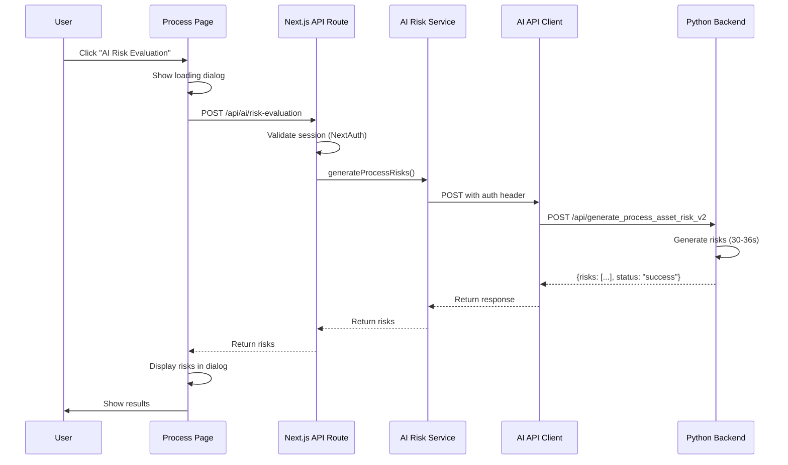

# AI Integration Documentation

## Overview

This document provides a comprehensive overview of the AI Risk Evaluation integration in the GRC application, including API endpoints, UI interfaces, implementation status, and usage instructions.

**Integration Date**: January 21, 2026  
**Status**: ✅ Completed and Tested  
**Branch**: `api_integration`

---

## Table of Contents

1. [Architecture Overview](#architecture-overview)
2. [API Endpoints](#api-endpoints)
3. [UI Integration Points](#ui-integration-points)
4. [Implementation Status](#implementation-status)
5. [File Structure](#file-structure)
6. [Usage Guide](#usage-guide)
7. [Testing Results](#testing-results)
8. [Known Issues & Limitations](#known-issues--limitations)

---

## Architecture Overview

### System Architecture

```
┌─────────────────┐      ┌──────────────────┐      ┌─────────────────────┐
│   Frontend UI   │─────▶│  Next.js API     │─────▶│  Python AI Backend  │
│  (Process Page) │      │  Routes (Proxy)  │      │  (RunPod)           │
└─────────────────┘      └──────────────────┘      └─────────────────────┘
                                  │
                                  ▼
                         ┌──────────────────┐
                         │  Service Layer   │
                         │  (Business Logic)│
                         └──────────────────┘
                                  │
                                  ▼
                         ┌──────────────────┐
                         │  AI API Client   │
                         │  (HTTP Client)   │
                         └──────────────────┘
```

### Key Components

1. **AI API Client** (`src/lib/ai-api-client.ts`)
   - Centralized axios instance
   - Automatic authentication with `PYTHON_API_SECRET`
   - Request/response interceptors
   - Error handling and logging

2. **Service Layer** (`src/services/ai-risk-service.ts`)
   - Business logic for risk generation
   - Semantic matching operations
   - Job polling utilities

3. **API Routes** (`src/app/api/ai/*`)
   - Next.js API routes acting as secure proxies
   - Authentication via NextAuth
   - Never exposes API secrets to client

4. **Frontend UI** (`src/app/(protected)/organization/process/page.tsx`)
   - AI Risk Evaluation button
   - Results dialog with loading/error states
   - Real-time risk display

---

## API Endpoints

### 1. Risk Generation API

**External Endpoint**: `POST https://js94jpkkazgpo9-9000.proxy.runpod.net/api/generate_process_asset_risk_v2`

**Internal Proxy**: `POST /api/ai/risk-evaluation`

**Purpose**: Generates AI-powered risk assessment for a business process

**Authentication**: 
- External: `auth` header with `PYTHON_API_SECRET`
- Internal: NextAuth session required

**Request Body**:
```json
{
  "Process_Details": {
    "Process_name": "string",
    "Process_description": "string",
    "Department": "string"
  }
}
```

**Note**: API accepts **EITHER** `Process_Details` **OR** `Assets_Details`, not both.

**Response**:
```json
{
  "risks": [
    {
      "Risk_name": "string",
      "Risk_description": "string",
      "Risk_category": "string",
      "Inherent_risk_rating": "High|Medium|Low",
      "Threats": [...]
    }
  ],
  "status": "success"
}
```

**Performance**: ~30-36 seconds (AI generation time)

**Status**: ✅ Implemented and Tested

---

### 2. Semantic Matching - Job Submission

**External Endpoint**: `POST https://js94jpkkazgpo9-9000.proxy.runpod.net/api/semanticMatch_process_asset_riskV2`

**Internal Proxy**: `POST /api/ai/semantic-matching`

**Purpose**: Submits a job to match generated risks against existing risk library

**Authentication**: 
- External: `auth` header with `PYTHON_API_SECRET`
- Internal: NextAuth session required

**Request Format**: `multipart/form-data`

**Request Fields**:
- `existing_library` (string): JSON string of existing library
- `generated_risk` (string): JSON string of generated risks

**Response**:
```json
{
  "job_id": "uuid",
  "status": "queued"
}
```

**Status**: ✅ Implemented (Infrastructure Ready, UI Pending)

---

### 3. Semantic Matching - Status Check

**External Endpoint**: `GET https://js94jpkkazgpo9-9000.proxy.runpod.net/api/semanticMatch_process_asset_riskV2_status/{job_id}`

**Internal Proxy**: `GET /api/ai/semantic-matching/status/[jobId]`

**Purpose**: Checks the status of a semantic matching job

**Authentication**: 
- External: `auth` header with `PYTHON_API_SECRET`
- Internal: NextAuth session required

**Response**:
```json
{
  "job_id": "uuid",
  "status": "queued|processing|completed|error|not_found",
  "error": null
}
```

**Status**: ✅ Implemented (Infrastructure Ready, UI Pending)

---

### 4. Semantic Matching - Result Retrieval

**External Endpoint**: `GET https://js94jpkkazgpo9-9000.proxy.runpod.net/api/semanticMatch_process_asset_riskV2_result/{job_id}`

**Internal Proxy**: `GET /api/ai/semantic-matching/result/[jobId]`

**Purpose**: Retrieves results of a completed semantic matching job

**Authentication**: 
- External: `auth` header with `PYTHON_API_SECRET`
- Internal: NextAuth session required

**Response**:
```json
{
  "results": {
    "risks": [
      {
        "Risk_name": "string",
        "Is_Matched": true,
        "Matched_Risk_Code": "R-1",
        "Similarity_Score": 0.85,
        ...
      }
    ]
  },
  "status": "success"
}
```

**Status**: ✅ Implemented (Infrastructure Ready, UI Pending)

---

## UI Integration Points

### Process Repository Page

**Location**: `/organization/process` (Repository Tab)

**Component**: `src/app/(protected)/organization/process/page.tsx`

**Feature**: AI Risk Evaluation Button

#### Button Location
- **Column**: "AI Risk" column in process table
- **Appearance**: Purple button with sparkles icon
- **Label**: "AI Risk Evaluation"
- **State**: Enabled and functional

#### User Flow

1. **User Action**: Click "AI Risk Evaluation" button on any process row
2. **System Response**: 
   - Dialog opens immediately
   - Loading spinner appears
   - API call initiated to `/api/ai/risk-evaluation`
3. **Loading State** (~30-36 seconds):
   - Spinner animation
   - Message: "Generating AI risk assessment..."
4. **Success State**:
   - Summary card showing total risks generated
   - Scrollable list of risks with:
     - Risk name and severity badge
     - Description
     - Category
     - Inherent risk rating
   - "Regenerate" button to generate new risks
   - "Close" button to dismiss dialog
5. **Error State**:
   - Red error box with error message
   - "Close" button to dismiss

#### Dialog States

| State | Display |
|-------|---------|
| Loading | Spinner + "Generating AI risk assessment..." |
| Success | Risk list with summary |
| Error | Red alert box with error message |

---

## Implementation Status

### ✅ Completed Features

| Feature | Status | Location |
|---------|--------|----------|
| AI API Client | ✅ Complete | `src/lib/ai-api-client.ts` |
| Type Definitions | ✅ Complete | `src/types/ai-types.ts` |
| Service Layer | ✅ Complete | `src/services/ai-risk-service.ts` |
| Risk Generation API Route | ✅ Complete | `src/app/api/ai/risk-evaluation/route.ts` |
| Semantic Matching Submission | ✅ Complete | `src/app/api/ai/semantic-matching/route.ts` |
| Semantic Matching Status | ✅ Complete | `src/app/api/ai/semantic-matching/status/[jobId]/route.ts` |
| Semantic Matching Result | ✅ Complete | `src/app/api/ai/semantic-matching/result/[jobId]/route.ts` |
| UI - Risk Evaluation Button | ✅ Complete | Process page - AI Risk column |
| UI - Risk Display Dialog | ✅ Complete | Process page - Dialog component |
| Loading States | ✅ Complete | Spinner with message |
| Error Handling | ✅ Complete | Error display + toast notifications |
| Success Feedback | ✅ Complete | Toast notification + results display |

### 🔄 Infrastructure Ready (UI Pending)

| Feature | Status | Notes |
|---------|--------|-------|
| Semantic Matching UI | 🔄 Pending | Backend ready, needs frontend integration |
| Job Polling UI | 🔄 Pending | Polling logic exists, needs UI implementation |
| Match Results Display | 🔄 Pending | API working, needs results visualization |

### 📋 Future Enhancements

- Export risks to PDF/Excel
- Save generated risks to database
- Risk library management UI
- Batch risk generation for multiple processes
- Caching layer for repeated requests
- Rate limiting for API calls

---

## File Structure

### New Files Created

```
src/
├── types/
│   └── ai-types.ts                    # TypeScript type definitions
├── lib/
│   └── ai-api-client.ts               # Centralized HTTP client
├── services/
│   └── ai-risk-service.ts             # Business logic layer
└── app/
    └── api/
        └── ai/
            ├── risk-evaluation/
            │   └── route.ts           # Risk generation endpoint
            └── semantic-matching/
                ├── route.ts           # Job submission endpoint
                ├── status/
                │   └── [jobId]/
                │       └── route.ts   # Status check endpoint
                └── result/
                    └── [jobId]/
                        └── route.ts   # Result retrieval endpoint
```

### Modified Files

```
package.json                           # Added axios dependency
package-lock.json                      # Dependency lock file
src/app/(protected)/organization/
  process/page.tsx                     # Added AI Risk Evaluation feature
```

---

## Usage Guide

### For Developers

#### 1. Environment Setup

Ensure these environment variables are set in `.env`:

```env
PYTHON_BACKEND_URL=https://js94jpkkazgpo9-9000.proxy.runpod.net/
PYTHON_API_SECRET=CD78AF69D4789425F9278144F1121
```

#### 2. Install Dependencies

```bash
npm install
```

This will install `axios` and other required dependencies.

#### 3. Start Development Server

```bash
npm run dev
```

#### 4. Test the Integration

1. Navigate to `http://localhost:3000/organization/process`
2. Login with valid credentials
3. Click "AI Risk Evaluation" on any process
4. Observe the risk generation process

### For End Users

#### Generating AI Risk Assessment

1. **Navigate** to Organization → Process
2. **Select** the "Repository" tab
3. **Locate** the process you want to assess
4. **Click** the purple "AI Risk Evaluation" button
5. **Wait** for the AI to generate risks (~30-36 seconds)
6. **Review** the generated risks in the dialog
7. **Optional**: Click "Regenerate" for new risk assessment
8. **Close** the dialog when done

---

## Testing Results

### Endpoint Testing (via curl)

All endpoints were tested directly using curl commands:

#### ✅ Risk Generation
```bash
curl -X POST "https://js94jpkkazgpo9-9000.proxy.runpod.net/api/generate_process_asset_risk_v2" \
  -H "auth: CD78AF69D4789425F9278144F1121" \
  -H "Content-Type: application/json" \
  -d '{"Process_Details": {...}}'
```
**Result**: ✅ Success - Generated 7 risks in ~30 seconds

#### ✅ Semantic Matching Submission
```bash
curl -X POST "https://js94jpkkazgpo9-9000.proxy.runpod.net/api/semanticMatch_process_asset_riskV2" \
  -H "auth: CD78AF69D4789425F9278144F1121" \
  -F 'existing_library={...}' \
  -F 'generated_risk={...}'
```
**Result**: ✅ Success - Returned job_id

#### ✅ Status Check
```bash
curl -X GET "https://js94jpkkazgpo9-9000.proxy.runpod.net/api/semanticMatch_process_asset_riskV2_status/{job_id}" \
  -H "auth: CD78AF69D4789425F9278144F1121"
```
**Result**: ✅ Success - Status: completed

#### ✅ Result Retrieval
```bash
curl -X GET "https://js94jpkkazgpo9-9000.proxy.runpod.net/api/semanticMatch_process_asset_riskV2_result/{job_id}" \
  -H "auth: CD78AF69D4789425F9278144F1121"
```
**Result**: ✅ Success - Returned matched risks with similarity scores

### Integration Testing

- ✅ Frontend button click triggers API call
- ✅ Loading state displays correctly
- ✅ Success state shows generated risks
- ✅ Error state displays error messages
- ✅ Toast notifications work properly
- ✅ Regenerate functionality works
- ✅ Dialog close/open works correctly

---

## Known Issues & Limitations

### Performance

**Issue**: Risk generation takes 30-36 seconds  
**Cause**: AI/LLM processing time on Python backend  
**Impact**: Users must wait for results  
**Mitigation**: Loading spinner with clear messaging  
**Future Fix**: Consider caching, faster models, or streaming responses

### API Constraints

**Issue**: API accepts EITHER Process_Details OR Assets_Details, not both  
**Status**: Fixed in implementation  
**Solution**: Only sending Process_Details in requests

### Semantic Matching UI

**Issue**: Semantic matching infrastructure is ready but UI is not implemented  
**Status**: Pending  
**Workaround**: Can be tested via API routes directly  
**Timeline**: Future enhancement

### Response Structure Variations

**Issue**: Initial implementation expected different field names  
**Status**: Fixed  
**Solution**: Updated types to handle both `risks` and `generated_risks` fields with fallbacks

---

## Environment Variables

| Variable | Value | Purpose |
|----------|-------|---------|
| `PYTHON_BACKEND_URL` | `https://js94jpkkazgpo9-9000.proxy.runpod.net/` | Python AI backend base URL |
| `PYTHON_API_SECRET` | `CD78AF69D4789425F9278144F1121` | Authentication secret for AI APIs |

**Security Note**: These secrets are only accessible server-side and never exposed to the client.

---

## API Call Flow Diagram



---

## Support & Maintenance

### Debugging

Enable detailed logging by checking browser console for:
- `[AI Service] Calling risk generation API with:` - Request payload
- `[AI API Request]` - Outgoing request details
- `[AI API Response]` - Response status
- `[AI Service] Error generating process risks:` - Detailed error info

### Common Issues

**404 Error**:
- Check `PYTHON_BACKEND_URL` is correct
- Verify Python backend is running
- Confirm endpoint path is correct

**Authentication Error**:
- Verify `PYTHON_API_SECRET` is correct
- Check auth header is being sent

**Timeout**:
- Normal for AI generation (30-36s)
- Check network connectivity
- Verify backend is responsive

---

## Changelog

### v1.0.0 - January 21, 2026

**Added**:
- AI Risk Evaluation integration
- Centralized AI API client
- Service layer for business logic
- Type-safe API interactions
- Risk generation UI in Process page
- Loading, success, and error states
- Toast notifications
- Semantic matching infrastructure (backend only)

**Fixed**:
- API response structure handling
- Request payload format (removed dual fields)
- Type definitions to match actual API
- Error handling and logging

**Known Issues**:
- Risk generation takes 30-36 seconds (backend limitation)
- Semantic matching UI not yet implemented

---

## Contact & Resources

- **Documentation**: This file
- **API Documentation**: `remote_api_summary.md`
- **Implementation Plan**: `.gemini/antigravity/brain/.../implementation_plan.md`
- **Walkthrough**: `.gemini/antigravity/brain/.../walkthrough.md`

---

*Last Updated: January 21, 2026*
